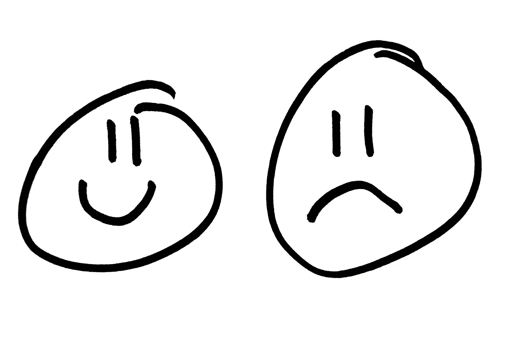

# 我们如何应对无法控制的力量

> 原文：<https://medium.com/hackernoon/how-we-respond-to-the-forces-beyond-control-51e636d1836b>

Photo Source: [photos-public-domain.com](http://www.photos-public-domain.com/2012/08/23/happy-face-sad-face/)

当一些不愉快的事情发生或者事情没有按照我们想要的方式发展时，我们会感到沮丧。每个人都想控制他们不能完全控制的事件。

*   父母希望儿子结婚。
*   男孩希望他的女孩花更多的时间和他在一起。
*   开发者想要一百万用户。
*   出版商想卖一百万本。

我们如此努力地控制每一个外部事件，在失败后变得垂头丧气。更糟糕的是，我们没有学到任何东西，并且一次又一次地重复同样的错误。我们必须接受严酷的现实，外部事件不在我们的控制之下。我们唯一能控制的是我们对外部事件的反应。

> “你无法控制的力量可以带走你所拥有的一切，除了一样东西，你选择如何应对这种情况的自由。你无法控制生活中发生的事情，但你可以控制自己的感受，以及如何应对发生在自己身上的事情。”——维克多·e·弗兰克尔博士，大屠杀幸存者，《人类寻找意义》一书的作者。

只有我们能控制我们对生活中发生的事情的反应。我们有自由。我们可以选择感到沮丧和抱怨，或者感到积极并采取行动。

*在评论中分享你的想法或者在* [*推特*](https://twitter.com/Dineshbabuhunky) *联系我。*

> [黑客中午](http://bit.ly/Hackernoon)是黑客如何开始他们的下午。我们是 [@AMI](http://bit.ly/atAMIatAMI) 家庭的一员。我们现在[接受投稿](http://bit.ly/hackernoonsubmission)并乐意[讨论广告&赞助](mailto:partners@amipublications.com)机会。
> 
> 如果你喜欢这个故事，我们推荐你阅读我们的[最新科技故事](http://bit.ly/hackernoonlatestt)和[趋势科技故事](https://hackernoon.com/trending)。直到下一次，不要把世界的现实想当然！

