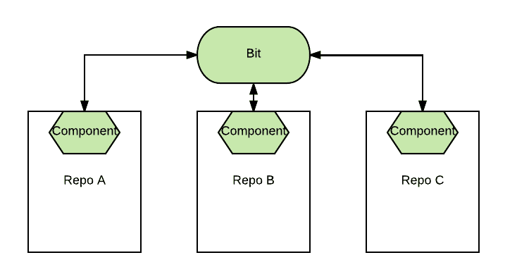
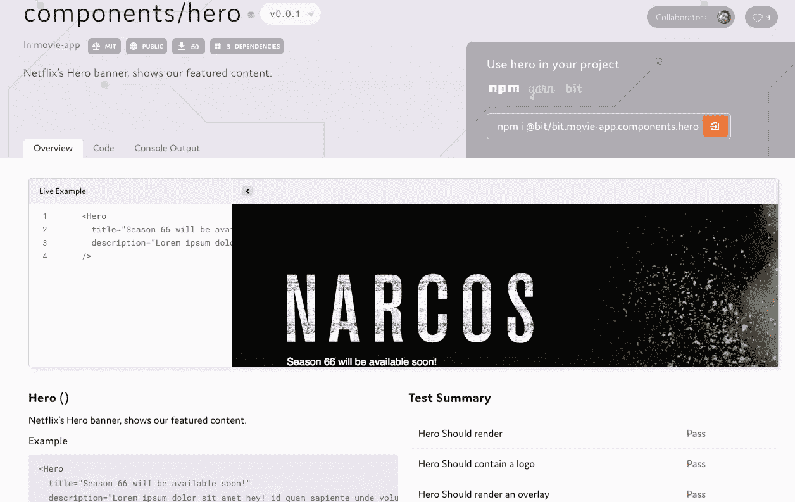

# 我们如何开始作为一个团队在项目之间共享代码组件

> 原文：<https://medium.com/hackernoon/how-we-started-sharing-components-as-a-team-d863657afaca>

*我们如何作为一个团队，使用一个名为* [*Bit*](https://bitsrc.io) *的工具，在项目之间共享和同步我们的组件和模块的故事。*

How we started sharing code as a team

共享代码[硬](/@jeffwhelpley/the-problem-with-shared-code-124a20fc3d3b)。即使对于使用可重用 UI 组件的团队，如 [React](https://hackernoon.com/tagged/react) 组件，[实现真正的可重用性](/walmartlabs/how-to-achieve-reusability-with-react-components-81edeb7fb0e0#.brpw2m2yu)也是一个挑战。

在过去的两年中，我们的团队发展到包括超过 15 名开发人员，他们从事多个项目。此外，我们正在使用 Node.js 微服务和 React UI 组件构建一个 [web 应用](https://bitsrc.io)。

随着每个新特性和每个新成员加入我们的团队，我们发现在我们的项目之间共享代码和保持代码同步变得更加困难。为了避免重复，我们考虑了从子模到 Lerna 的所有解。

然而，诸如发布开销、可发现性和可维护性困难等问题阻碍了我们成功地大规模共享代码。

最后，我们决定构建自己的解决方案；一个名为 Bit 的[开源](https://hackernoon.com/tagged/open-source)项目[，它将组件转化为构建模块，我们的团队可以在我们的项目之间组织、共享和同步。这是我们学到的东西。](https://bitsrc.io)

 [## 用代码组件进行位共享和构建

### Bit 使用更小的组件构建软件变得有趣而简单，与你的团队共享它们，并在你的…

bitsrc.io](https://bitsrc.io) 

# 寻找解决方案

起初，我们考虑将我们不同的组件和模块作为一个微包库发布给 NPM。然而，在几十个回购中发布和维护变更的开销让我们很快放弃了这个选项。

我们还考虑了 Lerna ,它非常适合从一个库发布多个包。这个解决方案对我们来说有两个主要问题。

第一个事实是，为了共享代码，我们必须将我们的代码库重构为几个 monorepos。虽然 monorepo 对于某些用例来说很棒，但我们需要一种更好的方法来共享代码，而不需要强制进行重构。

第二个问题是，我们仍然必须手动维护 repo 中的许多包，包括它们的配置和复杂的依赖树。每个变更仍然意味着在原始回购协议(及其所有者)的不同包之间进行变更。

由于共享库也不是一个很好的解决方案，我们开始意识到我们需要一个更好的方法来在我们的项目之间共享我们的代码。

我们认为这个解决方案是我们组件的“iTunes 播放列表”,这将使从不同项目中发现、共享和开发它们变得容易，同时保持我们代码库之间的变化同步。

所以，我们决定建造[钻头](https://bitsrc.io)。这是它的工作原理。

# 在项目之间直接共享组件

[Bit 的](https://bitsrc.io)概念相当简单。在 Bit 之前，我们必须为我们想要共享的每一段代码创建一个新的存储库并发布一个新的包。对软件包进行更改也必须通过回购。

Splitting repos just to share code

有了 Bit，你就不用拆分回购来共享代码了。你也不必重组现有项目的代码库([例子](https://github.com/teambit/movie-app))。

相反，您可以将 Bit 指向我们想要共享的任何 repo 的部分，使用它来自动隔离它们(Bit 将定义它们的文件/包依赖树)，并将它们共享到一个称为 Scope 的远程位置([示例](https://bitsrc.io/bit/movie-app))。

这根本不会改变现有 repo 的结构，因为 Bit 将定义依赖图，并且所有的[构建/测试环境](https://bitsrc.io/bit/envs)可以在共享之前简单地添加到组件中，所以只需要几秒钟。

Sharing components with Bit

从那里，这些共享组件可以很容易地发现和安装在其他 repos 使用 NPM(和纱线)。

当需要对组件进行更改时，您可以简单地使用 Bit 将它的实际源代码`import`到您正在工作的任何项目中，进行所需的更改，并共享新版本(到相同的范围或新的范围)。

当您将更改的代码共享回您的范围时，您甚至可以`eject`它再次成为您项目的包依赖项。

当一个组件被改变时，Bit 通过一个事件驱动的可定制的更新策略(仍在工作中)保持它在项目间的同步。我可以从我的团队成员那里建议和接收修改，看看测试是否仍然通过，并轻松地处理依赖关系，对我的代码库进行巨大的更改。

# 具有反应组分例子

例如，[这里有一个带有 React 电影应用组件的应用](https://github.com/teambit/movie-app)。使用 Bit(并且不创建新的回购)，我们将其组件共享到[这个范围](https://github.com/teambit/movie-app)。

正如你所看到的，它包含了一个[英雄组件](https://github.com/teambit/movie-app/tree/scss/src/components/hero)，我们团队中的一些人可能想在不同的项目中使用它。

通过内置的搜索引擎和组件的可视化 UI 特性，从渲染到测试结果(独立运行)和自动解析的文档和示例，可发现性得到了增强。

任何团队成员都可以很容易地找到这个组件，在他们的项目中使用，在项目中进行必要的更改，并在他们的 repos 之间同步它们。我们自己已经使用了 500 多个组件和模块。

# 结论

A demo of Bit (without the NPM workflow)

Bit 诞生于我们多年来渴望用更好的模块化来构建软件的经验。我们的团队使用它已经超过 10 个月了，每天都有更多的团队和库使用它。

使用 Bit，我们能够有效地消除回购和项目之间共享代码的开销。我们使我们的共享代码对我们的团队来说是有组织的和可发现的，减少了维护的 repos 数量，并从多个方面轻松地合作开发共享代码。

在投入使用几个月后，Bit 帮助我们创建了一个统一的、有组织的组件知识库，并在项目间共享它们。

这是一个社区协作项目，旨在使代码共享变得简单而有效。欢迎您来[试用](https://bitsrc.io)，建议反馈和[帮帮忙](https://github.com/teambit/bit)！

 [## 用代码组件进行位共享和构建

### Bit 使用更小的组件构建软件变得有趣而简单，与你的团队共享它们，并在你的…

bitsrc.io](https://bitsrc.io) 

# 了解更多信息

 [## 比特和 NPM 让 Monorepos 变得更简单

### 如何利用比特+ NPM 去单一回购没有开销？

blog.bitsrc.io](https://blog.bitsrc.io/monorepo-architecture-simplified-with-bit-and-npm-b1354be62870)  [## 如何在项目和应用程序之间共享 React UI 组件

### 如何使用 Bit 在团队的所有项目和应用程序之间轻松共享和同步 React UI 组件。

blog.bitsrc.io](https://blog.bitsrc.io/how-to-easily-share-react-components-between-projects-3dd42149c09)  [## 在 React 中加快开发的 5 个工具

### 加速 React 应用程序开发的 5 个工具，侧重于组件。

blog.bitsrc.io](https://blog.bitsrc.io/5-tools-for-faster-development-in-react-676f134050f2)