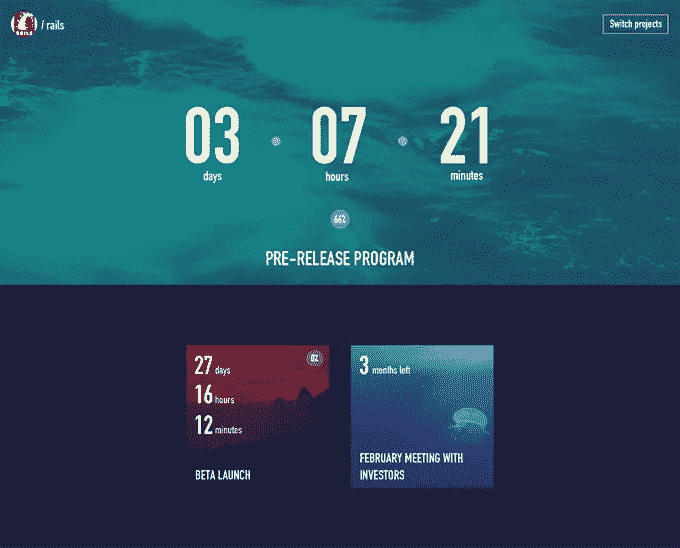
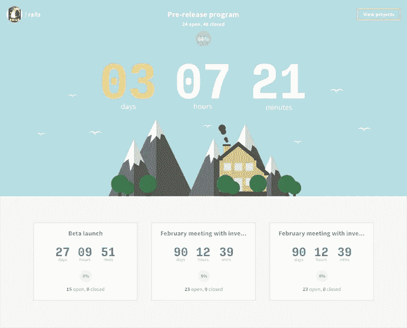
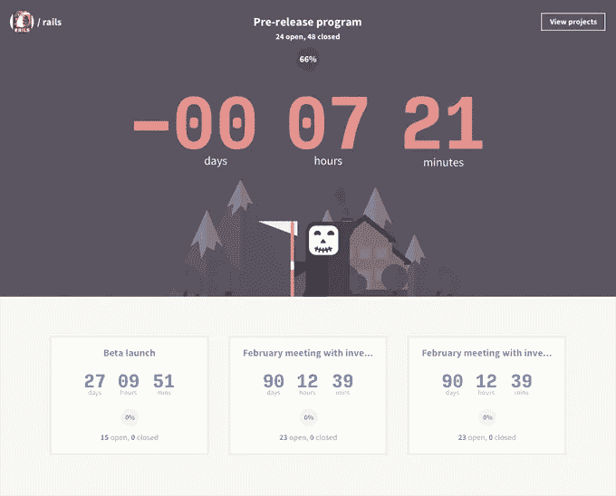
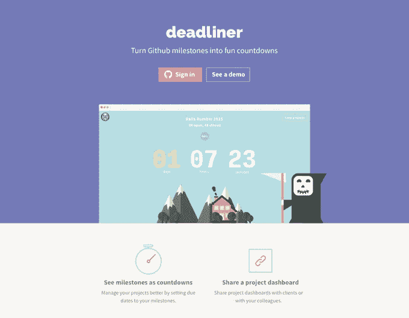

# 我们如何赢得铁路隆隆黑客马拉松。又来了。

> 原文：<https://medium.com/hackernoon/how-we-won-the-rails-rumble-hackathon-again-3e92fcfd4221>

尽管车队和去年不完全一样(托马斯和 T2【昆腾加入了 T4【马腾和我】),但是方程式还是一样的。三个开发人员和一个设计师。

这个过程也没什么不同。在黑客马拉松前几天，我们通过 Skype 通了两次电话，讨论了一些想法。和去年一样，我们选择了 Maarten 的一款应用:[一款将 GitHub 里程碑变成有趣倒计时的网络应用](http://www.deadliner.rip/)。

## 星期六

我们在早上建立了一个闲置账户，主要是因为我选择在家工作，而其他人聚集在马尔滕的地方。我最初的计划是在中午之前准备好一些“原型设计”,然后和团队的其他人见面讨论。顺便说一句，我不认为展示未完成的作品是一件坏事，尤其是当你的截止日期很短的时候。

不幸的是，[设计](https://hackernoon.com/tagged/design)并不总是容易安排。有时候你运气不好，一个好主意需要更长时间才能出现。但是我遵守了我的承诺，在 12 点钟的时候，我向他们展示了我的实力。

毫不奇怪，当他们说它看起来有点普通。所以我决定跳过面对面的会议，这将是一个 2 小时的往返旅程，并致力于我的另一个想法。一个很好的赌注，最终。

到那天结束的时候，我们已经实现了这个页面的一大块，我们又回到了正轨。

## 星期日

早上，我继续进行里程碑页面的 HTML 和 CSS 工作，而其他人则忙于共享选项和公共仪表板。

午饭后，我开始设计主页，我们就标语进行了头脑风暴。

到了晚餐时间，我们已经准备好了大部件，所以我们花了最后几个小时处理 bug 和打磨坚硬的边缘。

一周后，当邮件来的时候，我和去年一样惊讶，我们赢了。也许更多。

在这篇文章的最后，我主要想指出两点。首先，在参加黑客马拉松之前，让你的团队里有一个设计师可能是个好主意。第二，有了合适的人，远程工作可以带来好的结果。即使期限很短。

我要感谢 Rails Rumble 的组织者、赞助商，当然还有所有为我们投票的人。谢谢大家！

## 以下是我的一些其他项目:

[**前端前端** —专注于前端开发的众筹新闻网站](http://frontendfront.com/)
[**PSD 回购** —免费优质 PSD 可供下载](http://psdrepo.com/)
[**素描回购** —免费优质素描资源](http://sketchrepo.com/)

*最初发布于*[*ste Lian . firez . be*](http://stelian.firez.be/post/how-we-won-the-rails-rumble-hackathon-again/)*。*

> [黑客中午](http://bit.ly/Hackernoon)是黑客如何开始他们的下午。我们是这个家庭的一员。我们现在[接受投稿](http://bit.ly/hackernoonsubmission)并乐意[讨论广告&赞助](mailto:partners@amipublications.com)机会。
> 
> 如果你喜欢这个故事，我们推荐你阅读我们的[最新科技故事](http://bit.ly/hackernoonlatestt)和[趋势科技故事](https://hackernoon.com/trending)。直到下一次，不要把世界的现实想当然！

