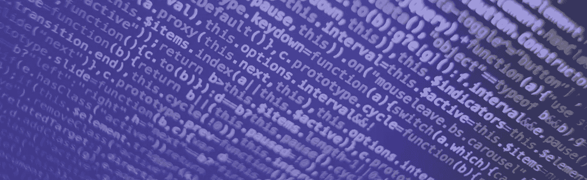
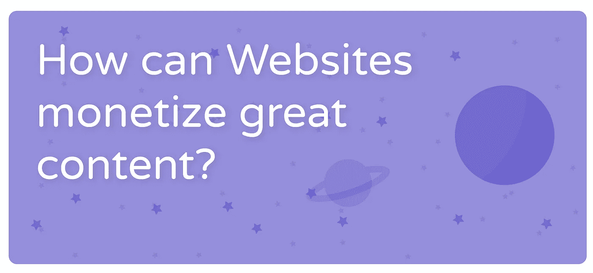
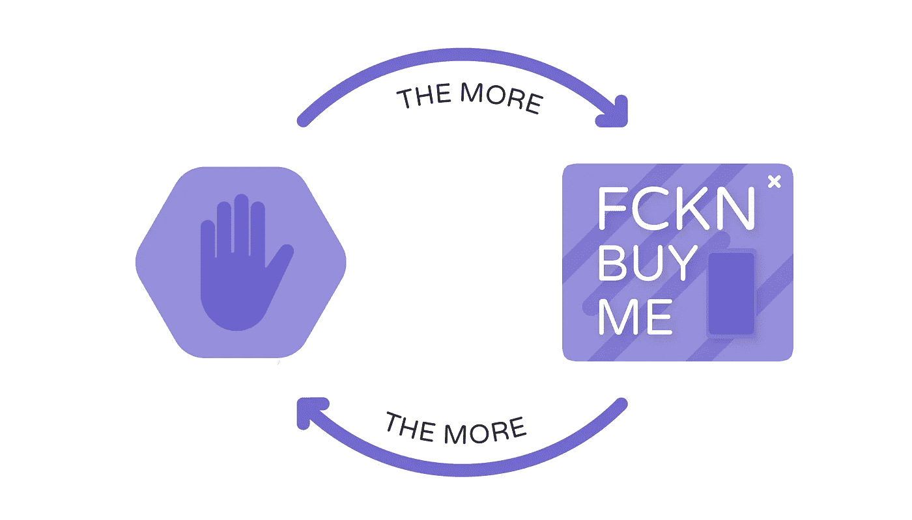
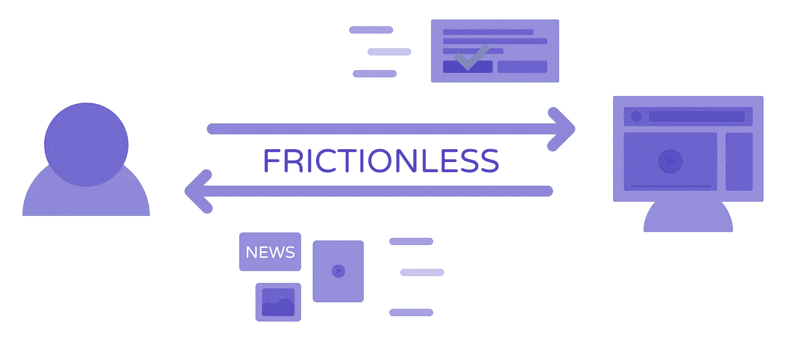
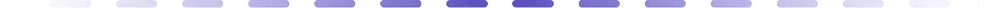

# 网络挖掘如何让互联网变得更好

> 原文：<https://medium.com/hackernoon/how-webmining-can-make-the-internet-a-better-place-569ee78e9758>

Photo by Markus Spiske

我记得第一次听说 [*SETI@Home*](https://setiathome.berkeley.edu/) 项目是在 2012 年。这是一个伟大的项目，想法很简单:每个人都可以下载一个免费的程序，在搜索外星智能(SETI)中处理来自宇宙的无线电望远镜数据。又名在家搜寻外星人。

它之所以如此伟大，是因为下载一个小程序并为更大的利益贡献你的部分计算能力一点也不麻烦。但是当很多人参与时，它会产生巨大的影响。即使如此，它也能解决人类面临的最大问题之一:我们是孤独的吗？

在 Inwemo，我们处理一个同样的谜。一个非常非常大的问题。

大家说说吧。

# 来自地狱的反馈回路

广告拦截器的强势崛起是不可否认的。无论是移动还是桌面。根据 Pagefair 广告拦截器报告，多达 6 . 15 亿台设备正在拦截广告。

数字每分钟都在攀升。用户对恼人的中断、漫长的加载时间以及病毒和恶意软件的出现感到沮丧。

但是，当一些用户为了更好的体验而拒绝广告时，内容创作者却被冷落了。看一看[最近的新闻](http://www.thedrum.com/news/2017/10/11/uk-publishers-lose-nearly-3bn-revenue-annually-due-adblocking)，网站货币化的未来风险很大。因此也有更好的内容。

广告主对广告拦截器的反应可以总结为一句话:**如果看广告的人少了，我们需要抓住那些看广告的人更多的注意力。**

但是如果我们回想一下，这就是问题的全部。

如果广告制作精良，精妙绝伦，那就好！没有人反对广告本身。但是当广告变得疯狂，只关心偷走你的注意力时，你不能责怪人们加入广告拦截者的行列。

当越来越多的人选择广告拦截，那么广告形式将变得对我们其他人更具侵略性。

欢迎来到地狱的反馈圈。

# 用一个简单的想法打破循环

因为盈利困境看不到尽头，我们不得不重新思考用户和网站真正想要什么。

从本质上讲，用户希望以最少的金钱和精力投入获得优秀的内容。阅读文章需要喜欢一个页面？再见！

网站想要完全相反的东西。他们希望通过制作优秀的内容获得最大的回报。这可以是金钱、时间或婚约的形式。

这是对比，对不对？但是如果是这样的话，最优解会是什么样的呢？

所以在一个乌托邦的世界里，用户可以免费获得很棒的内容，以一种神奇的方式，钞票会像雨点般落在网站上。嗯，这是不可能的…

但是我们有个主意。

> 为什么不建立一个生态系统，让站长和用户之间的价值交易没有摩擦？

因为当前的生态系统完全没有摩擦。

除非有付费墙或类似的地方，用户很容易从网站上获得价值。但是反过来呢？那是一场全新的比赛！

大多数时候，你必须支付固定的价格才能获得视频内容或优秀的新闻报道。这意味着你必须在某个地方注册。对于一个网站来说，这似乎很好，但是谁会只在一个网站上消费内容呢？

如果我想暂停订阅，因为我非常忙。我应该取消吗？然后两个月后又订阅了？简直不方便。

**为了支持网站的内容，用户必须做很多事情，也必须考虑很多事情。因此它不是没有摩擦的。**

为了打破这种循环，我们需要一种最大程度上无摩擦的网站盈利模式。系好安全带。

# 颠覆网站的盈利模式

由于[技术](https://hackernoon.com/tagged/technology)的新可能性，[浏览器](https://hackernoon.com/tagged/browser)可以更好地利用用户的计算能力。虽然可以用在一些不好的例子中(看着你，Coinhive！)，也为新的机会打开了空间。

第二大进步是设备的计算能力每年都在变得越来越好，而用例却保持不变。

> 这导致大量未使用的计算能力。

类似于 *SETI@Home，*我们的想法是开放这种能力，以产生价值，这可以毫不费力地转化为网站管理员，没有任何摩擦。

我们希望建立这个生态系统，让访问者帮助验证区块链的交易。这个过程被称为[密码挖掘](https://youtu.be/6DQb0cMvU7I?t=49s)。简单地说，计算机解决数学问题。这项任务的报酬由我们交给网站所有者。

没有任何跟踪。没有任何干扰。但绝不能没有你的同意。

我们认为，如果我们把这一点做好——让用户坐在驾驶座上——它会产生很大的影响。到成为我们最喜爱的网站的一个良好的收入来源的程度。

> 如果你认为这是一个有趣的想法，一定要在 www.inwemo.com 了解更多。如果你喜欢这篇文章，请随意在页面底部鼓掌。谢谢大家！