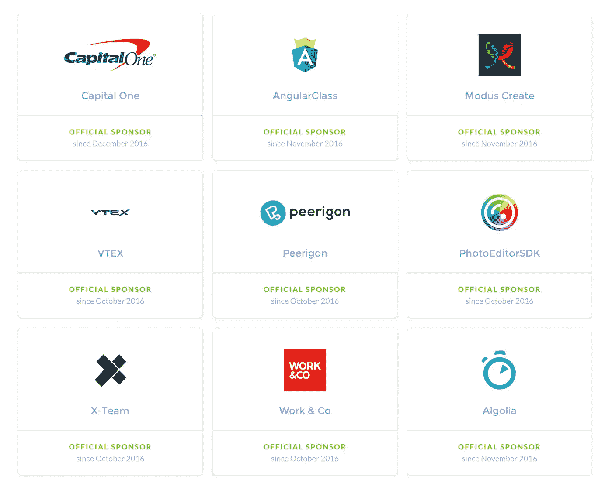
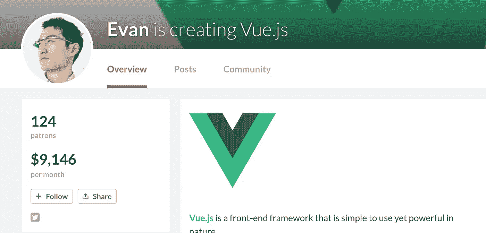
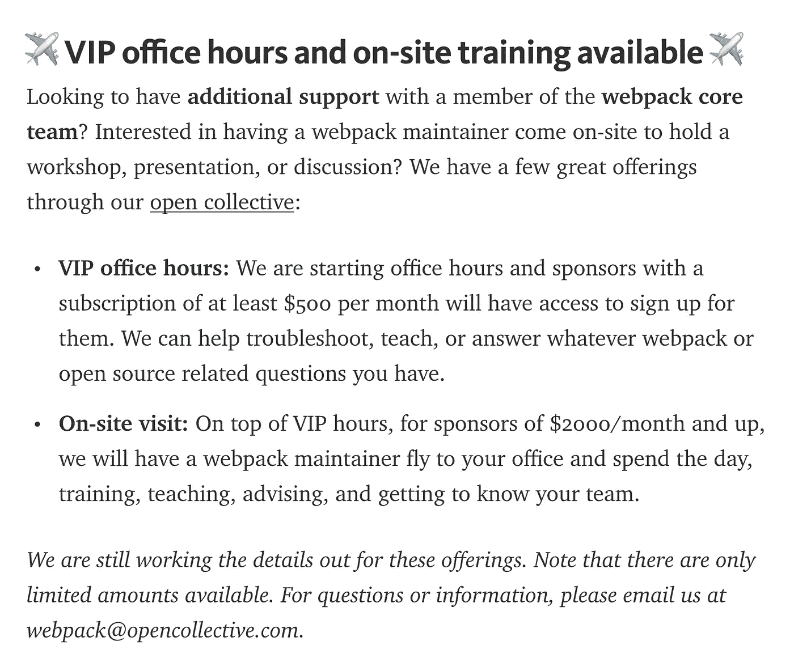
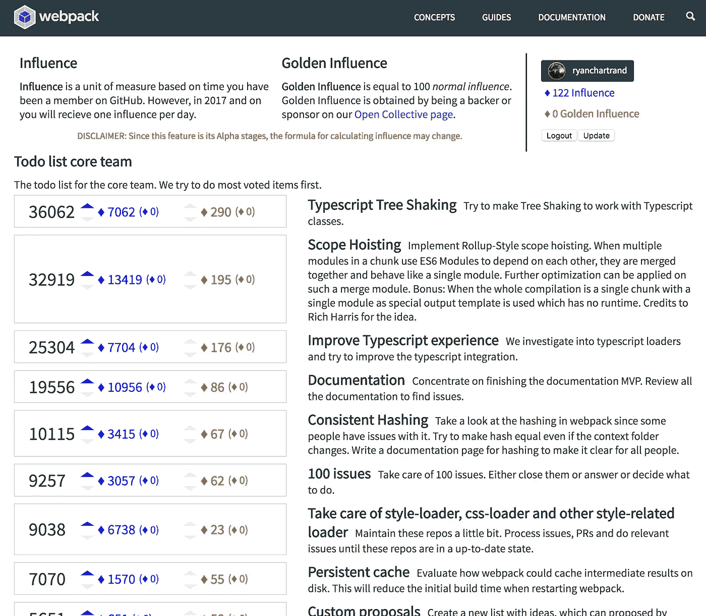

# Webpack 如何在 3 个月内筹集到 15，000 美元，以及开源的未来

> 原文：<https://medium.com/hackernoon/how-webpack-raised-15-000-in-3-months-and-the-future-of-open-source-cb2c9f68fffa>

开源软件的未来非常光明，我们要感谢 [**Webpack**](https://webpack.js.org/) 和 [**OpenCollective**](http://opencollective.com) 为我们奠定了基础。

在未来，团队实际上为他们使用的开源代码的可持续性做出贡献，并被激励这样做不是为了慈善，而是为了真正的投资回报。

我认为，这种未来甚至可能会让该行业不断引入新技术的局面平静下来。

# 它是如何开始的

【2016 年初，世界被给予[**open collective**](http://opencollective.com)，一个面向群体的筹款网站(但主要由开源和编码者主导)。

我喜欢他们的一个目标是**改变这样一种观念，即向开源项目捐款是慈善行为**，而是维持你公司产品所依赖的项目的一种方式。

直到 2016 年 10 月，随着越来越受欢迎的项目 [**Webpack**](http://webpack.js.org) 加入该网站，这一愿景才开始变成现实。

# **3 个月后 15，000 美元**

**没过多久，许多公司开始每月向 OpenCollective 的 Webpack 贡献 100 美元或更多。**

**这里只是赞助商名单中的一小块:
(左下方*不要脸塞给我的公司*[*X-Team*](http://x-team.com)*作为我们是 Webpack 的大粉丝*)**

****

**CapitalOne 甚至承诺在接下来的一年里投入 12，000 美元。**

**一年前，除非有谷歌(Google)、脸书(React)或 Acquia(Drupal)/automatic(WordPress)这样的大公司支持，否则这种对开源项目的贡献是不存在的。**

**虽然我怀疑这些公司中的一些是出于营销相关的原因赞助 Webpack 的，但许多公司都是因为 Webpack 现在是他们开发工作流程中至关重要的一部分。**

**如果 Webpack 的核心团队有一天退出，许多公司将不会有一个长期可持续的工作流程。此外，项目资金越多，新的改进和缺陷修复的速度也越快。**

**更不用说纯粹的责任了——大多数开源项目被放弃了，因为通过工作获得报酬往往胜过他们的优先事项。**

# **Webpack 并不孤单，看看 Vue.js 就知道了**

**尤雨溪，创造者 [Vue.js](http://vuejs.org) ，**已经通过** [**Patreon**](https://www.patreon.com/evanyou) 谋生大约一年了，所以他可以全职专注于这个项目。**

****

**结果如何？**

**公司现在选择[而不是](https://about.gitlab.com/2016/10/20/why-we-chose-vue/) *来应对。***

**当你为这些项目投资时，为开源项目创造可持续性的机会要大得多。**

**还记得[心痛](http://www.zdnet.com/article/funding-vital-but-ignored-open-source-projects/)吗？这就是当一个开源项目(OpenSSL)获得预算时会发生的事情。**

# **未来:为赞助者创造激励的开源项目**

**[就在今天](/webpack/webpack-2-2-the-final-release-76c3d43bf144#.g8cyfh1qb)，Webpack 再次让我们看到了未来。**

**下面您将看到，他们现在通过其 OpenCollective 计划，为任何出资 500 美元/mo 的赞助者提供 T16 办公时间和现场培训。**

**我已经能听到 CapitalOne 打开他们钱包的声音。**

****

**将来，向开源项目捐款不仅有助于确保项目的可持续性，还会以支持的形式提供价值，帮助您的团队更好地使用这些项目。**

**Webpack 向我们展示了 T21 对未来的又一瞥。**

**在 https://webpack.js.org/vote/，你可以投票决定核心团队应该如何度过他们的时间:**

****

**最棒的是(也许甚至是一个有争议的话题)，赞助商被赋予了“黄金影响力”，他们的选票更有分量。**

**我想这只是激励公司成为赞助商的方法的开始，我迫不及待地想知道 Webpack 和其他项目在未来会带来什么。**

# **拉金效应**

****

**Sean Larkin of Webpack at NEJS Conf**

**需要注意的是，如果没有更多像 Webpack 大使和核心团队成员肖恩·拉金这样的开发人员，这个未来是不可能的。**

**他近乎虔诚地推广 Webpack，并且在确保 Webpack 有一个强大的未来方面做得非常好。很像 Vue.js 的尤雨溪，这些人为公司投资创造了信心。**

**我希望和祈祷的是，这场运动不会就此停止，更多的开源项目会跟随 Webpack 的脚步，找到创造性的方法，通过为企业提供真正的价值来吸引企业资助他们的项目。**

**否则，当我们回顾历史的这个时期时，我们会发现这只不过是拉金效应，当肖恩·拉金加入你的核心团队时就会发生这种效应。**

**作为一个更大的开发社区，如果我们要创造这个光明的未来，我们需要支持和创造更多的拉金人(是的，刚刚创造出来的)。**

**请将此视为对 Sean 的请求，请他帮助教其他人如何做他所做的事情:)**

# **不断出现的新技术的减速？**

**最后，这种未来让我想知道它是否会减缓不断需要创建新框架和库的开发社区的速度。**

**如果项目实际上是持续的和被支持的，而不是一直被放弃，那么不断重新发明轮子的愿望会变得更少吗？**

**在我们的行业中，不断出现新技术的原因可能是项目在落到*下一个酷东西*之前缺乏任何支持的结果吗？**

**看着 React 和 Angular 这样资金雄厚的项目以及它们相对较长的存在时间，我不禁对这个理论产生了怀疑。希望你能在评论中表达你的想法。**

***我用心写每一篇帖子。我非常感谢那些点击* **来回报我的人💚** *:)***

***Ryan Chartrand 是*[***X-Team***](http://x-team.com)*的首席执行官，这是一个由非凡的远程开发人员组成的全球团队，他们可以加入您的团队，并从今天开始执行。***

***点击【http://x-team.com/blog】*查看并订阅 X-Team 的博客****

******************

> ***[黑客中午](http://bit.ly/Hackernoon)是黑客如何开始他们的下午。我们是这个家庭的一员。我们现在[接受投稿](http://bit.ly/hackernoonsubmission)并乐意[讨论广告&赞助](mailto:partners@amipublications.com)机会。***
> 
> ***如果你喜欢这个故事，我们推荐你阅读我们的[最新科技故事](http://bit.ly/hackernoonlatestt)和[趋势科技故事](https://hackernoon.com/trending)。直到下一次，不要把世界的现实想当然！***

******