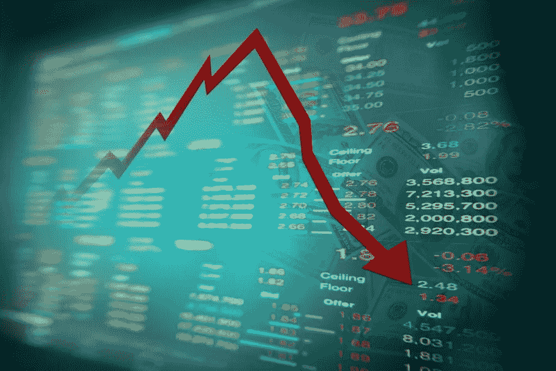

# 英国退出欧盟将如何影响英国和世界经济、初创企业、富人和穷人？

> 原文：<https://medium.com/hackernoon/how-will-brexit-affect-the-uk-and-world-economies-start-ups-the-rich-and-the-poor-264e370936e>

这个问题的答案是‘没有人知道’，我们大多数人所能做的就是猜测。以下是我的看法。

作为一名企业家，并考虑到大多数统计数据显示初创企业的成功率为 10%，我不希望有更多的不确定性，并将投票留在欧盟。然而，这并不意味着我不同意脱欧运动者的观点；对我来说，最重要的事情是看到我的创业成功，为此，现状和清晰最有效。

大多数人可能没有意识到，关于欧盟公投的投票可能会极大地影响我们近期和远期的未来。不幸的是，大多数人将无法做出明智的决定，因为留欧和脱欧运动都在向公众展示完全公正的观点方面做了令人震惊的工作。

在我今年 2 月[的一篇文章中，“英国退出欧盟将如何影响英国的创业公司？”](http://www.cityfalcon.com/blog/investments/how-will-brexit-affect-uk-startups/)，我已经讨论过不确定性、英镑贬值、投资、官僚主义和人才缺乏如何影响[英国退出欧盟](https://hackernoon.com/tagged/brexit)后的初创企业。现在，让我们想想它会如何影响全球经济。

**双方都认为，如果英国退出欧盟事件发生，英国和欧盟在短期内都会陷入困境**

尽管双方对脱离欧盟的中长期影响存在分歧，但他们一致认为，在短期内，将会出现膝跳反应——英镑可能贬值，企业可能遭受损失，并可能导致失业。从长远来看，脱欧运动者认为这是最好的选择。有了这么多的信息，我只是不确定怎么会有人预测我们未来的命运。

**即使我们离开欧盟，我们仍然受到欧盟命运的影响**

是的，那么，我是否同意在英国退出欧盟之后我们可以像现在一样与欧盟保持同样的贸易和商业关系？也许是，也许不是。在当今相互关联的世界，中国的问题影响着全球经济。同样，如果在英国退出欧盟之后，欧盟变弱，英国退欧，欧元受损，这将对我们的经济产生影响。

**全球经济如此脆弱，英国退出欧盟可能会带领世界经济重新陷入衰退**

我们仍未从 2008 年的衰退中完全恢复，英国退出欧盟可能会让我们再次回到那些艰难的岁月。是的，我们可以根据对金融市场的影响做出所有决定，但请记住，我们今天的生活方式是资本主义的结果。

**富人可能会度过短期低迷期，但穷人将是受害最深的人**

如果你还过得去，或者有主要的每月付款承诺，如抵押贷款等，要担心，非常担心。如果我们再次陷入衰退，这可能会导致失业、减薪，穷人将会遭殃。

贫富之间的差距只会扩大。富人通常可以对冲他们的投资组合，利用下跌的股票和房地产，甚至可以通过做空市场获利，即从市场和经济衰退中赚钱。

通过英国退出欧盟的移民控制可能会适得其反，导致更多英国人失业

移民是提出的关键问题之一，关于移民对英国经济和就业等是否有帮助或负面影响，有不同的报道。就英国退出欧盟而言，我们的东欧朋友再也不能来“偷走”英国的工作了。这将为本地低端市场带来更多就业机会，例如零售业，但随着劳动力供应的减少，成本将迅速上升。如果经济衰退发生，消费者的消费能力将下降，企业将不得不关闭，导致失业。你对移民是好是坏的回答通常取决于你是经济学家还是政治家。

**如果货币贬值，出口可能具有竞争力，但进口成本上升可能导致通货膨胀，并可能导致利率上升**

有一种观点认为，货币贬值可能有利于出口和经济，但大多数人忘记了它会如何影响进口，并可能导致通货膨胀，这可能需要央行采取强硬措施，包括提高抵押贷款利率。

**英国可能失去位于世界中心和时区的优势，可能不再是国际公司欧洲总部的首选**

在过去的几年里，一些金融机构评估了伦敦是否是他们在欧洲的最佳地点。他们现在又多了一个将业务转移到别处的理由。

**总结**

对我们英国人来说，这将是我们近年来不得不做出的最艰难的选择之一，我真诚地希望人们权衡利弊，即使我们能够获得的信息有限。我的观点是，在 2016 年，我们不应该建造更多的墙。谁知道呢，我们英国人将来可能自己也需要帮助。

如果你想了解英国退出欧盟、英镑/美元、英镑/欧元和富时 100 指数的最新消息，你可以登录我们的网站 [CityFALCON](http://www.cityfalcon.com/watchlists?assets=Brexit,GBPUSD,EURGBP,FTSE100) 。

最初发布于[博客 CityFALCON](http://www.cityfalcon.com/blog/investments/how-will-brexit-affect-the-uk-and-world-economies-start-ups-the-rich-and-the-poor/)

> [黑客中午](http://bit.ly/Hackernoon)是黑客如何开始他们的下午。我们是 [@AMI](http://bit.ly/atAMIatAMI) 家庭的一员。我们现在[接受投稿](http://bit.ly/hackernoonsubmission)并乐意[讨论广告&赞助](mailto:partners@amipublications.com)机会。
> 
> 如果你喜欢这个故事，我们推荐你阅读我们的[最新科技故事](http://bit.ly/hackernoonlatestt)和[趋势科技故事](https://hackernoon.com/trending)。直到下一次，不要把世界的现实想当然！

