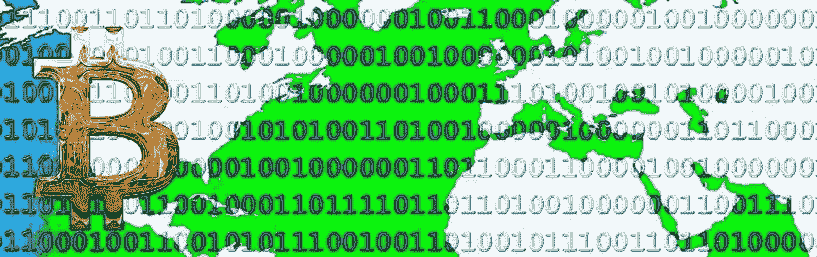

# 加密应用将如何赚钱？

> 原文：<https://medium.com/hackernoon/how-will-crypto-apps-make-money-a1c5c5d01285>

## “我们的令牌会去月球！”已经不够好了。

昨晚我想出了可能杀死 crypto 的东西。而且也不是黑天鹅事件。历史表明这是我们今天所走道路的自然终点。

## 一个隐秘的警示故事

在互联网的早期，开发人员建立了重要的基础设施:TCP/IP、HTTP 和 SMTP 等共享协议，为我们今天喜爱的浏览器、网站和应用程序打开了大门。但是需要建立的协议数量有限，而且这项工作没有多少资金。所以大多数开发人员继续开发应用程序。

应用程序吸引了用户。他们收集用户数据并将其出售给企业，聚集用户注意力并将其出售给广告商，或者坐在用户交易的中间并从中提成。总的来说，如果你能吸引很多用户，你就能赚很多钱。作为一个早期的消费者应用程序，你可以面无表情地告诉投资者，你的计划是专注于增长，然后再想办法赚钱。足够多的应用程序做到了这一点，这并不可怕。许多开发互联网应用程序的人变得非常富有。但是，使这一切成为可能的共享协议的发展萎缩了，在高尚的、无利可图的开源软件世界里蹒跚而行。人们抱怨缺乏协议创新，但他们追随金钱。

crypto 承诺的核心是，由于令牌，区块链开发者可以在协议上赚钱！如果你推出一个具有新功能的令牌，其他开发者可以在其上构建分散的应用程序，如果这些应用程序增长，你的令牌的价值会像百花齐放一样飙升。如果你推出自己的区块链，你也可以从每笔交易中获得报酬。[值累积到协议层](http://www.usv.com/blog/fat-protocols)。

这就是为什么这么多做 ico 的公司说他们正在建立新的协议，而不仅仅是应用程序。这就是现在的钱，聪明的加密创始人和投资者都知道这一点。

我们再次进入加密的基础设施阶段。但这一次，有些事情非常不同。

## 被看不见的手窒息

我喜欢那个花了 10，000 比特币买了两个披萨的家伙的故事。可怜的家伙。这些比特币今天价值 7000 万美元！

我敢打赌，这比所有[分散加密应用](https://www.stateofthedapps.com/)迄今为止的收入总和还要多。

比特币最近一直在疯狂撕扯。我已经写了为什么我认为这正在发生，以及为什么上升趋势(有高峰和低谷)可能会继续。监管和规模问题等因素会让它慢下来。但比特币持有者的经济动机过于一致，不能让它自然死亡。

什么能彻底杀死它？经济反激励。

简单来说:如果没有人能在去中心化的应用上赚钱，就没有人会去构建它们。如果没人开发应用，也没人能在协议上赚钱。投资者会赔钱，并停止资助加密项目。所有的怀疑者都将被证明是正确的。我们所知的秘密梦想将会消亡，不是砰的一声，而是呜咽一声。被最初催生它的经济自身利益所扼杀。

当然，集中化的公司将学会利用区块链做他们已经在做的事情，更快、更好、更便宜。但是，完全去中心化的应用程序有望在未来摆脱中间商吗？死了。或者，更糟的是，被永久送回他们刚刚出现的业余爱好者和修补匠的世界。

这还不够好。我们需要阻止它的发生。

去中心化未来的承诺太大了，太有趣了，不能让它不战而逝。

## 选择你的武器

我相信我们能解决这个问题，但第一步是承认它。如果你在读完这篇文章后什么也没做，请不要再把任意的价格升值和收入模型混为一谈。在项目层面，这是一个糟糕的赌注。在行业层面，这对 crypto 的未来是有害的。相应地管理你自己，或者被下一个秘密的冬天、证券交易委员会的裁决或更精明的竞争者消灭。

我们需要为加密应用找到正确的收入模式，并证明它们是可行的。许多通常的怀疑已经过时了，或者至少已经过时了。

贩卖用户数据？呸。我们想要一个共享的数据层，而不是集中的孤岛。

广告？很难用区块链的比例问题来解释这些数字。

从交易中提成？那么你就是一个中间人，即使提成很少——如果是这样，你就有了糟糕的经济学。

区块链开发者想要更好的答案。如果他们喜欢你的应用程序，但不喜欢你的收入模式，他们可能会分叉你的代码，并改变它。

ICO 投资者想要更好的答案。他们期待着回报。交付失败将使您的公司和加密空间处于危险之中。

我们的社区想要更好的答案。它们是我们做这些的重要原因。对吗？

我们需要证明加密项目可以成为可持续发展的业务。我们需要证明数字货币应用可以赚钱。

那么——加密应用将如何赚钱？

我还没有答案。你知道吗？

*我是一名常驻企业家，在* [*基础资本*](https://foundationcapital.com/) *从事加密项目。得到了好答案？我很想听听，* [*私下*](https://www.linkedin.com/in/nicksoman) *或者在评论里。*