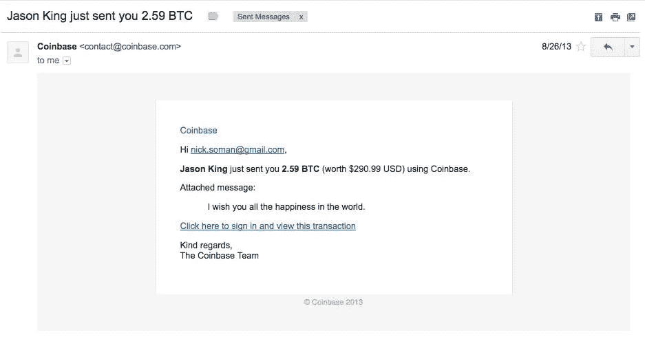

# dapps 会如何成长？

> 原文：<https://medium.com/hackernoon/how-will-dapps-grow-f8cd290ddcf>

自从一个朋友在 2013 年给我寄了一些比特币以来，我一直在想象一个区块链式的未来。现在，我相信未来即将到来，我正在创办一家公司，帮助每个人都能接触到它。带着这个目标，我想用一种没有术语的方式写下一些我正在学习的东西，以帮助我自己和其他人理解。

**什么是 dapp？**

[dapp 是一个应用程序，它的后端代码运行在一个对等网络上，而不是一个集中的机器上。](https://steemit.com/ethereum/@daynewright/learning-crypto-what-is-a-dapp)“在运行 dapps 的对等网络中，没有一个节点或中央实体【中间人】告诉其他节点该做什么。

由于没有中间人来确保一切都按照预期的方式发生，许多 dapp 依赖一个特殊的用户组(有时称为矿工)来验证用户报告的 dapp 内活动。这些矿工通常以硬币(加密货币)的形式获得支付，他们可以在 dapp 内用硬币和/或外部世界的其他硬币或货币进行交易。有时这些硬币被设计成当更多的人使用 dapp 时会增值。

为什么有人会在意？

dapps 的承诺是“ [X 不需要中央网络运营商 X。优步不需要优步作为一家公司来控制司机和乘客的网络。不需要 Reddit 作为一家公司集中托管和创建平台。没有脸书的脸书。](https://blog.coinbase.com/app-coins-and-the-dawn-of-the-decentralized-business-model-8b8c951e734f)”

今天有 [~1000 个 dapps】，大部分都相当初级。这让我想起了苹果在 2008 年推出的 iOS 应用商店，当时有 500 个应用，其中大部分都很糟糕。对我来说，最好的一个是手电筒，它可以把你的屏幕变成白色，这样你就可以在黑暗中晃动你的手机来找到你的钥匙。今天有 220 万个 iOS 应用程序，其中大约有 10 个是我每天都在使用的。想想你手机上最喜欢的应用。他们让你的生活变得更好了吗？](https://dapps.ethercasts.com/)

随着时间的推移，如果 dapp 克服了各种技术、监管、UX 和战略挑战，将会创造出更多的 dapp，其中一些将会让生活变得更好。除了其他好处之外，消除交易中的中间人将使事情变得更快，并为用户提供更好的交易。想象一下，出版商可以直接付钱给你，而不是付钱给脸书来获得给你做广告的特权。如果不通过电力公司为你的房子获取能源，你可以直接获得[批发能源价格](http://gridplus.io/)。如果不用付钱给亚马逊来借用数字存储空间和计算能力，你可以从你的邻居那里借，作为回报，[可以借出你电脑上的空间和能力并获得报酬。](https://filecoin.io/)

那么，为什么要写成长呢？

三个原因:

1.  建造伟大的 dapps 不足以实现区块链式的未来。我们需要帮助普通人发现、使用并从中受益。如果 dapp 没有增长，开发者就不会投入时间和金钱来制造更多的 dapp。dapps 不会让尽可能多的人生活得更好。
2.  权力下放本身并不能保证增长。当人们说不是的时候，我觉得我以前看过这部电影。互联网发行被认为是通过让任何独立艺术家为她的歌曲找到听众来改变音乐产业。在 Napster 工作告诉我，标签仍然存在，不是因为它们是邪恶的(尽管有些是)，而是因为它们为大多数消费者和大多数艺术家提供了比直接交易更好的经济交易。今天最成功的创新艺术家仍然不与粉丝直接交易——他们与唱片公司合作，与 YouTube 交易。
3.  我相信开发者将会开发出优秀的 dapps，并获得面对新问题的权利:弄清楚如何让它们成长。我喜欢思考和致力于成长。:)

**好的。那么 dapps 会如何成长呢？**

让我们来谈谈当今的应用程序是如何发展的。是谁让它发生的？他们的动机是什么？在一个以区块链为主导的世界里，这些激励措施会发生怎样的变化？

**应用开发者**

今天:应用开发者有一个直接的动机让他们的应用成长。当越来越多的人使用和喜爱你的应用程序时，你就更容易有灵感地去工作，雇佣优秀的员工，在你需要的时候筹集资金，并且赚钱。

未来:这些激励措施在 dapps 中是相似的。许多 dapp 开发者也有更直接的财务激励:他们预先为团队留出一大块硬币(类似但不等同于初创公司的股权)，如果这些硬币在更多人使用 dapp 时增值，他们可以看到他们的财富与他们的 dapp 用户群成比例增长。然而，大多数 dapp 的“付费游戏”性质给增长带来了潜在的障碍:如果用户需要花费硬币——可能价格不断上涨——才能从 dapp 中受益，并激励矿工继续验证 dapp 内的活动，dapp 的增长将比免费使用时更慢，开发新 dapp 的开发者将更少。

**平台**

今天:巨型企业投资应用商店平台——有时作为[的亏损领导者](https://www.fastcompany.com/1663012/apples-app-store-has-netted-429-million-loss-leader)——来销售更多的[硬件](https://www.apple.com/ios/app-store/)、[软件](https://appexchange.salesforce.com/)或[广告](https://play.google.com/store?hl=en)。

明天:这将是一场有趣的比赛。你只能在苹果设备上使用 iOS 应用。作为对应用程序开发者工作的独家权利的交换，苹果提供工具来帮助开发，并帮助营销、质量控制和增长。许多不喜欢集中控制的 dapp 开发者会接受类似的交易吗？如果没有，大多数新用户将如何了解 dapps？dapp 商店平台在未来有作用吗？

**用户**

今天:大多数应用程序(例如谷歌地图)都是“单人游戏”——你不需要与其他任何人互动来从他们那里获得价值——所以用户没有直接的动力来帮助他们增长。像脸书这样的一些应用有网络效应，这意味着当新用户加入时，它们通常对用户更有利。像优步这样的应用用应用内的好处来奖励用户(免费乘车！)当他们推荐的朋友加入应用程序时。

明天:这将是另一个有趣的。因为 dapps 是建立在点对点网络上的，所以比 app 更有可能产生网络效应。当更多的人使用 dapp 时，许多 dapp 会给用户增加价值的硬币。如此多的 dapp 将从双重网络效应中受益:随着网络的发展，dapp 将变得更加有用，为其提供动力的硬币也将升值。用户的激励措施旨在帮助 dapps 成长。

