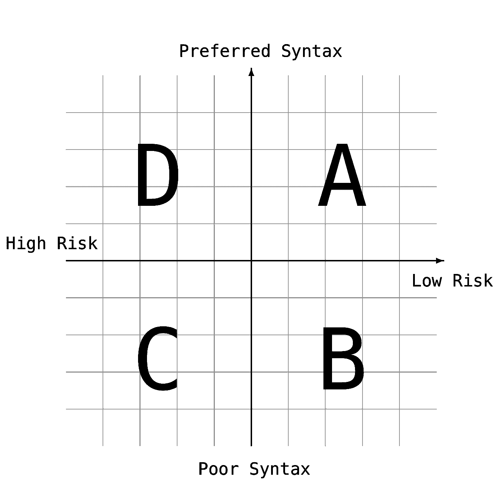
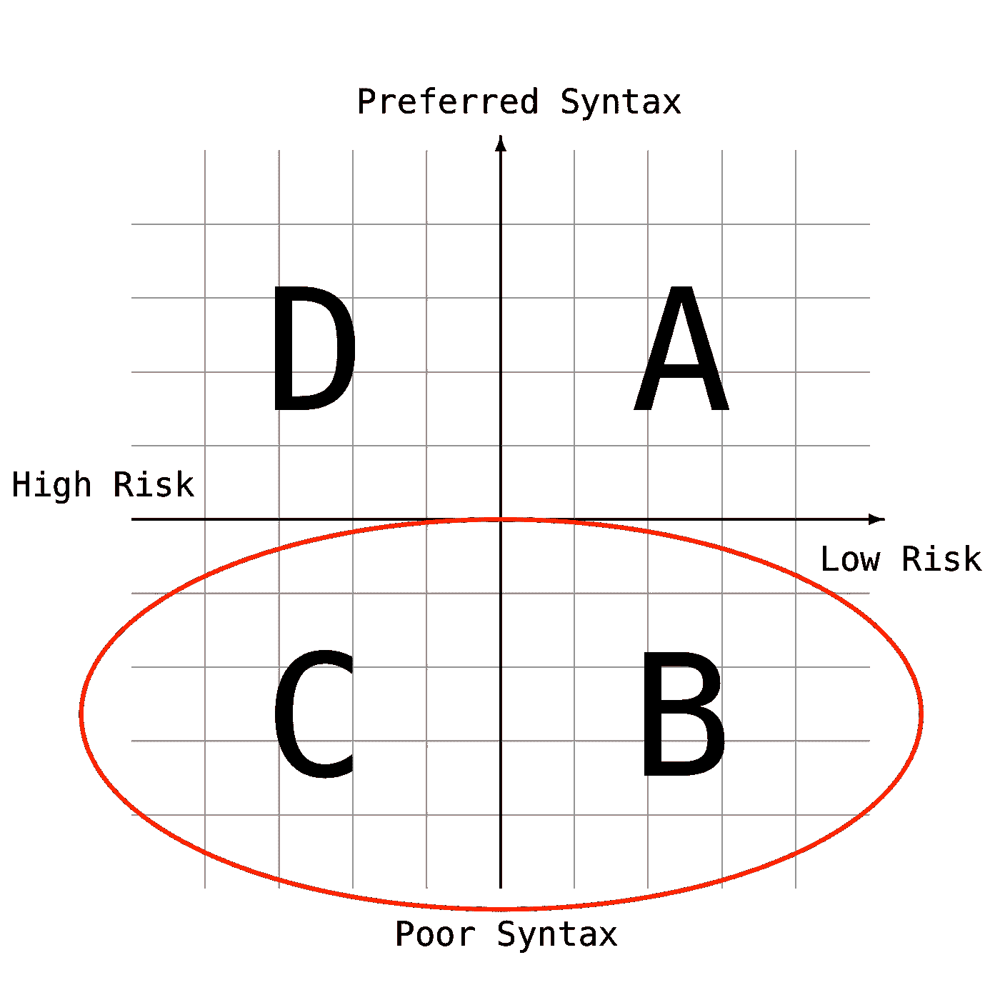
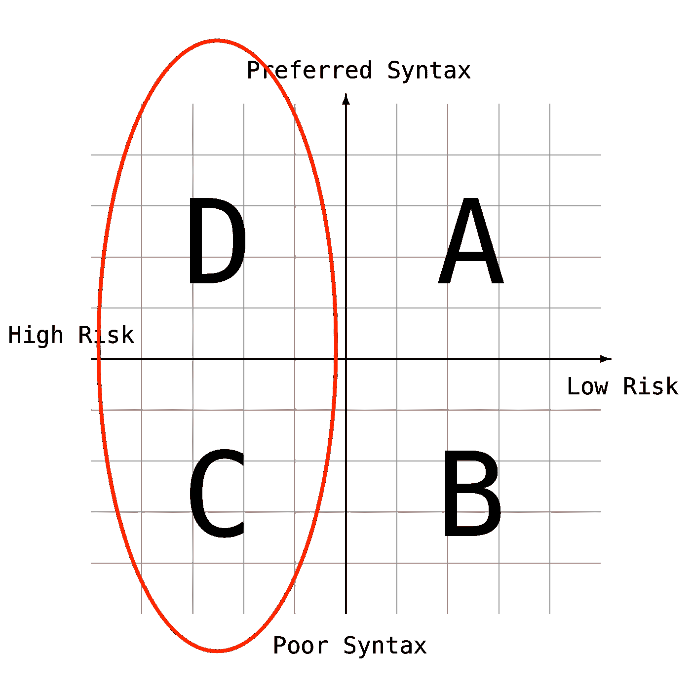

# 你将如何选择牺牲代码质量？

> 原文：<https://medium.com/hackernoon/how-will-you-choose-to-compromise-code-quality-a714ada2b32d>

第一次估算时，你会为你将要赚的额外的钱感到内疚。上一次你这么做的时候，你意识到你正在考虑你将要失去的东西。

**客户:**要求新功能
**我:**认为我可以花 100.00 美元构建这个简单的[功能](https://hackernoon.com/tagged/feature)，提供 100.00 美元的客户估价
**(年长的&更明智)我:**认为 100.00 美元是最好的情况，150.00 美元是最差的，提供 125.00 美元的客户估价

在历史的大计划中，这 25%的缓冲将净值为 0.00 美元。一些是最好的情况，许多是最坏的情况，一些事情属于中间。当你改进你的过程时，如果你能得到 0.00 美元，你就很幸运了。

缓冲基本上是对任务相关风险的高估或低估。有些开发人员实际上不需要缓冲区。以下是一些我认为属于低风险的例子:

*   用稍微不同的复制、设计和验证在另一个视图中重新实现一个现有的特性。
*   已知数量和上下文的自动化任务。*示例:发送带有 CSV 导出的电子邮件，删除名称无效的记录，将每日文件保存到 S3 存储桶。*
*   复制更改(在大多数情况下)。

以下是一些高风险、高缓冲的例子:

*   对关键数据模型进行彻底的更改。
*   UI 中新的性能密集型功能。
*   非结构化数据源的报告或分析。

不足为奇的是，很容易出现需要高缓冲的情况。大多数软件开发人员都是乐观主义者，我们往往会忽略逆风和从过去的经验中显而易见的警告信号。

# 黑客和最佳实践

开发人员必须管理另一个高估或低估的赌注，这个赌注很少暴露给我们的客户:

**我是否应该重构这种攻击并推行最佳实践？**

在这种情况下，黑客被理解为你(或某人)刚刚使其工作的代码库中的位置。

我做这一行已经很久了，我认为你永远不会有一个没有黑客的项目。尽管有机器人手术和太空任务，绝大多数以商业和消费者为中心的软件可以管理一些战略性的黑客攻击。

# 黑客解决方案

我们认为最好采用黑客解决方案的一系列理由如下:

*   怠惰
*   我们不了解此使用案例的最佳实践
*   掩盖他人(或我们自己)的错误
*   该框架缺乏正确的模式
*   对于这个问题，环境缺乏一个合适的解决方案

如果我们对这些黑客解决方案有一个高层次的看法，您可以很容易地将它们放入这些象限:

*   **首选语法**:良好的代码质量、一致性、最佳实践
*   糟糕的语法:混乱、不一致、视觉上压抑
*   **高风险**:变更可能会产生 bug
*   **低风险**:变更容易管理，不太可能产生 bug

# 开发者做什么

并非在所有情况下都是如此，但 C & B 似乎是吸引我们的地区:

语法问题和糟糕的组织得到彻底的代码审查。有些人花了一整天来确保字符串使用 ES6 `${REPLACEMENTS} here `而不是 REPLACEMENTS + ' here '。对糟糕语法的重构很有趣，很容易跟踪，并且很少需要来自高风险特性的硬成本收益判断。

开发者喜欢这个空间。争论代码风格很有趣。制定规则，把制度落实到位，这很有趣。我的团队在定制 ESLint 规则方面取得了巨大成功。这些规则对缩短我们的代码审查过程有很大的影响。我们的语法更加一致。人们花时间思考这个问题。

一个干净的代码库是鼓舞人心的，有趣的，并且不断挑战团队的合作智慧。代码风格是一个有意义的话题，因为它是编程中更具创造性的方面之一。这是一种形式取代功能的情况。在最好的情况下，好的形式就是好的功能。

# 顾客的想象

希望你是幸运的，你的产品所有者不知道你的黑客解决方案和最佳实践解决方案之间的区别。这并不是因为你的客户应该消息不灵通。只是业务和产品会更好，对你的架构了解得更少。

所有体面的企业和产品客户都知道，你会花宝贵的时间做一些清理工作。他们知道你必须做出选择，什么时候追求最佳实践，什么时候允许黑客攻击。

以下是他们认为聪明、自信、帅气的高级开发人员会做的事情:

从稳定性角度来看，客户希望您在黑客攻击最危险的地方推行最佳实践。语法上的糖是甜的，但不是令人满足的一餐。你的顾客喜欢可以降低风险的浓稠肉卷。

让我们举一些例子:

**开发者偏好:**用 **const 或 let** 替换所有 **var** 声明，因为我们刚刚升级到 [Node 4+](http://node.green/) 。

**客户偏好:**确保服务呼叫不依赖于随机错误处理模式。在应用程序范围内，为错误和功能创建一致的用户预期。

**开发人员偏好:**始终使用 Lodash 或本地方法，而不是混合和匹配。

**客户偏好:**找出为什么获取请求中的最新连接导致数据加载速度慢了 3 倍。

**开发者偏好:**从(回流，洛达什，承诺)*切换到(Redux，Ramda，Observables)或者选择自己的冒险。*

**客户偏好:**缓解 5%用户面临的 GET 请求无序加载并导致 bugs 强制刷新的问题。其中一些调用是使用非标准方法进行的，为什么？

时间是宝贵而有限的资源。知道了这一点，我们都知道愿望清单的某些部分会被砍掉。

每个人似乎都同意这一声明。这是我们选择做什么，我们选择修复什么样的黑客，这就是分歧所在。

# 评估系统

敏捷团队对错误进行风险评估。在确定如何对生产问题进行优先排序时，这实际上非常有效。QA 人员非常善于提出正确的问题和评估风险:

*   客户可能会看到这一点吗？
*   这涉及到应用程序的多少部分？
*   这种特性/行为有多重要？

在解决黑客问题上，我很少看到这种彻底的评估过程。对于开发者来说，就一个提议的黑客解决方案提出类似的问题也许是个好主意？

*   这种向最佳实践的转变有可能防止未来的错误吗？
*   是否改善了用户体验？
*   它是否改进了实时生产监控和问题分类？
*   修复这个漏洞会让我们的工程团队面临更大的风险吗？

哦，还有**远离代码。如果你盯着代码，那么代码风格问题将会是你首先想到的。他们将像一个翻倒的花园侏儒。你站在几英尺远的地方，除了把侏儒恢复到正常高度，你什么也想不到。**

远离你的开发机器来管理你的评估过程将会帮助你脱离你对代码质量的完全有效的感觉。

一些黑客仍然存在，你必须接受这一点。很难承认“根据当前的优先顺序，**这个问题**可能永远不会得到解决。”

一旦你适应了这种心态，你就可以把精力集中在最需要的地方。如果你幸运的话，你会提前到达。然后，代码质量技巧就是你的了。

快乐的，适当优先的黑客攻击！