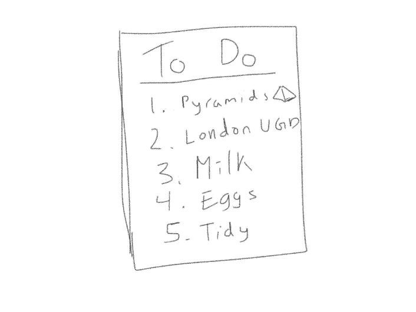
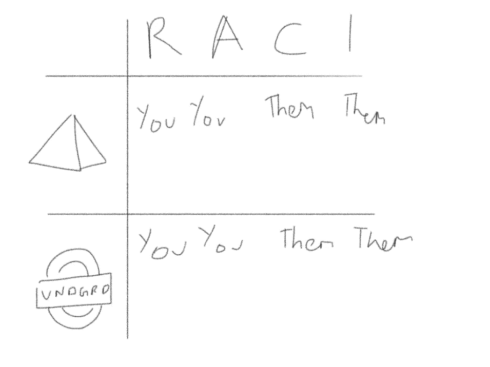
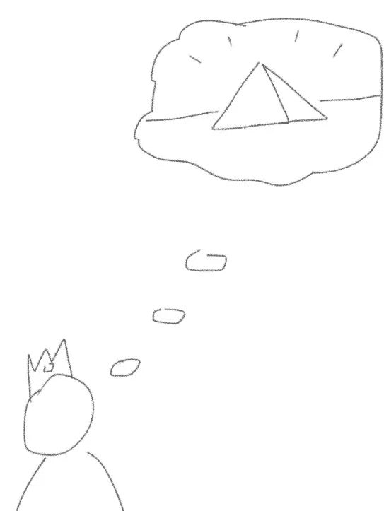
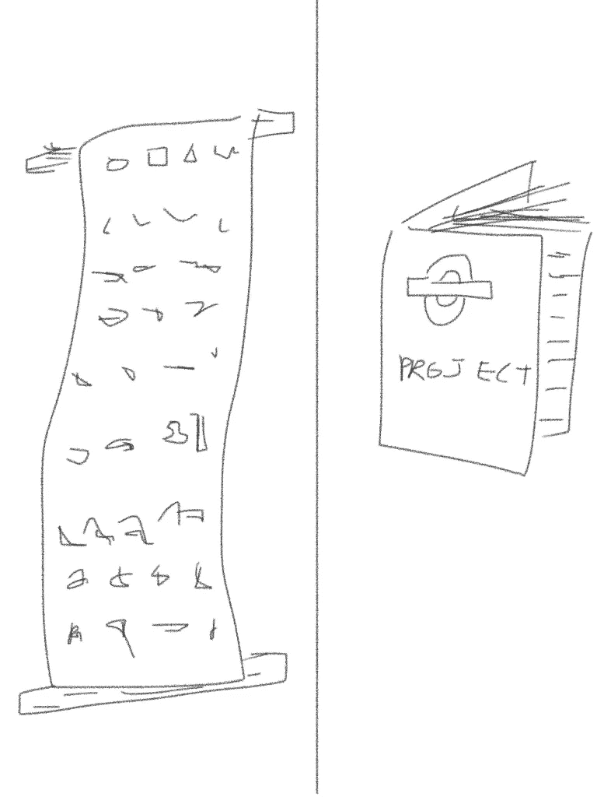
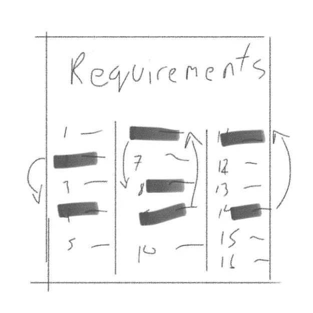
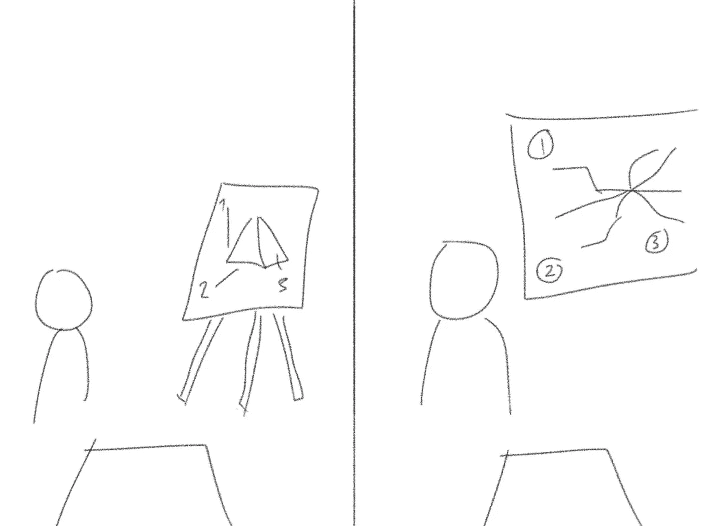
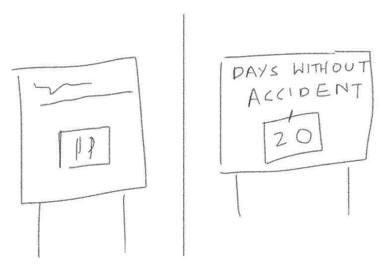
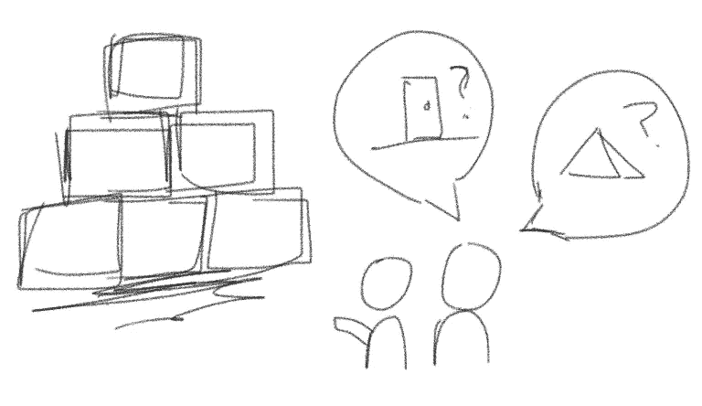
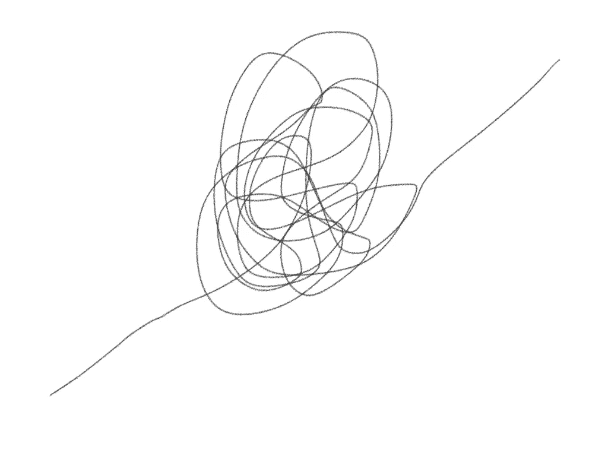

# 你会如何建造金字塔和伦敦地铁？

> 原文：<https://medium.com/hackernoon/how-would-you-build-the-pyramids-and-the-london-underground-39bd82a4cd74>

## 其中我们探索了项目管理和交付的方法。

祝贺你被提升了。你的新职位是时间旅行项目经理。你已经获得了时间旅行的许可，现在你是时间旅行项目经理委员会的成员。

这是一个令人垂涎的角色，作为对新成员的测试，董事会给了你两个项目。同时建造金字塔和伦敦地铁*。当然，时间在两者之间穿梭。*

**

*在历史的负责任的、负责任的、咨询的和知情的图表(RACI)中，你现在对这些奇迹的正确和及时的交付负有责任和义务。*

*澄清一下，不是你亲自建立他们，而是你将管理的团队。在线的是你的时间旅行的新执照，项目的历史重要性和你的角色的地位。*

*当然，你可能已经最清楚了，但是让我们想想你可能需要如何着手这项任务。*

## *步骤 1 —需求阶段。*

**在这种情况下，我们明白要交付什么，我们就需要明白我们需要交付什么。**

*这个阶段将关键人物引入我们的项目。我们将他们称为利益相关者。你在这里所追求的本质上是弄清楚一些关键的谁、什么、在哪里、什么时候和为什么的问题。*

*谁将会使用它？*完成后是什么样子的*？*会在哪里*呢？你什么时候期待这个？*为什么*想要？最后一个问题理解起来特别重要，因为它是你为什么要建造东西的指导动机。*

*我们的利益相关者可以分为各种类别，他们也将坐在我们的 RACI。在我们的场景中，他们将会受到我们创造的东西的影响，并最终使用我们创造的东西。我们要和他们谈谈，看看他们想建什么。*

**

*回到埃及，你会遇到你最大的股东，大老板，法老。*

*他的绝对授权意味着我们可以把时间集中在他身上。在一周的时间里，你在纸莎草纸项目计划上记录了他对你的许多问题的回答。*

*从你们的对话中，很明显法老是在为自己寻找古典形状的金字塔。他不担心它是用什么石头建造的，但重要的是，它需要在几英里外俯瞰尼罗河，并在 5 年内建成，以纪念个人周年纪念日。最终，这将是他前往冥界之前的安息之地。*

*一个决定性的和强大的利益相关者概述了他们对金字塔的期望和要求。*

**

*离开你的埃及服装，换上更现代的服装，你及时赶到伦敦参加地下工程。在这里，您的需求的涉众的数量已经显著增加。*

*对于项目的成功，这些利益相关者中的一些将比其他人拥有更高的优先级。因此，你的邀请和会议将不得不有所不同。他们包括市长、企业、通勤者、学生、游客、政府部长、房主、宠物、工程师等等。*

*你从所有这些利益相关者那里收集的名单很长。可能包含从座椅舒适度到停靠位置到隧道形状的项目。与风险承担者类似，一些需求比其他需求更优先处理。*

*从这些会议中，我们可以对我们将要构建的内容有一个总体的想法；一个高效的地下交通系统。然而，伦敦的基础设施、人口和它所使用的技术正在继续快速变化。这种变化将会通过改变你需求的优先级和不断产生新的需求而给你带来压力。*

*这是我们将在下一阶段解决的问题。*

## *第二步——计划。*

*在这个过程中，我们用我们所知道的来创建一个我们将要做的计划。*

*我们已经完成了需求收集，它看起来像一个奇怪的列表。用象形文字和英语写的。*

*应该明确的是，每个项目都不一样。要实现每一个目标，你都需要一个量身定制的计划，把这些话变成现实。为了做到这一点，你可以将你的过程分成细化、评估、计划和展示。*

*这是一个棘手的阶段，因为它需要你考虑时间、成本、技术可行性、利益相关者的个性以及对所有其他需求的依赖性等因素。同样重要的是，我们要做好这一点，因为这将为您项目的其余部分定下基调和节奏。*

**

*我们首先从细化开始；因为收集的需求可能是好的，但它们还可以更好。*

*例如，您需要删除隐藏的副本，澄清冲突的副本，收集其他需求的更多细节和可行性。你还需要不断地以你的利益相关者想要的方式提炼它们。还记得为什么的问题吗？*

*细化之后，我们需要将这些需求分解成清晰的任务集和估计时间。*

*例如，对于金字塔项目，两个星期可以分成几个任务，比如雕刻一块石头，然后将石块推到合适的位置。对于地铁来说，可能需要 2 个月的时间来完成具体的任务，如挖掘、加固和铺设隧道轨道。*

**

*一旦对活动的估计到位，我们就需要将它们安排到时间表中。这是为了让每个人都知道什么时候应该完成某些任务，这也是两个项目中特别有趣的地方。*

*金字塔有一个单一的完成点和一组静态的需求。项目的一般固定性质允许你的计划的方法是一步一步的过程。每个阶段由他们的主题专家处理。例如，石雕工人先开始雕刻，然后交给运输工人，运输工人再交给搬运工人等等。这个项目可以按照合理的时间表逐步完成。*

*正如我们之前发现的那样，伦敦地铁的需求不断变化。这是由于城市的发展、技术的变化和人们的需求。*

*这个项目不断变化的状态需要一个计划来让你对这种变化做出反应。为此，您可能同意您需要一定的敏捷性。*

*一个[敏捷](https://hackernoon.com/tagged/agile)计划之所以不同，主要是因为它应该持续地将你的注意力集中在最重要的任务上，也就是当时的价值所在。它还具有额外的组件，如自组织团队、混合移交和封闭工作区。*

*作为一个示例设置，您所有的细化需求都将被放在 [backlog](https://hackernoon.com/tagged/backlog) 中。这是将要建造的所有东西的仓库。这是由我们称之为产品所有者的人控制的。顾名思义，他们应该完全拥有正在开发的产品。这意味着他们对将建造什么、何时建造以及*是否完成建造有最终决定权。**

**

*核心开发团队可以由多种技能组成。这可能是建筑师，工程师，开发人员，沟通者和一个领导。每个团队成员都有自己的专业领域和职责，而领导有责任促进团队合作。*

*任务是从待办事项列表中提供给团队的，在任何给定的时间，根据最高值的位置，这些任务会发生变化。例如，奥运会即将到来，因此关注优先站点的基础设施就变得非常重要。*

*这种适应的灵活性是我们在这个项目中使用它的原因。关于这些团队如何沟通和进步，还有其他的方法，但是这里是一个核心过程。*

*尽管这两个计划是不同的，但都需要有一组里程碑、缓解能力和测试交付版本的时间。这些都还是日程安排的一部分。*

*里程碑是衡量进展的重要工具。如果你错过了几个里程碑的日期，那么很明显你的项目落后于计划，所以你需要减少缓解时间。另一方面，如果你的里程碑很快实现，你就领先了，所以你可以节省缓解时间。*

*最终你会移交你所建立的东西，所以你需要时间来测试你所交付的东西。如果您发现故障，我们将使用您的缓解时间来修复它们。*

*我们现在需要做的就是与你的利益相关者的愿景达成一致，以进入你的下一个阶段。因为确保你们双方在将要做什么和什么时候做上保持一致是达成一致的关键。*

**

*所以，你要准备好你最好的埃及语和你最好的演讲。记住，提出具有远见和清晰的计划是很重要的，尤其是当你的利益相关者在你获得批准之前很可能会有一些修改。*

*总的来说，在规划阶段结束时，我们现在有了一组细化的需求，一个为每个项目定制的预定计划，以及一组里程碑和缓解时间。*

*我们在这方面投入了大量时间，所以我们需要通过让它可见来收获它的价值，而不是在我们前进的过程中忽视它。*

## *第三步——控制和跟踪项目。*

*我们在其中建造东西并追踪我们做得如何。*

*是时候开始了，你及时旅行到金字塔的建造地点；一大片阳光普照、尘土飞扬的平原。接下来你时间旅行到伦敦一个下雨的建筑工地。各队开始动员起来。所以现在我们将使用我们的计划来指导他们做什么以及什么时候发生。*

*这是你在埃及和伦敦之间旅行时间最多的时刻。你这样做是因为作为项目负责人，你想要反复检查项目的健康状况，直到项目完成。有几种不同的工具可以用来做这件事。这些范围从每周状态报告，到交付指标，到简单地与您的不同团队交谈。*

*无论你选择哪一个，你都需要用其中的一部分向法老和伦敦地铁利益相关者更新你的进度。您已经让他们参与到整个项目中，从需求开始，介绍您的计划，现在您需要创建一种方法来持续地分享您的进展。*

*这不仅仅是一种礼貌，它对项目的成功和最终移交至关重要。在整个过程中向利益相关者报告并让他们参与进来是非常重要的，这样在最终的交付中就不会出现意外。*

*您之前创建的里程碑将是跟踪您的进度的特别有用的指南。*

**

*在项目开始时，你还需要在项目进展太快之前，密切关注关键的设置。比如巩固团队结构、明确职责以及定义团队中的信息流。*

*尽早解决这个问题是很重要的，因为你的团队的经验会随着他们的工作而增长，你需要在行为变得根深蒂固之前确保它以正确的方式增长。*

*此时，项目领导可以做的最重要的事情之一就是设定项目的文化。像一个小公司一样，信任、尊重、开放的价值观是受欢迎的，但这将来自于以这种方式行事的领导者。如果事情出了问题，那么培养正确的文化来纠正它是一个很好的步骤。*

*工作仍在继续。一些部分出错，另一些部分继续。你时间旅行来回评估，支持和指导。*

*最终，一旦你建立了流程，你需要信任你的团队和你自己来交付。*

## *步骤 4 —测试*

*在这个过程中，我们要确保我们建造的东西是好的。*

*你在最后阶段所处的尘土飞扬的平原现在有了一个非常大的金字塔状的结构。伦敦已经开始在地下运行火车。*

*最终你将不得不交出你所创造的东西。所以，你需要确保这样做是可以的。我们毕竟不想要一个愤怒的法老。*

*这个检查阶段可能涉及多种类型的测试，包括涉众和不涉众。这个阶段重要的不仅仅是确保事情正常运行，而是根据最初商定的需求重新评估它们。*

*在这个过程中，你可能会发现各种各样的问题，比如火车上没有足够的座位，或者金字塔天花板的形状不够宏伟。即使在最完美的项目中，也总会有错误需要修正。*

**

*所有这些都没问题，因为我们已经在规划阶段设置了缓解时间，特别是针对这样的场景。所以，在移交之前，你需要利用我们留出的时间做一些事情。*

## *第五步——成功！*

**我们参加发布会，思考如何改进。**

*时间旅行项目经理委员会批准你建造了两个非常独特的令人惊奇的东西。不仅仅是在架构方面，而是在他们为涉众交付了什么和将要做什么方面。以下两个你的项目发布会都很棒。*

*庆祝过后，是时候反思并从你所做的改进中学习了。*

**

*回想起来，你开始收集需求，提炼它们，并根据你的项目规划它们，然后你遵循计划，测试你创造的东西，然后交付它。*

*从利益相关者的头脑中提取话语、梦想和想法并将其转化为现实并不容易。*

*然而，这些场景中有相当多的假设。例如，有足够的时间与利益相关者、决策者一起做决定、足够的预算、就优先顺序达成一致等等。准确估计一项给定的任务需要多长时间也不是一件简单的事情。尤其是当考虑到风险和对其他团队的依赖等因素时。即使是最完美的项目也可能会忽略影响您项目的新技术或其他外部影响。*

*最终，这些可以而且应该与你的利益相关者讨论。总的来说，制定一个计划，让他们参与进来并努力适应将永远是最好的做法。*

*在这些场景中，时间旅行的能力使得传递变得如此容易。然而，我们大多数人手头都没有这些能力。我们只能记住我们做过的事情，并将它们应用到未来的经历中。*

*毕竟，真正的技能来自于管理你所拥有的时间。所以，去建造伟大的东西吧。*

*非常感谢您对本文的任何形式的反馈。*

******

> *[黑客中午](http://bit.ly/Hackernoon)是黑客如何开始他们的下午。我们是 [@AMI](http://bit.ly/atAMIatAMI) 家庭的一员。我们现在[接受投稿](http://bit.ly/hackernoonsubmission)并乐意[讨论广告&赞助](mailto:partners@amipublications.com)机会。*
> 
> *如果你喜欢这个故事，我们推荐你阅读我们的[最新科技故事](http://bit.ly/hackernoonlatestt)和[趋势科技故事](https://hackernoon.com/trending)。直到下一次，不要把世界的现实想当然！*

**