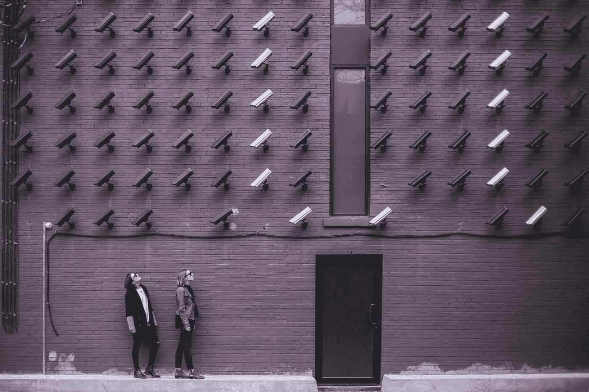

# 如何在网上识别(和跟踪)你

> 原文：<https://medium.com/hackernoon/how-you-are-identified-and-tracked-on-the-web-e9a9c1aa9b12>

By Matthew Henry from Unsplash.com

当谈到理解互联网的“邪恶霸主”如何跟踪我们时，我看到了很多误解。

作为一名开发人员，这是识别和跟踪独立用户的一些最常用方法的简要概述。

## IP 地址；网络地址

所有连接到互联网的东西都需要一个 IP 地址。您的笔记本电脑、Xbox、智能电视都有唯一的 IP 地址。尽管如此，在日常生活中，很少有设备拥有静态 IP 地址。也就是一个不变的 IP。

当你从 ISP(互联网服务提供商)如 Comcast 或 Google Fiber“租用”互联网时，你很可能只是租用 IP 地址。这意味着你的 IP 是动态的——它可能会改变。

因此，虽然 IP 地址是跟踪不经常更换 wifi 网络的设备的好方法，但在整体范围内，IP 地址本身在识别独特用户方面并不十分有效。

没有真正的方法来完全隐藏你的知识产权，不让那些需要获得它的人(权威人士)知道。也就是说，大多数大型网站没有[工具](https://hackernoon.com/tagged/tools)来做到这一点，因此如果你愿意，你可以做一些小事情来隐藏你的 IP。

1.  使用像 [Tor](https://www.torproject.org/) 这样的服务。
2.  VPN —使用 VPN 可以屏蔽地理位置信息，但是通过每次访问网站时使用相同的 IP(VPN 的 IP ),您不会阻止他们通过该 IP 地址识别您。
3.  代理人

如果你想进一步研究这些隐藏 IP 地址的方法，我建议你阅读这篇[如何极客文章](http://www.howtogeek.com/247190/whats-the-difference-between-a-vpn-and-a-proxy/)。

## 指纹

你的指纹在网上也被称为你的浏览器指纹。它是特定浏览器上许多配置和设置的组合，试图将您的浏览器标识为独一无二的。

这到底是什么意思？假设我们把你的浏览器版本:Chrome 55，操作系统版本 MacOS 12.2.2，浏览器中的字体，等等…都散列在一起。这将有 84%的可能性为你的浏览器创建一个完全独一无二的指纹，如果你使用 Flash 或 Java，这个可能性会更大(94%)。如果你同时使用火狐和 Chrome，那就是两个独特的指纹。手机浏览器也将拥有独一无二的指纹。

虽然指纹识别本身是有用的，但与其他因素结合起来时，它会变得更加强大。相似的 IP 地址，相同的浏览器指纹？网站可以很有把握地猜测该会话来自您的某个已识别设备。

没有什么办法可以防止你的浏览器出现指纹。有些东西可以被禁用，这降低了拥有唯一指纹的百分比，但在大多数情况下，很难对抗它。

如果你想知道你的浏览器是否独一无二，那就去看看 AmIUnique.org 吧。

## 饼干

Cookies 是存储在浏览器中的信息片段。网站会为您创建一个 cookie，其中包含某些信息，以便在您返回网站时识别您的身份。Cookies 是持久的，所以除非你特别删除它们，否则它们很可能会在浏览器关闭时一直存在。

使用隐私浏览，如 Chrome 匿名模式，可以防止 cookies 存储在您的会话中。您也可以从浏览器中删除 cookies。

关于删除或阻止使用 cookies 的更多信息，我推荐 [SaferVPN 的文章](https://www.safervpn.com/blog/tracking-cookies/)。

## 登录

每次你登录一个服务或授权访问一个服务，你就允许他们更有效地跟踪你。就在今年，谷歌加入了脸书的 T4，在不同的网站上通过名字追踪你。

尽管“注册脸书/推特/谷歌”让注册新服务变得非常容易，但这是有代价的。每次你这样做的时候，你都允许该服务访问你的一定数量的信息，也允许脸书/推特/谷歌访问更多关于你的跟踪信息。

如果你真的关心你的隐私，知道你注册了什么，用什么登录应该是最重要的。

# 我应该保护自己不被网站跟踪吗？

这是一个有趣的问题。对许多人来说，这是个人隐私问题。他们不希望网站知道他们是谁或他们的信息，并出售给其他人。虽然这绝对是一件值得注意的重要事情，但看到用户跟踪的另一面也很有趣。

我试图识别回到我的应用程序的用户，这样我就可以让他们更容易使用我的应用程序。如果我有 99.99%的把握知道你就是我想的那个人，那么我不会浪费你的时间去做额外的安全措施，比如一次性密码。我会让你的权利，使你的经验更加愉快。

用户追踪并没有那么糟糕。当您需要在不放弃某些安全措施的情况下提高 UX 时，它是一个重要的实施工具。

延伸阅读:

*   [隐私浏览的工作原理](http://www.howtogeek.com/117776/htg-explains-how-private-browsing-works-and-why-it-doesnt-offer-complete-privacy/)

*原载于 2016 年 12 月 7 日*[*【blog.seankilgarriff.com*](https://blog.seankilgarriff.com/how-internet-user-tracking-works-and-how-it-doesnt-2/)*。*

[*提交修正*](https://github.com/Skilgarriff/Blog-Posts) *。*

> [黑客中午](http://bit.ly/Hackernoon)是黑客如何开始他们的下午。我们是 AMI 家庭的一员。我们现在[接受投稿](http://bit.ly/hackernoonsubmission)并乐意[讨论广告&赞助](mailto:partners@amipublications.com)机会。
> 
> 如果你喜欢这个故事，我们推荐你阅读我们的[最新科技故事](http://bit.ly/hackernoonlatestt)和[趋势科技故事](https://hackernoon.com/trending)。直到下一次，不要把世界的现实想当然！

