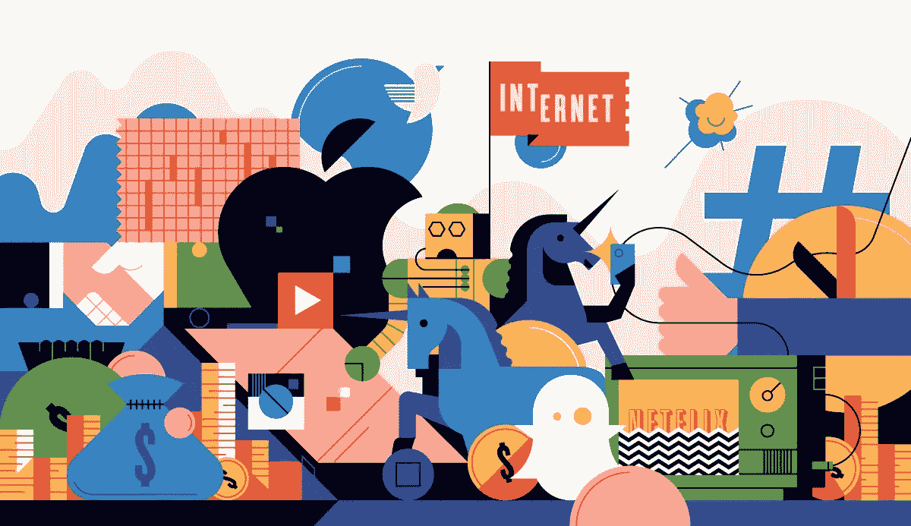

# 在下一个脸书，你如何将零钱变成所有权

> 原文：<https://medium.com/hackernoon/how-you-could-turn-pocket-change-into-ownership-in-the-next-facebook-2391503ccc2d>

## 为什么让你的钱为你工作如此有意义

# 有没有比你的银行更不喜欢的公司？

## 有什么业务你用的很频繁，但提供给你的却很少？

我鄙视银行。他们什么也没为我做。他们也许是世界上最大的真相仲裁者——然而没有一个行业如此不透明。没有哪家企业给我们带来过如此多的痛苦——然而它们依然如故。技术革命甚至彻底改变了最传统的行业——出租车行业(优步)和货运行业(flexport)——然而银行的运营仍然对我们不利。不再有了。

# 银行每天都在欺骗我们

肥猫们高高地坐在他们的玻璃办公室里吃着奶油，而我们的财富却因储蓄利息支付不足而被窃取。我们忍受着他们强加的钟摆的摆动，这是由于 2008 年的最终崩溃，这是由于他们无法控制自己的行为。

# 为什么我们继续让他们逍遥法外？

部分原因是缺乏选择。我们觉得银行是我们社会结构中不可或缺的一部分，我们无法想象有什么替代物可以取代它。银行之所以是这样，是因为它们一直都是这样。最大的危险莫过于随之而来的自满。

## 我正在解决一个困扰很多人的大问题

每个月你的活期账户里有多少钱几乎没有利息回报？如果你和我交谈过的 1000 人中的任何一个一样，那就太多了。我们都希望有一种安全、可靠且简单的方式来增加我们的财富。

我寻求创建的是世界上最大的投资基金，拥有最多样化的投资伙伴，从成千上万个人的活期账户中获得资金。作为回报，你将获得期货最大公司的部分所有权，以换取你账户上的利息。这让你毫无风险地获得所有权。

# 回到未来——你的钱为你工作

一切事物的未来都在人群中——通过分布式网络和区块链实现前所未有的协作。独自一人我们很脆弱，团结在一起我们很强大。这在互联网上再正确不过了。这是我们正在开发的银行的基础。我们的论点是，来自最多样化背景的成千上万的用户可以集合起来成为世界上最有用、最有洞察力和最成功的网络。Anarch 旨在将成千上万的个人聚集在一起，成为世界上最具创新性的投资基金的合伙人。要参加，你所要做的就是开一个账户。这样做后，你账户里的钱开始为你工作。

# 如何获得所投资创业公司的所有权

*   把钱存入我们的银行账户，你可以把它作为活期账户
*   等待 30 天
*   赚取加密令牌=您在整个平台上节省的%
*   你现在拥有该基金的 10%，并从投资组合中的所有公司获利

## 就这么简单，最棒的是没有风险

用于投资的钱是从所有账户中持有的钱的利息累计而来的。你存的钱仍然是你的，永远不会减少。你可以随时提取或花掉它。

# 你账户里的钱仍然是完全流动的

无论何时你需要它，它都是可访问的。你可以把它作为标准的活期账户，也可以用于日常开支。您累积的代币金额等于您在该日历月的账户金额。如果你账户里的金额增加，下个月底你会收到更多的代币。只要您的帐户中还有钱，您将继续收到代币，从而获得更多所有权。

## 为什么创业公司会选择 Anarch 而不是传统的风险基金？

由于我们能够施加的影响显著增加，这种独特的产品激励创业公司作为投资者与我们合作，而不是与其他基金合作。每家公司都有机会接触到一个庞大的积极参与的传道者网络，他们从自己的成功中直接受益——这个人可能就是你。每个人都可以因为参与而获得奖励——在社交媒体上分享帖子，去超市订购产品，分享自己的主屏幕截图——代币相当于基金所有权的一小部分%。你可以帮助你投资的公司，为自己赚更多的钱，初创公司可以得到更便宜的营销和支持。

## 你越早加入，你将获得越多的硬币

你每个月越早开始使用这个账户，你就能获得越多的硬币，使你有权在我们投资的公司中拥有更高份额的所有权。拥有账户的人越少，意味着你将能够获得每月铸造的硬币的更高份额，相比之下，以后每个月在他们的账户中拥有相同数量的人。

# 发展路线图以你为中心

人民是无政府主义的中心。银行目前掌握着你每月支付多少服务费的所有数据。他们也有其他人的数据。任何一家银行都可以获得这些数据，将其与所有其他客户进行比较，并告诉你相对于其他人支付的费用，你可以节省多少。他们都不知道。无政府意志。我们所有的数据都是你的。这给了你谈判的权力，在你支付太多的地方降低成本。

## 在此基础上，我们将开发出一种能自动完成这一任务的产品

仅仅通过在无政府账户里存钱，你就可以存钱。将您的帐户转移到我们这里，如果您每月支付/$90 的电视订阅费，我们将自动协商，将其降至平台上实现的最低成本。想象一下你所有的经常性开支。

# 这是每家银行都有能力为你做的事情

我们是唯一一家愿意将权力交还给消费者的公司。

## 我们会让你从历史上最具创业精神的时期获利

凭你自己的力量，你不可能成为脸书的首批投资者之一。这种模式不仅提供了一种可能性，它还激励那些将彻底改变世界未来的初创企业直接从 Anarch 寻求投资。你可以成为地球上最强大的网络的一部分，只要做一些你已经做过的事情。把钱留在银行账户里。

# 加入已经在等候名单上的 8000 个人！

 [## 无政府银行

### Anarch 给你在赚钱的同时改变世界的力量。利率很可怕；我们的模型奖励你…

mailchi.mp](https://mailchi.mp/9f92f5e60c64/anarch-bank)