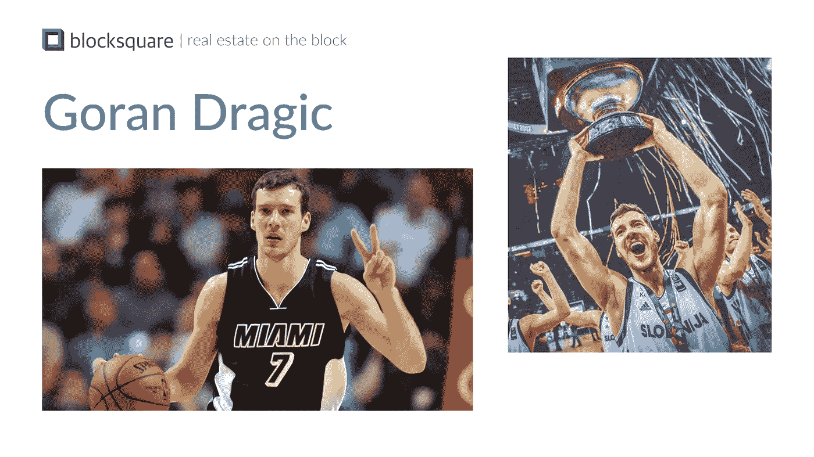
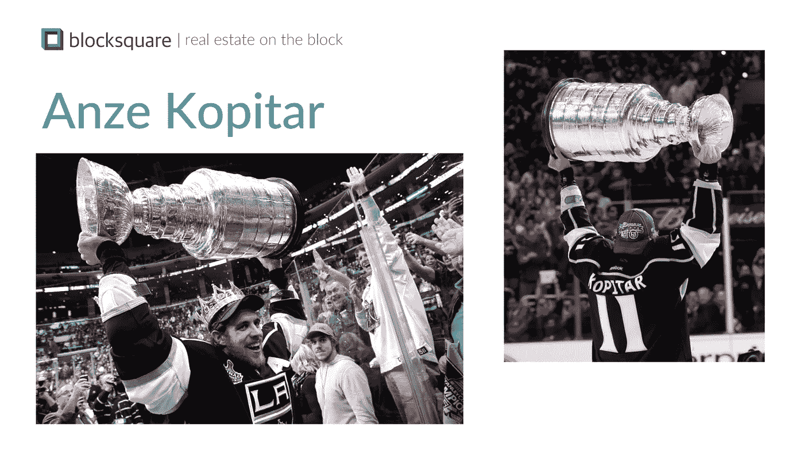

# 你的国家的世界级运动员如何帮助你的创业

> 原文：<https://medium.com/hackernoon/how-your-countrys-world-class-athletes-can-help-your-startup-7c75a30ddd87>

> 这不是一篇关于如何通过这样做来销售更多产品的营销文章。这只是我最近想分享的个人经历。希望它能帮助任何人。

摘月亮的人一直激励着我。我一直非常尊重任何取得世界级成绩的人。不管他们做什么？为了达到伟大，你需要专注。专注需要时间，时间越少，就不可避免地会从你的朋友和家人那里夺走时间。这是伟大的人决定在某个时间点做出的牺牲，因为他们知道他们有能力突破极限。这就是为什么我们渴望成为体育明星。他们牺牲时间来测试人类的极限。

当我还是个孩子的时候，我训练高山滑雪。直到我辞职为我的大学教育腾出空间，我的教练总是要求我突破自己的界限，我会反驳说我做到了。我深信我一直都在尽全力。直到我真的做到了。然后我才明白*追求*的真正含义。这是一种完全不同的心态。你的身体以不同的速度振动。你的眼睛看得更清楚。你的耳朵听得更远。你活在当下，但感知未来。许多人一生中能达到一次，有些人甚至不止一次，但只有少数人能持续更长时间。

发展一家[创业公司](https://hackernoon.com/tagged/startup)需要同样的关注。你需要每天挑战自己的极限。你需要尝试和失败。每天。你需要对此保持明智。你需要利用你所拥有的，用它来建设[的未来](https://hackernoon.com/tagged/future)。你的个人故事就是这样一件事。您从哪里来？你的背景是什么？我来自斯洛文尼亚，前南斯拉夫小国，与意大利、奥地利、克罗地亚、匈牙利接壤，总人口 200 万。想象一下，这会给纽约会议上的人们留下怎样的印象…

那么你如何展示自己呢？

事实证明，我们有一些了不起的运动员非常成功，不仅在美国，而且在全球都是如此！

当斯洛文尼亚赢得第一届欧洲篮球锦标赛时，迈阿密热火队的戈兰·德拉季奇刚刚被选为最有价值球员

Miami Heat’s Goran Dragić was just [named MVP as Slovenia won the 1st European basketball championship](http://kwese.espn.com/nba/story/_/id/20738281/slovenia-wins-first-european-basketball-championship-mvp-goran-dragic)

以及洛杉矶国王队队长[安泽·科皮塔，他在 2012 年和 2014 年随国王队赢得了斯坦利杯冠军](https://en.wikipedia.org/wiki/Anže_Kopitar)，两次都在季后赛中领先。安泽·科皮塔[把斯坦利杯带到了它从未去过的地方——斯洛维尼亚。](http://nationalpost.com/sports/hockey/nhl/anze-kopitar-taking-the-stanley-cup-where-it-has-never-been-before)

Anze Kopitar [took the Stanley Cup where it has never been before — to Slovenia.](http://nationalpost.com/sports/hockey/nhl/anze-kopitar-taking-the-stanley-cup-where-it-has-never-been-before)

**所以** [**维克多**](https://medium.com/u/aea0be671b96?source=post_page-----7c75a30ddd87--------------------------------) **我和我决定在这些全能的体育明星的帮助下展示我们自己和我们的创业公司**[**block square . io**](http://www.blocksquare.io)**。观众中的每个人都知道这些家伙！他们可能不知道他们来自斯洛文尼亚，他们很可能不知道如何在地图上找到我们的国家，但他们知道这些人有能力实现伟大。这立即定下了基调——我们现在是来自一个国家的人，这个国家培养了一些了不起的人，他们渴望成为明星。**

然后，我们通过展示我们著名的斯洛文尼亚人阵容中的最新明星——美国第一夫人梅兰妮·特朗普夫人，结束了简短的*我们来自哪里*的介绍。

[How Far Can You Go With English? Just Ask Melania Trump](https://www.usnews.com/news/world/articles/2017-09-15/how-far-can-you-go-with-english-just-ask-melania-trump)

不幸的是，只有 5 分钟的时间来介绍，我们不得不跳过*她的*著名视频，但我强烈希望与会者至少没有听过我的*演讲*。

人们确实会有所作为。

因此，无论你来自哪里，通过向他人展示谁是你成功的同胞来展现你自己。

记住，他们曾经处于和你现在一样的情况，但是他们克服了。

他们突破了限制，让所有的追随者更容易接受。

只有你的头脑能给你能去的地方设定界限。不是你的护照。

*我是*[*block square*](http://www.blocksquare.io)*的联合创始人，我们正在这里拓展房地产的界限。*

*想象一下* [*街区广场*](http://blocksquare.io) *作为商业房地产的* [*以太坊*](https://medium.com/u/d626b3859bc9?source=post_page-----7c75a30ddd87--------------------------------) *，在这里，不是企业家做 ico，房地产专业人士可以出售象征性的商业地产，然后你可以根据分散交易协议进行购买和交易。通过释放流动性溢价的价值，Blocksquare 承诺未来房地产投资对任何人、任何地方开放。*