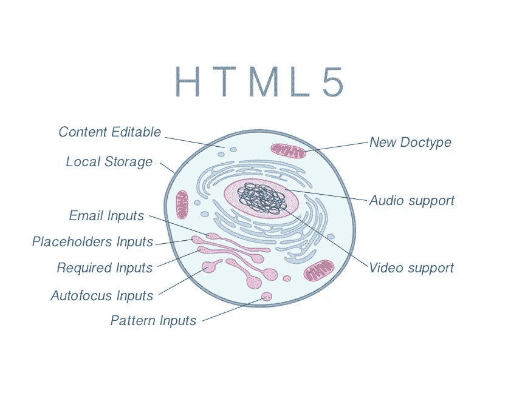
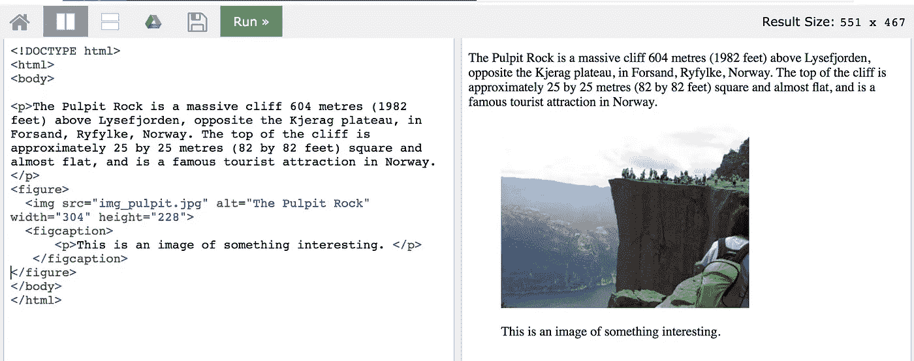
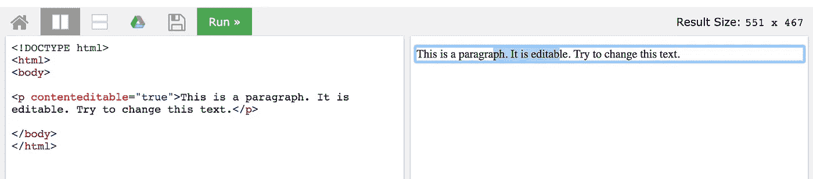
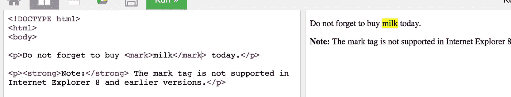
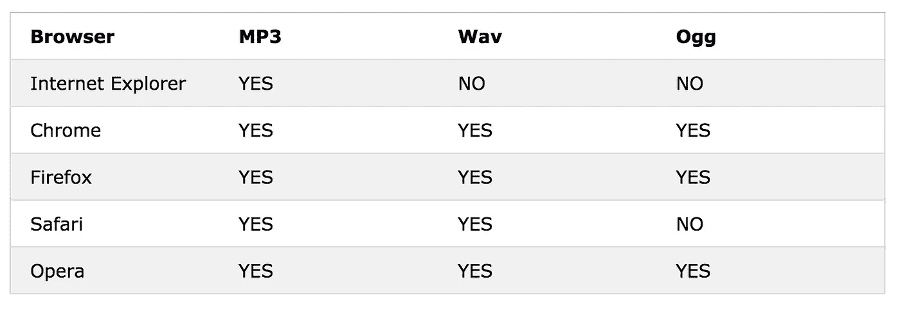
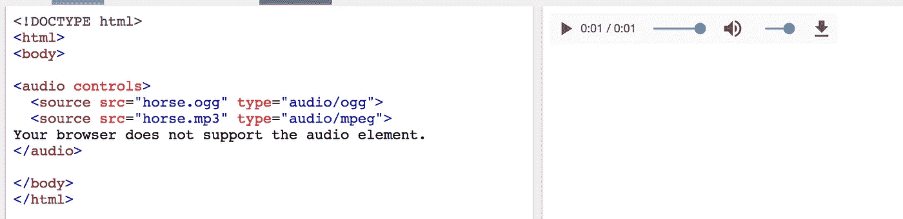
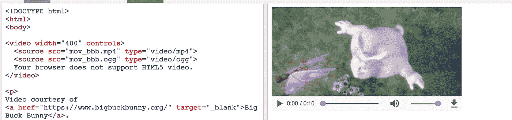
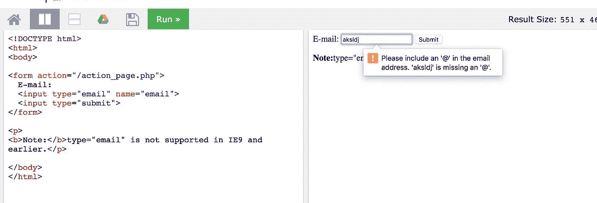
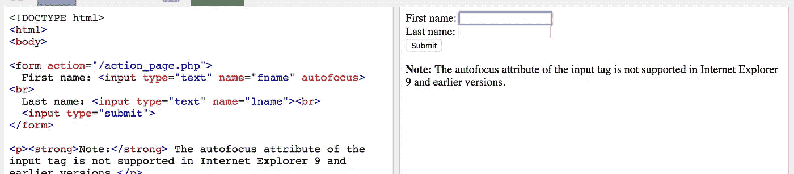
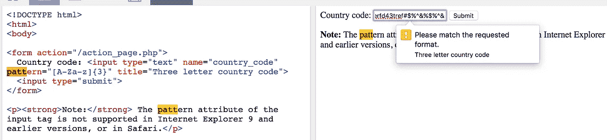

# [HTML5]回顾:好的部分

> 原文：<https://medium.com/hackernoon/html5-tutorial-for-beginners-examples-features-list-review-901f3aea2386>



> 这是最初来自[杰弗里](https://code.tutsplus.com/tutorials/28-html5-features-tips-and-techniques-you-must-know--net-13520)、[露西](https://webdesignerhut.com/top-15-features-of-html5-that-every-developer-must-know/)和 [w3s](https://www.w3schools.com) 的文章的注释，并摘录了对我有启发的部分。

我最近花了很多时间和精力来掌握前端技术，我想说前端发展如此之快，每隔几个月就会出现新的框架和标准。听起来很难捕捉并成为一个前端大师，但这不是真的，可能动物王国，它是多样化的，有这么多不同物种的研究，或一个物种的不同行为。但是动物体内有两个永久的核心，像细胞。而且我可以说 HTML，CSS，Javascript，HTTP 请求是网站的细胞。

许多长寿的网站，10、20 岁的，既支持过时的浏览器给忠诚用户，又支持最新手机上的浏览器给潮人用户，支持跨浏览器和老浏览器一直是 web 开发中的两大难题，没有什么灵丹妙药。

理解 HTML5 就是理解网站的细胞，它使一个有机的网络能够说话、移动、与人互动。

# 内容:

1.  新文档类型
2.  图形元素
3.  脚本和链接不再需要`Types`
4.  带“引号”的灵活性
5.  内容可编辑
6.  标记元素
7.  音频支持
8.  视频支持
9.  局部存储器
10.  [输入]电子邮件类型
11.  [输入]占位符属性
12.  [输入]必需属性
13.  [输入]自动对焦属性
14.  [输入]自动对焦属性

## 1.新文档类型([来自](https://code.tutsplus.com/tutorials/28-html5-features-tips-and-techniques-you-must-know--net-13520))

还在使用那个讨厌的、难以记忆的 XHTML 文档类型吗？

```
<!DOCTYPE html PUBLIC "-//W3C//DTD XHTML 1.0 Transitional//EN"
    "[http://www.w3.org/TR/xhtml1/DTD/xhtml1-transitional.dtd](http://www.w3.org/TR/xhtml1/DTD/xhtml1-transitional.dtd)">
```

如果有，为什么？切换到新的 HTML5 文档类型。道格拉斯·奎德可能会说，你会活得更久。

```
<!**DOCTYPE** html>
```

## 2.图形元素

HTML5 提供了新的 **<图>** 和 **<图标题>** 元素，有效地将 ***的内容与其祖先的结构隔离开来。图内的任何内容都不会影响图外的文档轮廓。***

```
<**figure**><**img** src="path/to/image" alt="About image" /><**figcaption**><**p**>This is an image of something interesting. </**p**></**figcaption**></**figure**>
```



## 3.脚本和链接不再需要`Types`

您可能还会将`type`属性添加到您的`link`和`script`标签中。

```
<**link** rel="stylesheet" href="path/to/stylesheet.css" type="text/css" /><**script** type="text/javascript" src="path/to/script.js"></**script**>
```

这意味着这两个标签都与样式表和脚本有关**。**

```
<**link** rel="stylesheet" href="path/to/stylesheet.css" /><**script** src="path/to/script.js"></**script**>
```

## 4.带“引号”的灵活性

不管你是否想用引号结束你的元素。

```
<p class=**myClass** id=**someId**> Start the reactor. </p>
```

## 5.内容可编辑

名为 contenteditable 的新属性使用户能够编辑元素中包含的任何文本。

([例 w3s](https://www.w3schools.com/tags/tryit.asp?filename=tryhtml5_global_contenteditable)

```
<ul contenteditable=true>
```



## 6.标记元素

如果你想突出显示部分文本，使用标签。

```
<p>Do not forget to buy <mark>milk</mark> today.</p>
```



## 7.音频支持

我们不再需要依赖第三方插件来渲染音频(比如 flash)。

HTML5元素指定了在网页中嵌入音频的标准方式。在 HTML5 中，有 3 种支持的音频格式: **MP3、Wav 和 Ogg** 。



[https://www.w3schools.com/html/html5_audio.asp](https://www.w3schools.com/html/html5_audio.asp)

```
<audio controls>
  <source src="horse.ogg" type="audio/ogg">
  <source src="horse.mp3" type="audio/mpeg">
Your browser does not support the audio element.
</audio>
```

([例 w3s](https://www.w3schools.com/html/tryit.asp?filename=tryhtml5_audio_all) )



## 8.视频支持

很像`<audio>`元素，在 HTML5 之前，视频只能在有插件(像 flash)的浏览器中播放。

HTML5 元素指定了在网页中嵌入视频的标准方式。不过， **Safari** 和 **IE9** 将接受 **H.264** 格式的 HTML5 视频，而 **Firefox** 和 **Opera** 则接受 **Theora** 和 **Vorbis** 格式。并且， **Chrome** 将展示以**MP4 和 Ogg 格式编码的视频。**

```
<video width="400" controls>
  <source src="mov_bbb.mp4" type="video/mp4">
  <source src="mov_bbb.ogg" type="video/ogg">
  Your browser does not support HTML5 video.
</video>
```

([例 w3s](https://www.w3schools.com/html/tryit.asp?filename=tryhtml5_video) )



## 9.局部存储器

使用本地存储，web 应用程序可以在用户的浏览器中本地存储数据。

B 在 HTML5 之前，应用数据必须存储在**cookie**中，包含在**每个服务器请求**中。本地存储更加安全，大量数据可以存储在本地，而不会影响网站性能。

与 cookies 不同，存储限制**要大得多(至少 5MB)** ，而且信息永远不会传输到服务器。

本地存储根据**来源** ( **根据域和协议**)。来自同一个源的所有页面可以存储和访问相同的数据。

```
if (typeof(Storage) !== "undefined") {
   localStorage.setItem("lastname", "Smith");
   localStorage.getItem("lastname");
}
```

([例 w3s](https://www.w3schools.com/html/tryit.asp?filename=tryhtml5_webstorage_local) )

## 10.电子邮件输入属性

如果我们将“email”的`type`应用于表单输入，我们可以指示浏览器*仅*允许符合有效电子邮件地址结构的字符串。

```
<form action="/action_page.php">
  E-mail:
  <input type="email" name="email">
  <input type="submit">
</form>
```

([例 w3s](https://www.w3schools.com/html/tryit.asp?filename=tryhtml_input_email) )



## 11.占位符属性

占位符文本是一种提示文本，当表单域没有焦点时，它会显示在表单域中。

早些时候，开发人员**不得不使用 JavaScript 为文本框构建占位符**。但是现在您不需要为此使用 JS，因为 HTML5 引入了占位符属性，该属性将显示字段中的文本，直到字段被聚焦。

```
<input name="email" type="email" placeholder="[xyx@abc.com](mailto:xyx@abc.com)" />
```

## 12.必需属性

必需的属性是一个**布尔**属性，它决定了在最终提交表单之前是否填写输入字段。

```
<input type="text" name="someInput" required>
```

或者

```
<input type="text" name="someInput" required="required">
```

## 13.自动聚焦属性

autofocus 是 HTML5 中的一个新属性，用于指定输入元素在页面加载时自动获得焦点。

```
<form action="/action_page.php">
  First name: <input type="text" name="fname" **autofocus**><br>
  Last name: <input type="text" name="lname"><br>
  <input type="submit">
</form>
```

([例 w3s](https://www.w3schools.com/TAgs/tryit.asp?filename=tryhtml5_input_autofocus) )



## 14.模式输入

早先，开发人员必须使用一个 JavaScript 并且很难快速编写一个正则表达式。Pattern 属性，它使向标记中添加正则表达式变得容易。

```
<input type="text"
       name="username"
       id="username"
       placeholder="4 <> 10"
      ** pattern="[A-Za-z]{4,10}"**
       autofocus
       required>
```

([例 w3s](https://www.w3schools.com/tags/tryit.asp?filename=tryhtml5_input_pattern) )



## 参考:

[https://code . tuts plus . com/tutorials/28-html 5-features-tips-and-techniques-you-must-know-net-13520](https://code.tutsplus.com/tutorials/28-html5-features-tips-and-techniques-you-must-know--net-13520)

[https://web design . tuts plus . com/tutorials/quick-tip-consider-wrapping-your-code-with-a-figure-element-CMS-21646](https://webdesign.tutsplus.com/tutorials/quick-tip-consider-wrapping-your-code-with-a-figure-element--cms-21646)

[](http://bit.ly/HackernoonFB)[](https://goo.gl/k7XYbx)[](https://goo.gl/4ofytp)

> [黑客中午](http://bit.ly/Hackernoon)是黑客如何开始他们的下午。我们是阿妹家庭的一员。我们现在[接受投稿](http://bit.ly/hackernoonsubmission)并乐意[讨论广告&赞助](mailto:partners@amipublications.com)的机会。
> 
> 如果你喜欢这个故事，我们推荐你阅读我们的[最新科技故事](http://bit.ly/hackernoonlatestt)和[趋势科技故事](https://hackernoon.com/trending)。直到下一次，不要把世界的现实想当然！

