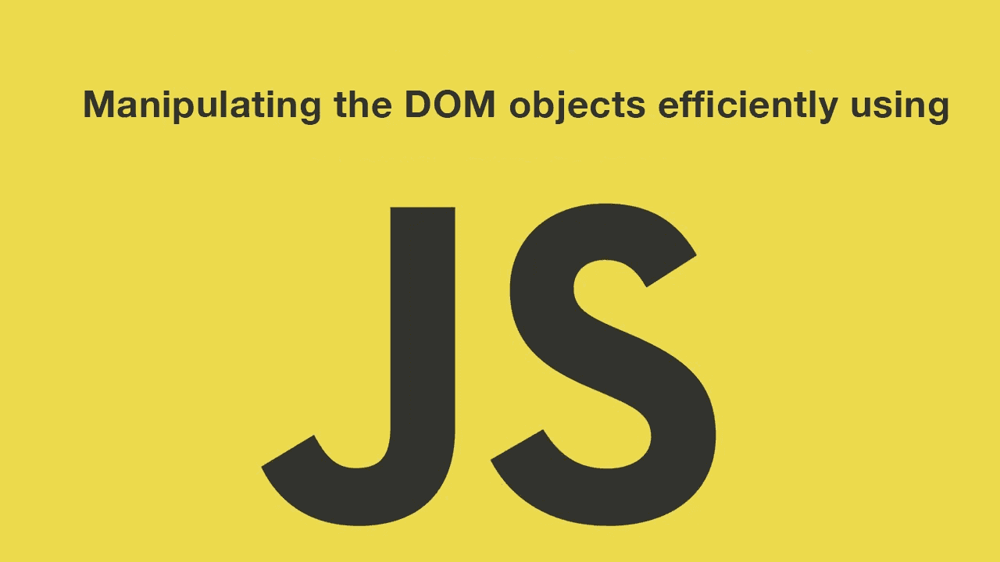

# html 集合、节点列表和对象数组

> 原文：<https://medium.com/hackernoon/htmlcollection-nodelist-and-array-of-objects-da42737181f9>



假设 DOM 如下面的代码片段所述，我的要求是获取一个包含所有`container` div 子节点的 javascript 数组。

```
<div id=”container”>
 <div class="divy">...</div>
 <div class="divy">...</div>
 <div class="divy">...</div>
 <div class="divy">...</div>
</div> 
```

在好的 jQuery 时代，你可以只做`$('.divy')`或`$('#container').children()`

我试图使用原生 DOM 选择器 API 做同样的事情，结果大吃一惊

```
const childDivs = document.querySelectorAll('.divy')Array.isArray(childDivs) //=> false
childDivs.constructor.name //=> NodeList
```

好的，让我们试试`getElementBy%`方法之一，看看返回的是什么

```
const childDivsAgain = document.getElementsByClassName('divy')Array.isArray(childDivs) //=> false
childDivs.constructor.name //=> HTMLCollection
```

那么什么是`NodeList`和`HTMLCollection`对象，为什么我们不能从这些方法中得到普通的 javascript 数组呢？

我们先试着理解 HTMLCollection 和 NodeList 的区别。

> HTMLCollection 是节点列表。单个节点可以通过序号索引或节点的名称或 id 属性来访问。
> 
> HTML DOM 中的集合被假定为活动的，这意味着当底层文档发生变化时，它们会自动更新。

HTML 集合总是*“在 DOM 中”，而节点列表是一个更通用的结构，可能在也可能不在 DOM 中。*

> *NodeList 对象是节点的集合。NodeList 接口提供了有序节点集合的抽象，而没有定义或约束如何实现这个集合。DOM 中的 NodeList 对象是活动的还是静态的取决于用来检索它们的接口*

*让我们用相关代码来测试规范，以了解更多信息*

```
*let parentDiv = document.getElementById('container')let nodeListDivs = document.querySelectorAll('.divy')
let htmlCollectionDivs = document.getElementsByClassName('divy')nodeListDivs.length //=> 4
htmlCollectionDivs.length //=> 4//append new child to container
var newDiv = document.createElement('div');
newDiv.className = 'divy'
parentDiv.appendChild(newDiv)nodeListDivs.length //=> 4
htmlCollectionDivs.length //=> 5*
```

*我们可以看到 HTMLCollection 实际上是活动的，在这种意义上，对 DOM 的任何更改都会自动更新并在集合中可用。*

*并非所有的 NodeList 对象都是静态的。例如，`document.getElementByName`将返回一个活动节点列表。*

*但是记住`HTMLCollection`和`NodeList`都不支持像`push` `pop`或`splice`这样的数组原型方法。像`forEach`这样的迭代器方法是最近才加入的，最新的浏览器可能会支持它们。*

*当我试图使用 [dragula drag-n-drop](https://github.com/bevacqua/react-dragula) 库将选定的组件添加到库中时，我开始了解到这个区别*

```
*let draggableLists = document.querySelectorAll('div.draggable')
dragula(draggableLists); //will not work*
```

*这不会像预期的那样工作，因为`dragula()`构造函数需要一个 javascript 数组，而我们正在向它传递一个 NodeList。*

*要将 NodeList 或 HTMLCollection 对象转换为 javascript 数组，可以执行下列操作之一:*

## *使用 Array.from 方法*

```
*const nodelist = document.querySelectorAll(‘.divy’)
const divyArray = Array.from(nodelist)*
```

## *使用 Array.prototype.slice*

```
*const nodelist = document.querySelectorAll(‘.divy’)
const divyArray = Array.prototype.slice.call(nodelist)*
```

## *ES6 方式*

*我喜欢这个。如果您使用 ES6，您可以只使用扩展操作符*

```
*const divyArray = […document.querySelectorAll(‘.divy’)]*
```

*现在，让我们把它应用到 dragula api 中，让它工作起来*

```
*dragula([...document.querySelectorAll('div.draggable')])*
```

*那么什么时候真正把 NodeList 转换成数组呢？这取决于你的用例。如果你真的想要一个迭代器一直指向最新更新的 DOM，你应该直接使用`NodeList`或者`HTMLCollection`而不要把它转换成数组。*

**如果你喜欢这篇文章，请关注我的* [*推特*](https://twitter.com/rcdexta) *获取更多更新..**

*[](http://bit.ly/HackernoonFB)**[](https://goo.gl/k7XYbx)**[](https://goo.gl/4ofytp)*

> *[黑客中午](http://bit.ly/Hackernoon)是黑客如何开始他们的下午。我们是阿妹家庭的一员。我们现在[接受投稿](http://bit.ly/hackernoonsubmission)并乐意[讨论广告&赞助](mailto:partners@amipublications.com)机会。*
> 
> *如果你喜欢这个故事，我们推荐你阅读我们的[最新科技故事](http://bit.ly/hackernoonlatestt)和[趋势科技故事](https://hackernoon.com/trending)。直到下一次，不要把世界的现实想当然！*

**