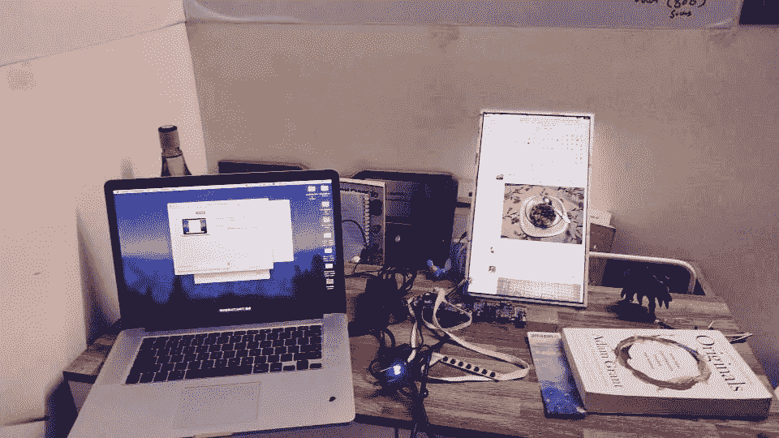
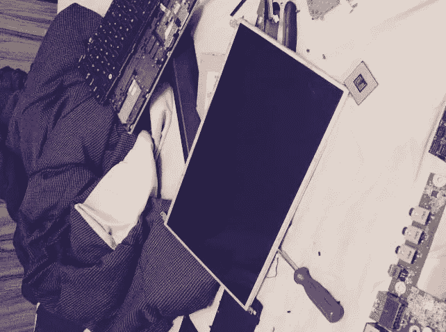
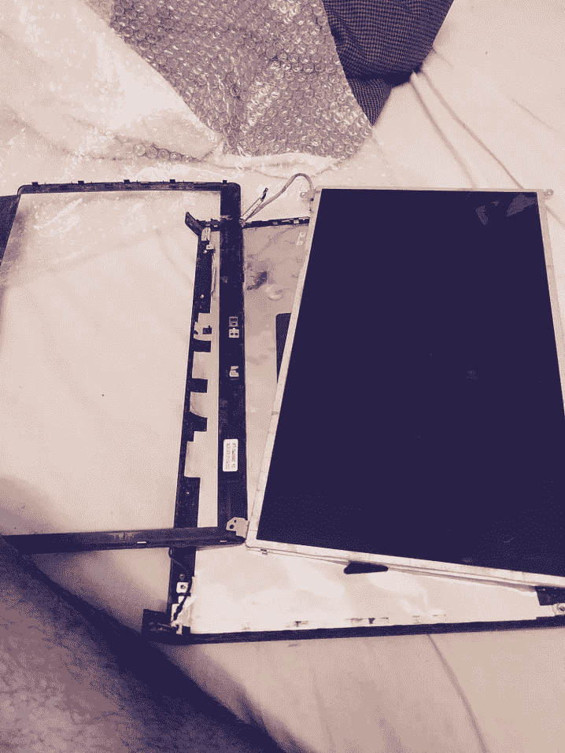
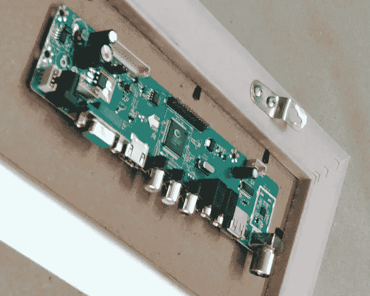
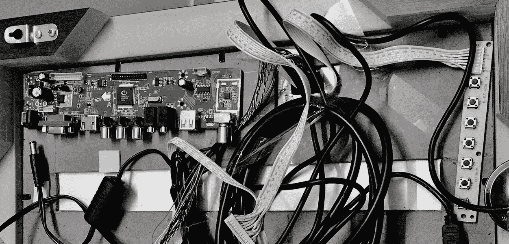
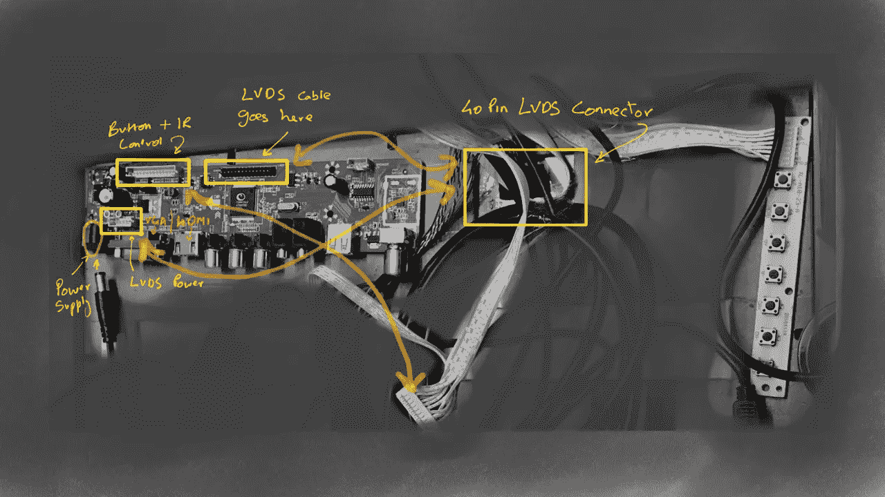
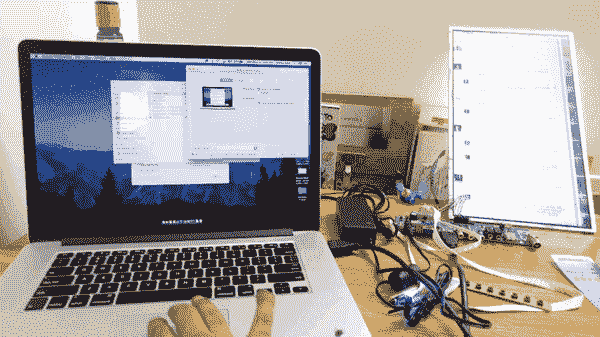
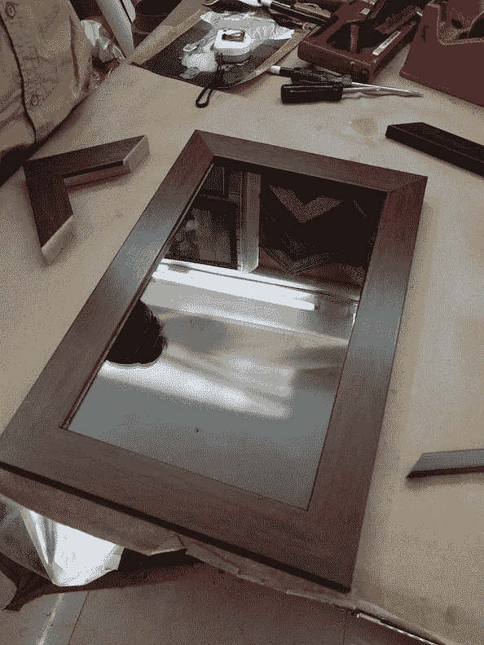
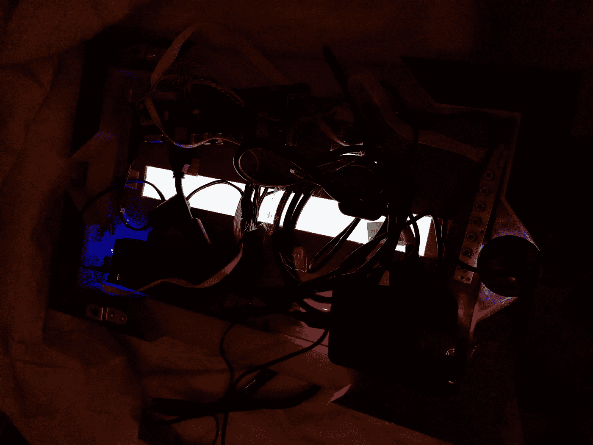

# 把你的旧的无用的笔记本电脑屏幕变成一个外部显示器

> 原文：<https://medium.com/hackernoon/https-medium-com-akshaykore-diy-monitor-410ac3bbb6b9>

Trust me. It’s easier than it sounds!

我拥有一台旧的戴尔工作室笔记本电脑已经太久了。它为我服务了整整 5 年，我去了很多服务中心，更换了电池和硬盘，进行了格式化和操作系统升级。在过去的几年里，我放弃了旧的笔记本电脑，换成了 Macbook。然而，我从来没有费心去处理它。毕竟它仍然工作(慢自动对焦，但工作！).如果出现“紧急”情况，我需要使用这项古老的技术，该怎么办？我试着卖了它，但是这个行为本身和我得到的价格实在不值得。把它免费送给某人感觉像是对这个人的惩罚(大多数智能手机都有更好的规格)。把它处理掉感觉不太对(是的，没错！这就是我所说的中产阶级。对环境也不是很好)。

*我们不都是那些认为有一天会用到的东西的囤积者吗？为有一天*干杯

我已经做了几个星期的智能镜子了。其主要组件之一是 LCD 屏幕。由于这是一个宠物项目，我在寻找最便宜的解决方案。大多数在线显示器的价格都在 4000 卢比以上，甚至 OLX 和 Quikr 上的价格也高达。2500 印度卢比。在那里*有*是一个更便宜的解决方案。对于至少 13.3 英寸的屏幕，我的预算上限是 1500 印度卢比。所以我决定等到我能找到一个更便宜的解决方案。我很高兴我做到了。

一个罕见的周日下午，当我正在清理橱柜时，我偶然发现了忠实的老戴尔工作室。我打开它，尽管它的电池寿命恶化，它仍然工作。我打开它，开始拆卸笔记本电脑，以获得上面的液晶显示屏。我们都知道笔记本电脑是一台复杂的机器，只有当你拆开它时，你才会真正面对现实。一定要非常小心地把它拆下来，最好是在一块布上。为此你需要那些细螺丝刀。

**长话短说……将笔记本电脑的液晶显示屏变成外接显示器非常简单。**

这是不可指示的。我不喜欢写“如何做”的文章，所以我冒昧地假设这样一个事实:你会很小心，很聪明，你会想出办法的。提醒你，提问是解决问题的一部分。所以，如果你有任何问题，请联系我，我会尽力回答大多数问题，或者引导你找到合适的资源。

一旦你有了液晶显示屏，删除电缆在后面。这是 LVDS 电缆，你以后会需要一个类似的电缆。现在，您已经小心地移除了 LCD 屏幕，您需要购买一些东西:

## 1.液晶控制器板

独立的液晶屏不能直接通过 HDMI 或 VGA 输入处理信号。你需要一块控制板来连接液晶显示屏和你的电脑。它包含一个微型微处理器。我建议寻找一个“通用液晶控制器板”。如果你只是想要一个 VGA 输入，而不是特别想要一个 HDMI 输入，那就便宜了。在易贝、亚马逊等网站上找找这个。对于有 HDMI 输入的，如果你愿意等待，全球速卖通是黄金。

## 2.LVDS 电缆公司

你将需要这个来连接你的屏幕和控制板。下面是如何去[的指南](https://www.electronicsweekly.com/blogs/electro-ramblings/industry-comment/lvds-cables-a-simple-guide-2016-06/)。在大多数情况下，你需要一根 40 针的电缆。你需要在网上搜索一下，找到一个便宜的交易(**易贝将是最好的**)。

## 3.带电缆的红外传感器和按钮控制

控制板通常带有一个红外传感器和一个遥控器。我更喜欢按钮控制。搜索“LCD 控制板的键盘”。这相当便宜。

## 4.HDMI 或 VGA 电缆

说够了。

## 5.电源适配器

你需要一个 12V 的电源适配器。**12V 非常重要**。你会很容易发现这一点。

**如下图所示连接一切。**

如果是你做的，给自己一个鼓励。恭喜你！🥇

这大概是它应该看起来的样子。它周围有一个框架会看起来更好。

# 为什么要做这一切？

> *对修补或我们在印地语中称之为“* chull *”的需求永无止境。我们这样做是为了给这个'* chull *'喂食。*

我认为定期做一些事情，让你稍微离开舒适区是非常重要的。长时间的睡眠、无所作为、静止状态是无限循环。越睡越想睡。你越习惯于无所事事，你就越无所事事。我是这种状态的受害者。舒适很容易，也很重要，但它不会让你去任何地方。轻微的不适对于做任何有意义的事情都是必不可少的。

*P.S .我还从笔记本电脑上拿到了硬盘，当时把它拆下来改装成了外置硬盘。稍后会有更多相关内容。可惜的是，我们不能在一些新的笔记本电脑上做到这一点。唉！我想每个人都有自己的理由。除此之外，如果你有更好的方法，请分享。*