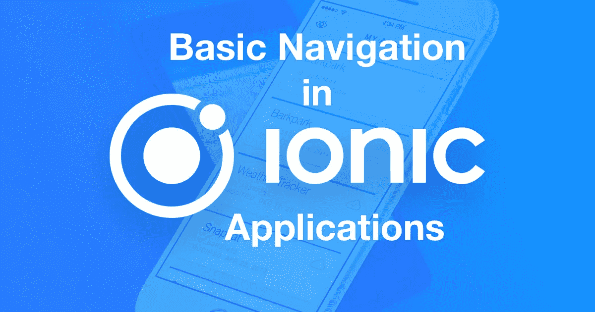

# 离子应用中的基本导航

> 原文：<https://medium.com/hackernoon/https-medium-com-amanhimself-basic-navigation-in-ionic-applications-ecb199cdf15b>

Ionic 中的导航不能像在某些客户端 web 框架中那样使用正常的路由，尤其是与基于浏览器的导航相比。它使用了`pages`的术语，我发现与 Ionic 版本 1 的`states`相比，这个术语更通用，命名也更正确。这种方法非常类似于本地移动应用程序中的导航。

页面从导航控制器*推送*和*弹出*一个定义的类，其在 Ionic 中可用的子类是`ion-nav`。这里的逻辑相当于堆栈的逻辑。`ion-nav`的目的是使用导航栈。

若要在 ionic 应用程序中定义导航栏:

在与上述 HTML 代码关联的 typescript 文件中，我们可以访问导航控制器。

因此，我们可以访问`NavController`及其属性，如`push`和`pop`，以导航到不同的页面或返回到上一页。

注意:*深度链接在 Ionic 中是可用的，但这完全是另一个话题。*

**在 Twitter 上找到我**

 [## 阿曼·米塔尔·🖖(@阿曼本人)|推特

### 阿曼·米塔尔·🖖的最新推特(@阿曼本人)。# book blogger @ https://t.co/UQvyNf1OTC |开发者| #Nodejs |…

twitter.com](https://twitter.com/amanhimself)