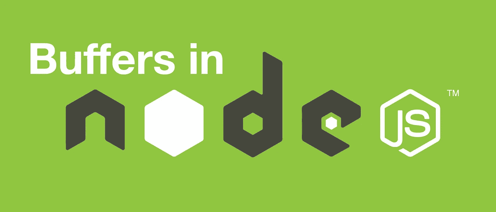

# 在 Nodejs 中将缓冲区转换为 JSON 和 Utf8 字符串

> 原文：<https://medium.com/hackernoon/https-medium-com-amanhimself-converting-a-buffer-to-json-and-utf8-strings-in-nodejs-2150b1e3de57>

Nodejs 和基于浏览器的 JavaScript 不同，因为 Node 甚至在 ES6 草案推出`ArrayBuffer`之前就有处理二进制数据的方法。在节点中，`Buffer`类是大多数 I/O 操作使用的主要数据结构。它是在 V8 堆外分配的原始二进制数据，一旦分配，就不能调整大小。

在 Nodejs v6.0 之前，要创建一个新的缓冲区，你可以用`new`关键字调用构造函数:

要在 Node 的最新和当前稳定版本中创建新的缓冲区实例，请执行以下操作:

`new Buffer()`构造函数已经被弃用，并被单独的`Buffer.from()`、`Buffer.alloc()`和`Buffer.allocUnsafe()`方法所取代。

更多信息可以通过 [**官方文档**](https://nodejs.org/api/buffer.html) 阅读。

# 将缓冲区转换为 JSON

缓冲区可以转换成 JSON。

JSON 指定被转换的对象类型是一个`Buffer`，以及它的数据。

# 将 JSON 转换为缓冲区

# 将缓冲区转换为 Utf-8 字符串

`.toString()`不是将缓冲区转换成字符串的唯一方法。此外，默认情况下，它会转换为 utf-8 格式的字符串。

将缓冲区转换为字符串的另一种方法是使用 Nodejs API 中的`StringDecoder`核心模块。

想要收到更多像这样的文章吗？订阅我 [**这里**](https://patreon.us17.list-manage.com/subscribe?u=ad4c168a6d5bb975f2f282d54&id=39e959cecd) **。有时，我会向我的订户发送“从未见过”的内容。**

**在 Twitter 上找到我:**

 [## 阿曼·米塔尔·🖖(@阿曼本人)|推特

### 阿曼·米塔尔·🖖的最新推特(@阿曼本人)。# book blogger @ https://t.co/UQvyNf1OTC |开发者| #Nodejs |…

twitter.com](https://twitter.com/amanhimself)