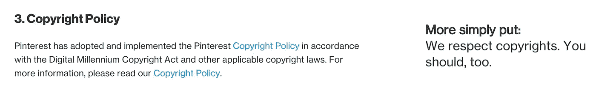
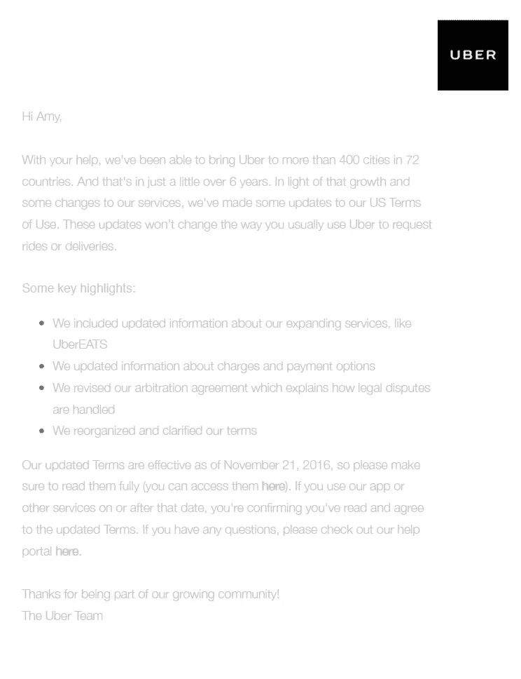
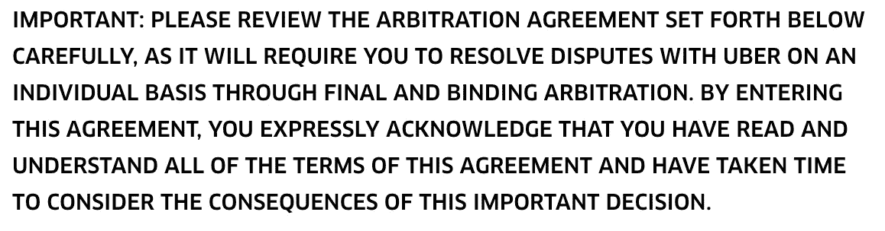

# 法律术语的设计

> 原文：<https://medium.com/hackernoon/https-medium-com-amythibodeau-the-design-of-legal-terms-c23c609b7d92>

[Lady Justice Mural](https://www.flickr.com/photos/ngawangchodron/14280898174/). Photo by Lotus Johnson. Some rights reserved.

## 以优步 2016 年 11 月更新为特色的案例研究

在 UX 世界，我们经常谈论在设计中考虑用户需求是多么重要。我们是模式的热情拥护者，这些模式是可识别的，设定了明确的期望，并且易于遵循。我们对那些在按钮上放置误导性文字以增加点击量的公司，或者那些欺骗人们采取他们不打算采取的行动的公司感到震惊。作为用户体验的保护者**的重要角色，感觉温暖而模糊。**

**有设计头脑的人很快会支持一连串好的 UX 原则，但当谈到人们在注册我们的服务时遇到的体验时，我们许多人都自满和懒惰。我具体说的是人们面对的法律语言，然后作为新用户被要求同意。**

**对于这些几乎一致的糟糕经历，我们有很多借口:**

*   **没有人会阅读术语或法律语言，所以为什么要这么麻烦呢？**
*   **律师和法庭使用某种难以理解的语言和模式，我们无法摆脱**
*   **我们不想要这些法律语言，但某些司法管辖区和法律迫使我们这样做，我们必须保护公司**
*   **我们的意图是好的，我们永远不会做任何损害用户信任的事情，所以他们不理解他们同意的所有事情也没关系**
*   **很难用一种容易理解的方式来写这些东西，我们认为消费者体验更重要**

**对于这些事情，我说:扯淡！**

**我不是律师，所以我无法提出在法庭上站得住脚的详细法律论据，但我可以指出优先顺序。有越来越多的例子表明，一些公司非常关心，通过注册一项服务来帮助人们理解他们所同意的东西。两个早期的例子是 [Pinterest](https://about.pinterest.com/en/terms-service) 和 [500px](https://about.500px.com/terms/) 。他们将条款分为两栏，左边是完整的法律文本，右边是更简短、更容易理解的摘要。只要花几分钟阅读这些法律文件，用户就可以清楚地了解他们被要求同意什么。这并不完美，但至少他们在努力。**

****

**From Pinterest’s Terms**

**也有理由认为，法律可能会向更简单、更容易理解的术语倾斜。在 2012 年美国诉 Nosal 一案中，首席法官 Kozinski 感叹服务条款有时是多么不合理:**

> **“不仅服务条款含糊不清，通常不为人所知——除非你非常仔细地看网页底部的小字——而且网站所有者保留随时更改条款的权利，无需通知……因此，昨天不是犯罪的行为今天可能变成犯罪，而无需国会法案，也无需任何通知。”**

****

**[Confused dog](http://www.lovethisgif.com/image/4848/confused-dog).**

**2016 年 3 月，英国的[商业创新和技能部](https://www.gov.uk/government/uploads/system/uploads/attachment_data/file/504063/bis-16-67-terms-and-conditions-call-for-evidence.pdf)开始收集选民的研究，以了解他们目前如何使用法律语言。这是努力创建指导方针的第一步，该方针将鼓励公司在撰写服务条款时考虑到理解。当时的技能部长 Nick Boles 在他的呼吁书中写道:**

> **“…客户可能会忽略可能会对他们的选择产生重大影响的差异。这对个人不利，但对整体经济也不利——个人选择推动企业之间的竞争，提高生产率。这就是为什么在这次征集证据的活动中，我们在寻找切实可行的方法，让条款和条件对客户来说更加透明和容易理解。”**

**让我们从潜在的法律和商业争论转移到更多的人类术语，深入到我们作为设计社区成员的道德义务的浑水中。**

**产品设计师和 UX 作家社区很快就会哀叹黑暗的模式，混乱的设计系统，以及改变视觉语言的利弊。我们焦虑地剖析如何给出有用的设计反馈，我们绞尽脑汁如何使我们的内容更具对话性([但又不太具对话性](https://blog.prototypr.io/how-to-build-and-care-for-your-own-chatty-quirky-funny-interface-robot-5d0be81a0f50#.83yr6y901)！).然而，我们当中似乎很少有人在乎，在用户的第一次互动中，我们是给用户戴上法律手铐的同谋。这是它的走向:**

*   **一家公司设计了深思熟虑的营销活动，旨在让人们对颠覆世界、让生活更美好的承诺感兴趣。突出的主题通常包括社区、过你最好的生活、做一个更好的人、节省/获得时间。**
*   **人们决定下载应用程序，或者注册。**
*   **但是在他们能够体验我们所提供的启示之前，我们向他们展示了一份客观复杂的长篇内容，其中包含一系列具有法律约束力的声明。我们要求他们点击“同意”继续。**
*   **他们这样做，并不是因为他们实际上同意或理解，而是因为我们的行业已经让他们对这种体验麻木不仁，以至于他们甚至几乎不去想它。**
*   **对大多数人来说，这是结束，但其他人谁经历了有意义的法律问题，如歧视，发现自己受到法律手段，他们没有阅读和不理解的约束。**

**作为一个社区，我们已经接受了这是可以的，或者至少可以忽略。这甚至不是一个[黑暗模式](http://darkpatterns.org/)——这是现状。**

**我们正在进入[一个新的政治阶段](https://www.theatlantic.com/politics/archive/2016/11/richard-spencer-speech-npi/508379/)，我们对不公平或歧视行为提起诉讼的权利可能比以往任何时候都更加重要。现在，*尤其是现在*，声称关心用户体验的人需要倡导清晰、直接和人性化的法律术语，以便人们能够就同意做出有效的个人选择，并了解收集哪些数据以及将如何使用这些数据。**

## **优步**

**当谈到他们在最近的术语更新(2016 年 11 月 21 日)中使用的语言的长度或性质时，优步不是唯一的，甚至不是特别糟糕。他们只是引起了我的注意，因为他们最近做了一项改变，他们是大多数科技公司如何做到这一点的典型代表。**

****通知邮件****

****

**Uber email: received Novmeber 22, 2016**

**2016 年 11 月 22 日，我收到了一封来自优步的电子邮件，主题是“我们已经更新了我们的服务条款”。指向他们一个清晰的主题行和易于阅读和理解的电子邮件文本。**

**但是仔细观察，有几个问题:**

*   **邮件开头提到了优步的国际扩张，并将这种积极的增长与他们条款的更新联系起来。这是不诚实的，因为条款的变化只适用于在美国使用优步的人。**
*   **这种变化的先导应该是对他们的仲裁协议的更新。如果你点击进入[完整条款](https://www.uber.com/legal/terms/us/)，靠近页面顶部有一些粗体文字强调仲裁部分，所以很明显，对优步来说，表明他们试图引起人们的注意在法律上是很重要的。然而在这封邮件中，这个话题作为四个要点中的第三个被埋没了。**

****

*   **根据优步的电子邮件，这些条款自 11 月 21 日起生效，在此之后，如果我使用该应用程序，我确认我已经阅读并接受了新规则。当优步在新条款生效后的第二天，也就是 22 号才发出邮件时，这个时间表怎么可能实现呢？**
*   **最后，优步在单词“here”下嵌入了完整术语和帮助文本的链接。“Here”不是描述性的链接文本，而是一种粗制滥造的设计模式，已经被彻底地痛斥和到处打折(大约 16 年了！).它是不可访问的、信息丰富的或可操作的。不太可能让人们点击阅读这些条款。(看看当我告诉你去[这里](https://www.smashingmagazine.com/2012/06/links-should-never-say-click-here/)、[这里](https://www.w3.org/TR/WCAG10-HTML-TECHS/#link-text)和[这里](https://www.wordpress-web-designer-raleigh.com/2015/04/16/4-reasons-to-avoid-using-click-here-in-link-text/)阅读我关于为什么这不好的资料来源时，弄清楚你点击的是什么有多难？)**

## **条款**

**优步的条款看起来像许多公司所做的。这就是为什么他们是大多数消费者在注册使用服务时不知道他们同意什么的一个很好的例子。**

*   **这些术语的语言很难理解，而且愤世嫉俗。如果我们认为这是用户体验的一个设计部分，我们应该这样做，它是为了混淆信息，这样普通人就不太可能知道他们同意什么。更简单的单词选择，甚至是视觉化地组织页面以供浏览，都会带来立竿见影的效果。**
*   **默认情况下，这些条款中规定的规则适用于现有客户。同意是自动适用的，而不是要求人们同意重大变化。为什么？因为这减少了公司的开销，并将全部责任推给了客户(顺便说一下，这是标准做法)。如果你不想接受对优步条款的修改，你需要往下读第五段，其中说，要选择退出，你需要在新条款公布之日起 30 天内向优步提供书面通知。如果你做不到这一点，你将受到这些新规则的法律约束。**
*   **这些术语的框架是不诚实的。任何使用这种术语的公司都很清楚，他们的大多数客户不愿意，而且在很多情况下无法阅读和理解这种语言。然而，这些条款的全部前提是:“通过签署本协议，您明确承认您已经阅读并理解了本协议的所有条款，并且已经花时间考虑了这一重要决定的后果。”在这种情况下,“签订本协议”意味着除了在接下来的 30 天内不给优步写一封信之外，什么也不做。鉴于优步可能会监控其电子邮件的分析，它很清楚很少有人会点击阅读这些条款。几乎可以肯定的是，它还会查看文档的阅读分数水平，并知道它超过了 12 级的阅读理解水平。这几乎是 T2 普通美国人文化水平的两倍。**
*   **没有办法简单地将优步条款的[前版本](https://www.uber.com/legal/other/US-terms-pre-Nov-2016/)与这个新版本进行比较，以了解有什么变化。我们从新条款顶部的免责声明中得知，仲裁协议部分有所变化，但很难确定到底发生了什么变化。条款的这一部分很重要，因为它规定了如果人们认为优步从事了非法行为，他们可以如何向优步寻求补救。我们需要在旧版本和新版本之间来回切换，以真正挖掘出有哪些变化，这样我们就可以“充分考虑这一重要决策的后果”**
*   **单纯从更新的条款来看，很明显(也不奇怪)优步希望避免被乘客起诉。通过在这些新条款下使用优步，你同意不起诉优步的错误行为，你只有通过有约束力的仲裁的选择。这意味着，你唯一的选择是让一名独立的仲裁人审查你的文件并做出判决，而不是去找法官和陪审团，可能是与其他有类似担忧的人合作(在集体诉讼中)。除非您的索赔金额超过 10，000 美元，否则您甚至没有权利进行听证，并且您无权将您的案件与其他类似的投诉一起进行听证。最后，仲裁人的决定是最终决定。如果你觉得这个过程不公平，你没有上诉的机会，也没有其他机构可以求助。**
*   **一个特别偷偷摸摸的条款是，除非你在 30 天内写信给优步反对这些条款，否则你将受到新规则的约束，即使你正在对优步提起诉讼。条款规定，“这将阻止您对优步提起任何集体诉讼、集体诉讼或代表诉讼，也阻止您参与或恢复任何当前或未来集体诉讼、集体诉讼、合并诉讼或代表诉讼下的救济*……”(强调是我的)。所有目前正在起诉优步的[人需要在 30 天内写信给优步否认这些条款，否则他们的诉讼将“被排除在参与或从优步获得救济之外”。](http://money.cnn.com/2016/08/11/technology/uber-lawsuits/)***

**我可以继续。重点不是挑优步的毛病，因为他们不比大多数其他科技公司更好或更差。这是很重要的一点:**

> **作为 UX 人，我们需要更多地关注这些事情，因为这很重要。**

**公司，甚至是提供有价值和有价值的服务的大公司，存在的首要目的是盈利。不管他们的营销材料多么热情和模糊，增加公司对股东的价值才是他们的首要任务。这很好，但对消费者来说，在这种关系中重新获得一些公平是很重要的，作为设计师从业者，我们的工作就是努力倡导这一点。**

**判断一家公司有多关心的最好方法不是看他们简洁的发布说明、古怪的动画、模糊过滤的宣传片或可爱的图片。这取决于公司在多大程度上试图清楚地解释或阻碍你做出重要法律决定的能力，这些决定是关于你给予它什么以及它在你生活中的作用。公司可以要求他们想要的东西，但他们应该在法律上和道德上被迫以确保明确理解和同意的方式向消费者提出他们的要求。**

**作为设计专业人士，我们需要承认我们在这方面的角色和责任。**

************

> **[黑客中午](http://bit.ly/Hackernoon)是黑客如何开始他们的下午。我们是 [@AMI](http://bit.ly/atAMIatAMI) 家庭的一员。我们现在[接受投稿](http://bit.ly/hackernoonsubmission)并乐意[讨论广告&赞助](mailto:partners@amipublications.com)机会。**
> 
> **如果你喜欢这个故事，我们推荐你阅读我们的[最新科技故事](http://bit.ly/hackernoonlatestt)和[趋势科技故事](https://hackernoon.com/trending)。直到下一次，不要把世界的现实想当然！**

****