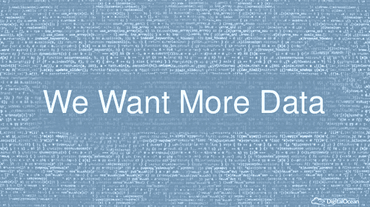

# 数据集和算法哪个先出现？

> 原文：<https://medium.com/hackernoon/https-medium-com-atshruti-array-ventures-which-came-first-the-dataset-or-the-algorithm-e04a554a864e>

Array Ventures 的 Shruti Gandhi 最近在 T2 的播客中与 Crowdflower 的 Lukas Biewald 讨论了他对机器学习的想法。Lukas 建议人们接受以下认识:

**1。你需要大量的数据**

与过去不同，现代机器学习能够梳理成吨成吨的训练数据。数据越多，机器学习算法越好。算法越好，产品才能越好。例如，美国政府花费数十亿美元试图建立一个全面的翻译服务平台。谷歌通过利用尽可能多的数据抢先了一步。尽管谷歌翻译只是该公司的一个副业项目，但他们可以对数百万个国际网站进行数据抓取，以帮助算法更好地学习。

**2。公司必须对期望持现实态度**

大多数人认为计算机程序不会出错。问题是它们确实如此——尤其是在人工智能领域。最好的人工智能解决方案有 80-82%的准确率。但是，如果机器学习程序在大约 20%的情况下出错，许多高管就会质疑这个价值主张。这是可以理解的，因为错误会带来巨大的代价。因此，在人工智能无法处理这些情况的 20%时间里，仍然需要一个人在循环中。

**3。人工智能的发展才刚刚起步**

然而，机器学习的质量正在上升。仅仅在过去的五年里，机器学习已经有了显著的进步。

在他的最新文章，[中，人工智能的记者戴夫·格什格恩](https://qz.com/author/dgershgornqz/)说，在 2012 年，“谷歌的神经网络[……]教会了自己检测猫和人类的形状，准确率超过 70%。这比当时任何其他机器学习都提高了 70%。”今天，人工智能更加先进。Gershgorn 继续说，“人工智能研究在过去五年中比过去 50 年取得了更大的进展，部分原因是有更多的数据可用于训练人工智能。这种进步很大程度上可以在谷歌、亚马逊和脸书的产品中看到:你的照片可以被自动标记，你的电子邮件应用程序知道你喜欢如何回复电子邮件，或者新的智能扬声器可以使用人工智能来识别你在说什么。”

同样，数据越多，算法就越好。

然而，卢卡斯认为期望应该是有限的。要让人工智能算法 100%正确是极其困难的，如果不是不可能的话。但是梦想总是有帮助的，可能性每天都在增加。

还想要更多吗？点击 查看整个播客 [**。订阅**](https://itunes.apple.com/us/podcast/array-ventures-podcast/id1215062660)**[【Array】播客](https://itunes.apple.com/us/podcast/array-ventures-podcast/id1215062660?mt=2)从其他成功的创始人那里学习一系列技巧和技能。**

[*Shruti Gandhi*](https://twitter.com/atshruti)*是*[*Array Ventures*](http://www.array.vc/)*的管理合伙人。Array Ventures 是一家风险投资公司，专注于投资创始人创建利用数据、人工智能和新行为为大型市场创建新平台的公司。*

> [黑客中午](http://bit.ly/Hackernoon)是黑客如何开始他们的下午。我们是这个家庭的一员。我们现在[接受投稿](http://bit.ly/hackernoonsubmission)并乐意[讨论广告&赞助](mailto:partners@amipublications.com)机会。
> 
> 如果你喜欢这个故事，我们推荐你阅读我们的[最新科技故事](http://bit.ly/hackernoonlatestt)和[趋势科技故事](https://hackernoon.com/trending)。直到下一次，不要把世界的现实想当然！

