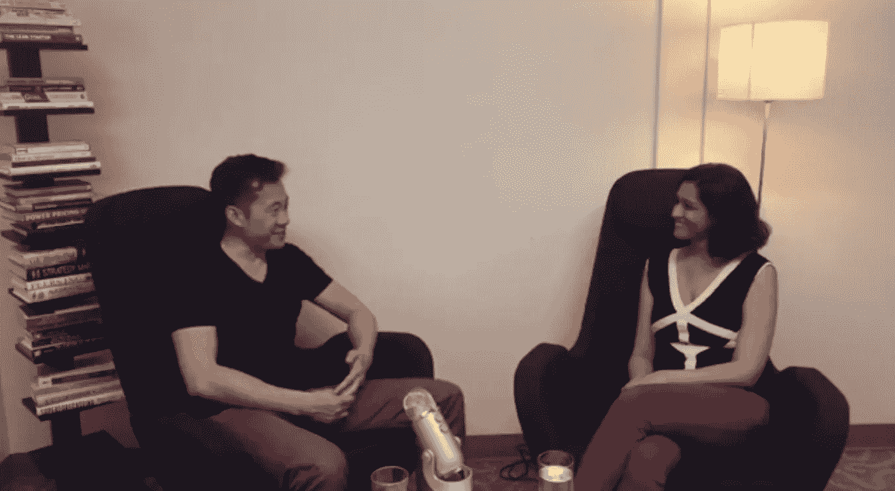

# 如何从大学毕业后的自我反省到从 1B 的亚马逊网站退出

> 原文：<https://medium.com/hackernoon/https-medium-com-atshruti-justin-kan-how-to-go-from-post-collegiate-soul-searching-to-a-1b-exit-to-amazon-b32e60415615>

Justin Kan (left), Shruti Gandhi (right)

在 9 年的时间里，贾斯汀·坎(Justin Kan)从大学毕业后漫无目的的自我反省转向大规模退出他的公司 [Twitch](https://www.twitch.tv/) ，他以 1B 美元的价格将该公司卖给了亚马逊。在此之前，他在 ebay 上以 25.8 万美元的价格卖掉了自己的公司 Kiko Software！后来他把 Exec 卖给了 Handy。贾斯汀从 Y-Combinator 的合伙人变成了自己的孵化器 Zero-F，最近还在 AskWhale.com[成立了他们的第一家公司](http://askwhale.com)

以下是他分享的许多经验中的几个—

**1。创造力**

当贾斯汀出售 Kiko 软件时，他向雅虎提出的收购提议落空了。6 个月后，由于他看不到其他选择，他决定创造性地选择退出。他决定在易趣上拍卖公司，公司以超过 25.8 万美元的利润售出！现在，他不再是一个失败的创始人，而是一个成功的退出者。

**2。自适应**

能够倾听客户的意见，并在适当的时候进行调整，是成为伟大创始人的主要特征之一。当贾斯汀创建 Justin.tv 时，他们的平台上有 3000 万人，筹集了 700 多万美元。大多数人会认为创业是成功的。然而，在更深层次上，人们认为他们的节目很无聊，但人们经常询问他们如何才能制作自己的直播节目。

根据这些反馈，Justin 转向了 Twitch，并正式推出了服务于这一需求的服务。同样，他将 Exec 从优步遇见任务兔转向家庭清洁服务，并将其出售给 Handy。

**3。吃自己的狗粮**

这是不言而喻的，但当贾斯汀开始 Kiko 软件，这是一个日历产品。他认识到该产品的市场机会。但那时他在学校，每周只开两次会。这意味着他没有充分利用他的产品来制造用户理想中想要的产品。

贾斯汀的建议是，只筹集你需要的资金，首先要有一个用户喜欢和需要的可持续产品。

**4。大家都有疑惑**

贾斯汀也有。Justin 在打造 Justin.tv 等公司的同时，也多次想放弃。他不确定这是否会成功。但是怀疑是与领土相伴而来的。如果你接触新事物，产生怀疑是很自然的。

在 iTunes [**这里**](https://itunes.apple.com/us/podcast/array-ventures-podcast/id1215062660) 找到整个播客。订阅[【阵列】播客](https://itunes.apple.com/us/podcast/array-ventures-podcast/id1215062660?mt=2)，从其他成功的创始人那里学习一系列技巧和技能。

[*Array Ventures*](http://www.array.vc/)*是一家专注于投资创始人创建公司的风险投资公司，这些公司利用数据、人工智能和新行为为大型市场创建新平台。*

> [黑客中午](http://bit.ly/Hackernoon)是黑客如何开始他们的下午。我们是 AMI 家庭的一员。我们现在[接受投稿](http://bit.ly/hackernoonsubmission)并乐意[讨论广告&赞助](mailto:partners@amipublications.com)机会。
> 
> 如果你喜欢这个故事，我们推荐你阅读我们的[最新科技故事](http://bit.ly/hackernoonlatestt)和[趋势科技故事](https://hackernoon.com/trending)。直到下一次，不要把世界的现实想当然！

