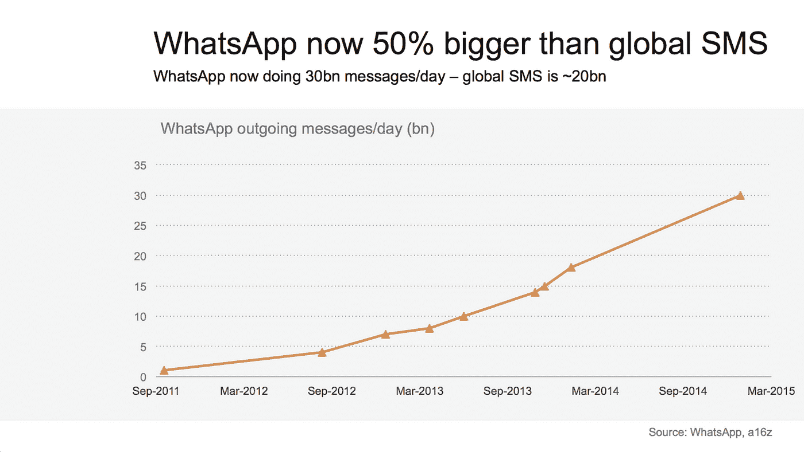
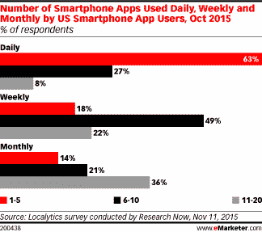

# 简单技术的案例:为什么短信仍然重要

> 原文：<https://medium.com/hackernoon/https-medium-com-avatstaffjoy-the-case-for-simple-technology-why-sms-still-matters-f9c3507c9ab6>

在 2017 年，我们习惯了闪闪发光的移动应用程序 UI，UX 似乎只是*让我们*。但是，让我们后退一步，记住移动的卑微的开始。

你还记得那些让你的朋友们羡慕的笨重的 Nokias 和 Snake score 的日子吗？今天的时尚智能手机与它们的前辈仍然有几个共同点。其中之一就是[短信](https://hackernoon.com/tagged/sms)。

每个人都按响了 WhatsApp 的喇叭，因为截至 2015 年，它每天处理[300 亿条消息](http://ben-evans.com/benedictevans/2015/1/11/whatsapp-sails-past-sms-but-where-does-messaging-go-next)，完全盖过了通过短信发送的 200 亿条消息。但是[对讲机最近完美地总结了](https://blog.intercom.com/sms-isnt-going-anywhere)“在所有的消息接口中，短信是最直接的。没有自定义 UI，没有学习曲线。”

在这里，我要大胆地说，SMS 的核心是正确地发送消息。它不会因为无关的特性而使过程复杂化。它很容易使用——我 70 多岁的父母甚至会用它。

消息传递以前只供个人使用，但随着 Messenger 将您连接到企业的支持团队，很容易看到个人和专业正在融合。有了智能手机或其他短信功能的设备，在任何时候都触手可及，是时候让企业认真对待短信了。

毕竟，不是每个人都想给自己的手机添加另一个应用程序。即使他们下载了应用程序，也很可能不会使用，因为 49%使用应用程序的智能手机用户每周只使用六到十个应用程序。为什么不使用所有手机中已经根深蒂固的功能来达到同样的目的呢？有效的[技术](https://hackernoon.com/tagged/technology)简单，不会让初次使用的用户摸不着头脑。这不是把你能塞进去的东西塞进一个产品里，而是把最本质的版本呈现给大众。仅仅因为你可以添加一个特性，并不意味着你应该这样做。

Source: [eMarketer](https://www.emarketer.com/Article/How-Many-Apps-Do-Smartphone-Owners-Use/1013309)

## **这对科技公司意味着什么**

在很多方面，科技公司都在做 180 度大转弯。极简主义正在卷土重来。当涉及到与客户交流的消息时，SMS 就能做到。中国的微信注意到了这一点，并将工作交流、账单支付和更多的集成整合到他们受欢迎的应用程序中，有效地满足了移动用户的需求。

> 这可能不那么吸引人，但也许我们应该从“有一个应用程序”过渡到“有一个解决方案”

用更低的进入门槛来解决市场的一个痛点，是不是这么野的想法？随着许多银行、个人金融产品、礼宾服务等已经在运行这一想法，它可能并不那么疯狂。

让我们明确一点，并不是每个公司都适合使用短信。正确的人都有一种紧迫感。如果一个产品是围绕着客户需要马上知道的东西，那么短信就能起作用。

## **短信中断**

我认为 SMS 在技术上有两种不同的用途。首先，有警报。让我们以一家信用卡公司为例。欺诈提醒是有帮助的，当你通过短信收到它们时，回复一个“是”或“否”来判断交易是否是你做的会快得多。如果这种交流是应用程序内的通知，你可能会把它们关掉，直到有人刷爆了你在百思买买电视的卡，你才会意识到。也就是说，时间很重要，对于时间敏感的通信来说，SMS 是最好的选择。

对企业有用的第二种 SMS 形式是会话消息。在许多情况下，您希望能够提出问题并得到回应，而不是“我们已收到您的电子邮件，将在 24-48 小时内给您回复。”

[聊天机器人](https://hackernoon.com/tagged/chatbots)最近风靡一时，在自动化的帮助下，它们可以迅速提供有用的信息。它们对许多行业都非常有效，但在某些情况下，一个人需要站在另一端。例如当客户需要意见或一些其他个性化服务时。

无论对方是人还是机器，短信都是与绝大多数人沟通的便捷方式。尽早采用这种方式的企业将准备通过一种渠道来接触他们的客户，这种渠道已被证明不仅仅是一种时尚。

***当归瓦伦丁*** *是*[*staff joy*](http://staffjoy.com/?utm_source=Hackernoon&utm_medium=gp&utm_campaign=1-17&utm_content=SMS)*的市场经理，一款日程沟通软件。可以* [*在 Twitter 上关注她*](https://twitter.com/AngelicaSaidSo) *。*

> [黑客中午](http://bit.ly/Hackernoon)是黑客如何开始他们的下午。我们是 T21 家庭的一员。我们现在[接受投稿](http://bit.ly/hackernoonsubmission)并乐意[讨论广告&赞助](mailto:partners@amipublications.com)机会。
> 
> 如果你喜欢这个故事，我们推荐你阅读我们的[最新科技故事](http://bit.ly/hackernoonlatestt)和[趋势科技故事](https://hackernoon.com/trending)。直到下一次，不要把世界的现实想当然！

