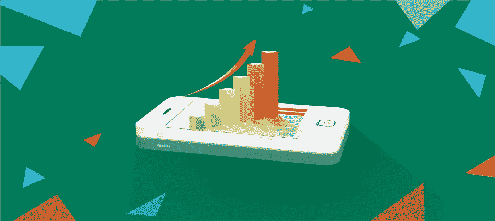
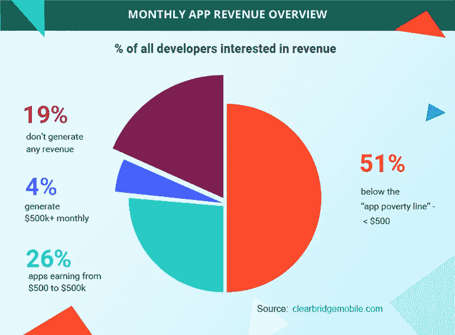
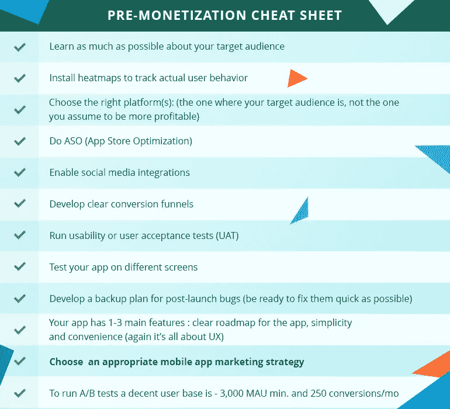
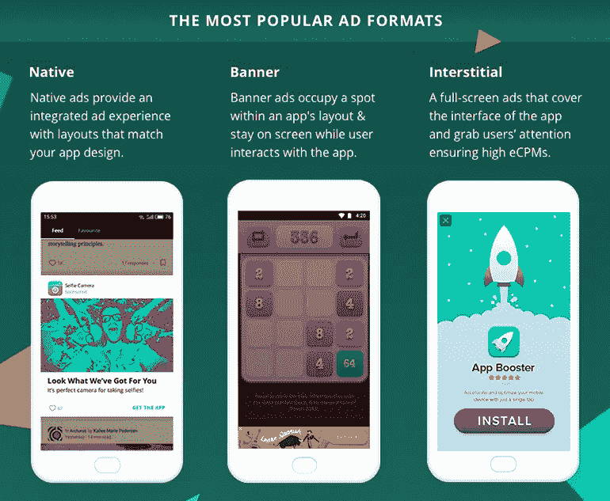
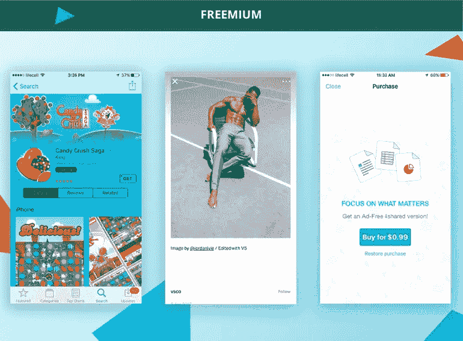
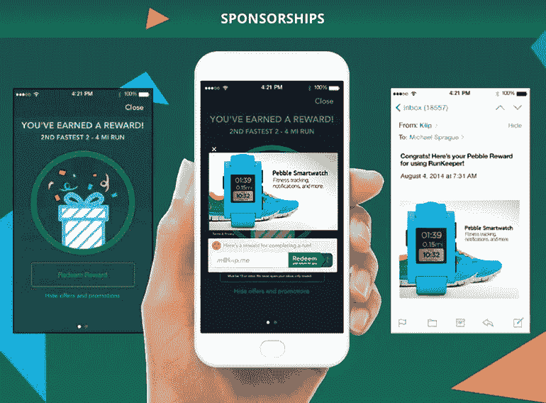
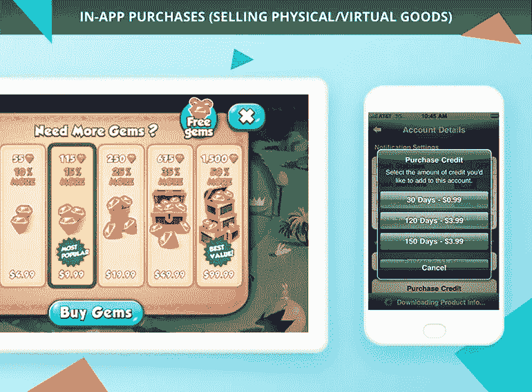
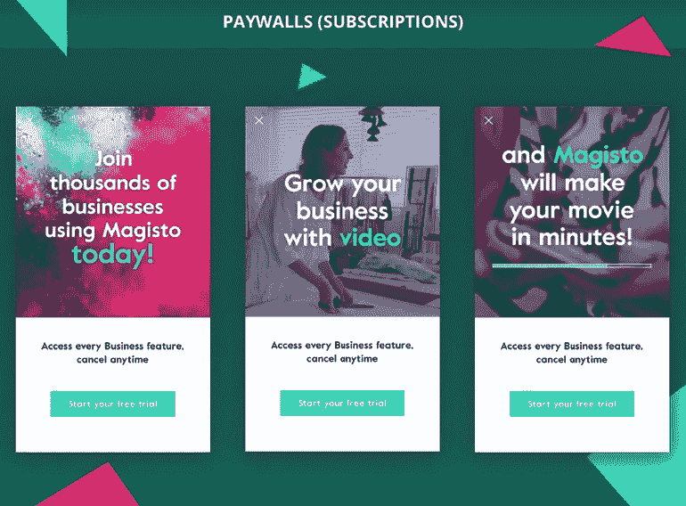

# 应用程序货币化指南:如何不去拧你的应用程序？

> 原文：<https://medium.com/hackernoon/https-medium-com-linosphere-app-monetization-guide-12809d74b6b0>

到 2020 年，应用经济将翻一番，全球收入将达到惊人的 1010 亿美元。
人们渴望在优秀的移动产品上花费 ***更多*** 的钱。

然而，对许多产品所有者来说，将应用程序货币化似乎仍然是一个可以实现的目标。

> 在应用创建之前或早期阶段制定移动应用盈利计划**对于应用的成功至关重要。**

未能正确地将其货币化是出版商退出市场并放弃进一步发展的最常见原因之一:

这就是坏消息。

现在，你可能想知道——我如何才能进入 1010 亿美元的收入流，而不是满足于这些小钱？

# 货币化前清单

在你开始考虑金钱之前，你需要确定你的产品是值得为之付钱的。

下面的快速清单说明了[最常见的应用程序开发陷阱](https://blog.kissmetrics.com/11-mobile-app-pitfalls/)并帮助您避免这些陷阱。

使用它来构建您的用户会喜欢的应用程序:

# **如何选择正确的货币化策略**

找到完全适合你的应用的完美应用盈利模式需要对你的移动目标有完整的了解。有了正确的模型，你就有更大的机会将你的应用适当地货币化。

例如，根据 AppAnnie 的数据，游戏是过去五年中票房最高的应用之一，其中 98%是免费下载的。

游戏——很简单。大多数用户都对各种应用内购买感兴趣。

但是其他利基呢？你应该免费提供你的应用程序还是要求付费？你如何诱使用户付费？

考虑到“免费”现在是常态，我们研究了各种值得使用的应用内货币化策略。

## 通过广告网络的应用内广告

如今，移动应用并不缺乏广告网络。然而，它们都有一些缺点——低收益、不相关的广告、烦人的条款等等。好的一面是，你可以结合不同的广告网络来实现更高的广告效果。如果你有足够的销售和广告运营专业知识，你可以使用自助中介，如 Mopub，appnext，Admob 等。

如果你想节省时间并降低运营成本，最好使用智能应用货币化平台，如 [Epom Apps](https://apps.epom.com/) ，它负责调解和广告优化，而你则专注于让你的产品变得更好。
通过这种方式，你将获得现金，同时还有时间尝试其他的赚钱策略。
以下是表现最佳的广告形式:

**最佳适合:**所有利基

**优点:**

*   如果你选择原生广告和定向广告，效果会更好。用户使用原生广告的频率比横幅广告高 20%到 60%。
*   移动广告支出将在 [2018](http://blogs-images.forbes.com/roberthof/files/2015/03/emarketermobile.gif) 超过桌面 50%。
*   易于应用程序开发人员实施，因为您只需将 SDK 代码插入到应用程序中。

**缺点:**

*   人们可能会对广告感到恼火，这可能会导致应用程序流失。选择原生的和非侵入性的广告来避免这种情况。
*   移动广告会占据大量屏幕空间，从而妨碍应用内体验。
*   对于旨在帮助用户执行重要功能(例如，打车)的小众应用程序来说，这种货币化模式并不奏效。

## 免费增值

你向用户提供一些基本的功能，但是向他们收取额外的费用。

根据 [App Store 的 200 强票房排行榜](https://www.appannie.com/en/apps/ios/top/)，**《我的世界》**(售价 6.99 美元)， **Grindr** (售价 0.99 美元)，以及 **Facetune** (售价 3.99 美元)是 2017 年第一季度仅有的付费应用。所有其他公司都使用免费增值模式，通过在应用程序内销售商品来产生收入。

**最适合:**游戏、教育应用、提供高级功能的产品，任何涉及进度的应用(有多个层次)。

**优点:**

*   如果您的应用程序已经内置了高级级别或功能，则很容易实现。
*   “先试后买”已被证明是一种很好的商业模式。
*   这是一个很好的应用模型，可以解决燃眉之急。

**缺点:**

*   一开始，这款应用的总拥有成本并不明确。
*   只有 0.5-2%的用户会为你的应用付费。
*   如果免费功能没有吸引力，你就不会吸引用户付费。

## 赞助

它需要与广告商合作，当用户完成某些应用内的动作时，广告商将向用户提供奖励。这个模型假设你的受众足够大，足以吸引品牌为曝光付费。

**最适合**:旅游类 app，约会类 app，活动类 app。

**优点:**

*   适合任何小众。
*   用户参与度可以很高，因为内容是相关的和/或有价值的。

**缺点:**

*   寻求客户群与你一致的合作伙伴。

基于原始赞助协议的固定价格收入。如果活动表现好于预期，你不会赚得更多。

## 应用内购买

应用内购买听起来就像真的一样。简而言之，这种应用货币化策略包括在你的应用中销售实物或虚拟商品，然后保留利润。应用内购买可以包括各种各样的消费品，如衣服和配饰。

**最适合**:游戏，无广告应用。

**优点:**

*   低风险/高利润，尤其是数字或虚拟商品。
*   足够灵活，支持联盟和合作伙伴计划。

**缺点:**

*   大多数应用程序市场从数字和虚拟购买中抽取很大一部分利润(高达 30-40%)
*   你需要加入一个机制来防止意外的应用内购买。

## 付费墙(订阅)

其核心是，这种模式类似于“免费增值”模式，因为用户可以先试驾应用程序，但随后需要注册订阅，以绕过某些内容限制和约束。

**最适合**:娱乐、生活方式、音乐和新闻类应用。

**优点:**

*   由于用户的参与，客户流失率更低。
*   由于汽车更新，定期、持续的收入流。

**缺点:**

*   管理和/或创造用户愿意付费的高质量内容是一项挑战。

## 混合应用盈利模式

好消息是，你可以将上述所有策略结合起来，以符合你的商业模式。

例如，你的应用程序的免费版本可以包含应用程序内广告，一旦用户升级到高级版本或订阅了高级内容，这些广告就会消失。付费应用可以提供应用内购买来提高盈利能力。只要有合适的广告客户来敲你的虚拟之门，就可以整合合作安排。

请记住，最好的盈利策略不会干扰应用程序体验的自然流动，也不会造成干扰(因为那只会导致客户流失)。

# 移动应用货币化的下一步是什么:需要了解的常青树趋势

每年都会有人提交《(插入年份)应用货币化趋势报告》，承诺革新你用应用赚钱的方式。但是不要跟着炒作，而是坚持常青树策略:

> **移动测量和归属**的重要性将进一步上升。

[在这里](https://www.appboy.com/blog/essential-mobile-app-metrics-formulas/)您可以找到要跟踪的最重要指标的基本列表。提示:从应用使用(MAU 和 DAU)、LTV 和流失率开始。

**移动程序化媒体购买**帮助您实时自动化和优化移动媒体购买流程。这意味着你可以向用户提供更多相关的广告。保持您的应用程序更新，使用原生广告格式，并与值得信赖的广告商合作。

对于流失率较高的应用来说，原生广告和视频广告是一个很好的选择，尽管它们已经证明了其在所有细分市场的效率。请记住，广告需要首先关注用户体验，因此应该吸引人而不是分散注意力。[在这里](https://apps.epom.com/formats/native-best-practices)你可以找到将原生广告与你的应用整合的全面指南。

把 Snapchat、Messengers、IOS 搜索广告当做**新的流量来源**。

> 如果你拥有一款游戏应用，请记住，现在全球 50%的游戏会话发生在[**美国、印度、中国、巴西和俄罗斯**](http://flurrymobile.tumblr.com/post/162044023226/play-longer-spend-more-gamers-become-serious) **。然而，不要停止发现新的地方:越南、拉丁美洲国家等。**

适当的规划和可靠的策略是增加应用收入的关键。密切关注你的目标受众，制定你的盈利策略，永远不要停止尝试。