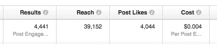
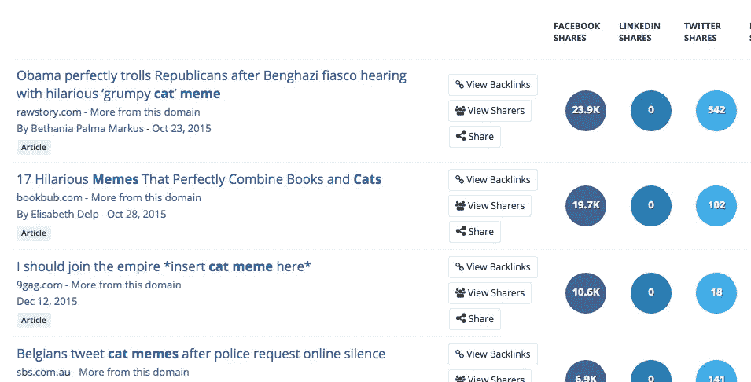
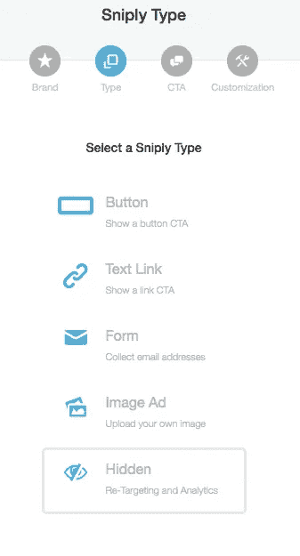
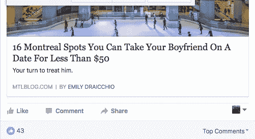
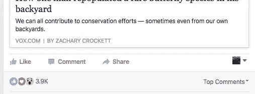

# 在 Buzzfeed、Vox、Gawker (eww)这样的脸书页面上创建病毒式帖子并重新定位你的受众？他们有一大群内容创作者，非常有针对性的观众，并有大量的预算让他们的内容出现在你面前。令人震惊的是，我们大多数人都没有这些资源，所以这里有一些我在[用的商业秘密来增加我们的内容。非常感谢](https://www.spoil.co) [Eyal Toledano](https://medium.com/u/aa50d46f53b7?source=post_page-----4e5d71ed07cb--------------------------------) 在这里提供的一些提示和技巧。

> 原文：<https://medium.com/hackernoon/https-medium-com-mlovekovsky-create-viral-posts-retarget-your-audience-for-cheap-4e5d71ed07cb>

让我们得到一些甜蜜的内容

Check out that Per Post Engagement Cost ☝️

## 内容营销很棒，但是谁有时间呢？幸运的是，其他人知道🙂。假设你是一个猫迷因网站，你想要一些关于猫迷因的有趣内容。为了找到脸书现在的热门内容，请前往 Buzzsumo。这个网站绝对是趋势内容的金矿。搜索与你的行业相关的内容(在这个例子中是猫迷因),并按脸书股票进行排名。

另一方面，我不确定脸书是否会喜欢那些已经被分享了很多次的内容，但是让我们谨慎一点(因此脸书分享的文章排名)。现在你有了你的内容，你就有了诱饵来吸引你的观众并重新定位他们。

23.9K shares for a grump cat meme…. *sigh*

现在你可能想知道，“*我如何重定向那些点击了不属于我的网站链接的人？”。这是非常非常酷的部分，再次感谢 Eyal Toledano 向我展示了这个技巧。*

重新定位其他人网站的流量

## 此时，你应该有 1 到 2 篇文章能真正打动你的目标人群，让他们感兴趣。你想把它作为你的脸书页面，但你也想确保你可以重新定位点击你链接的流量。这样做的方法是，使用另一个叫做 [Sniply](http://snip.ly/) 的很棒的服务。你可以用这个工具做很多令人惊奇的事情，但是我们将特别关注它的一部分。

在你完成初始设置(设置你的 facebook pixel，你的品牌…)后，创建一个重定位 CTA。

完成这些之后，使用你从 Buzzsumo 获得的链接，创建你的“snip”(snip ply 链接的别称)。这是非常强大的，因为这将允许你重新定位将要访问这个链接**的人，即使**是在别人的域上🚀 💸。

廉价获得社会认可

## 问题。你更有可能点击这两篇文章中的哪一篇？

我猜是右边的那个。为什么？因为有 3 900 人对它做出了反应(而不是 43 人)。它得到了社会的认可，有了更多的互动，由于更多的人对它做出了反应，脸书将会更频繁地推广它。

现在，脸书的糟糕之处在于，如果你不知道自己在做什么，你会很快挥霍掉大量现金😢。那么，你如何在不倾家荡产的情况下获得那么多赞(以及其他反应)？很简单，瞄准那些没有被瞄准的人。在我之前的[帖子](/@mlovekovsky/facebook-ads-for-noobs-5c6bcd48cd93#---0-15.xifobgiax)中，我提到了如何通过位置竞价，然而在这种情况下，我说的是跳出框框。在孟加拉国、巴基斯坦、开曼群岛等国家投标...我建议在曾经是英国殖民地的国家投标，因为这样一来，与你的帖子互动的人的名字将会是英文字母，而不是梵文。我创建了一个廉价的 facebook 受众，所以我可以随时选择它来使用这个策略。

现在你有了所有的工具来创造廉价和病毒式的帖子。

my cheap audience

去你的 power editor，创建一个提升的帖子，选择你的廉价受众，设定大约 5 美元的每日预算，然后等待大约 1 天。你会很容易地以极低的价格获得超过 1000 个帖子的赞。在某一点上，小数点向右移动了太多，看起来好像我每次预约都要花 0 美元！

一两天后，你的脸书帖子会有很多社会认可和喜欢，现在是时候瞄准你市场中的人了。转到 Power Editor，简单地将受众改变为美国的目标人群(或者你的目标市场在哪里/是谁)。现在，当他们看到你的文章时，看起来会有成千上万的人与它互动，他们更有可能点击。啊，瞧，从现在开始，你可以开始以非常低廉的价格创造你的营销漏斗顶端🙂 🎈

如果你喜欢这篇文章，请点击下面的❤️，这样其他人会在这里看到这篇文章。

[*我的推特:@mlevkov*](https://twitter.com/mlevkov)

在下面加入我的时事通讯，获得更多酷的东西👇

[黑客中午](http://bit.ly/Hackernoon)是黑客如何开始他们的下午。我们是 [@AMI](http://bit.ly/atAMIatAMI) 家庭的一员。我们现在[接受投稿](http://bit.ly/hackernoonsubmission)，并乐意[讨论广告&赞助](mailto:partners@amipublications.com)机会。

> 如果你喜欢这个故事，我们推荐你阅读我们的[最新科技故事](http://bit.ly/hackernoonlatestt)和[趋势科技故事](https://hackernoon.com/trending)。直到下一次，不要把世界的现实想当然！
> 
> If you enjoyed this story, we recommend reading our [latest tech stories](http://bit.ly/hackernoonlatestt) and [trending tech stories](https://hackernoon.com/trending). Until next time, don’t take the realities of the world for granted!

