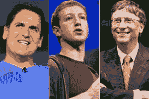
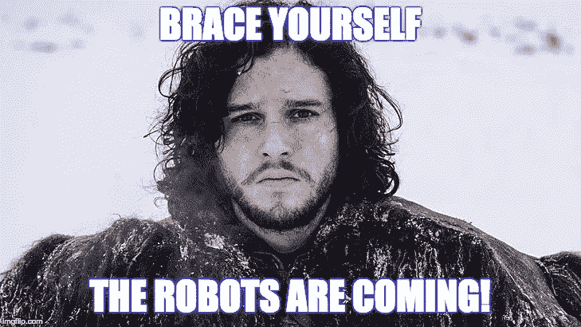

# 根据马克·库班、扎克和比尔盖茨的观点，科技的未来是…文科？！？

> 原文：<https://medium.com/hackernoon/https-medium-com-stevenchien-the-future-of-tech-according-to-mark-cuban-zuck-and-bill-gates-is-liberal-arts-5abfbb959918>

当这些亿万富翁科技重量级人物发言时，值得一听。

我们都听说过即将到来的机器人末日，机器人会来抢走每个人的工作。

一些制造恐慌的标题的例子:

*   JP 摩根刚刚将金融和法律工作外包给一个机器人，该机器人可以在几秒钟内完成 360，000 小时的收费工作。
*   [马克·库班预测](http://time.com/money/4676298/mark-cuban-best-job-skill/)机器人很快就能写出比人类更好的计算机代码。
*   [甚至一些医生可能会被智能马桶和其他提供更准确诊断的传感器取代。](http://www.wired.co.uk/article/yaniv-j-turgeman)

想象一下…

医生、律师、会计师和工程师被机器人取代……***这是每个虎妈最可怕的噩梦！***

# 停下来。那么这一切意味着什么？

达拉斯小牛队的老板、亿万富翁软件开发商马克·库班说:

> “我个人认为，10 年后对文科专业的需求会比编程专业甚至工程专业更大。”

换句话说，在一个机器人将越来越多地取代工作的世界里，**创造性思维**将成为新的需求技能。当你让机器人计算和处理数百万个数据点时，你仍然需要一个具有创造性思维的人来解释数据，产生见解和断言。

麦肯锡似乎同意这一观点，指出最难取代的活动是人员管理和创造性工作。任何文科教育的经典标志。

[比尔·盖茨选择了玻璃半满视角](https://qz.com/911968/bill-gates-the-robot-that-takes-your-job-should-pay-taxes/)，他指出，工作岗位的转移将解放劳动力，让他们能够…

> “更好地帮助老人，缩小班级规模，帮助有特殊需求的孩子。你知道，在所有这些事情上，人类的同情和理解仍然是非常非常独特的

# 怀念那个博雅教育？

马克·扎克伯格给了我一个建议:

> “这个世界需要目标。由你来创造。承担大的有意义的项目是我们能做的第一件事，创造一个每个人都有目标感的世界(T2)

机器人不能创造有意义和目的感的项目。做到这一点需要一定程度的创造性思维和人类同理心，即使是最先进的机器人也远远达不到。

那么，你如何承担大的、有意义的项目呢？

就像你吃大象一样:一次一口。

# 从边上开始，现在我们在这里

**脸书**原本是哈佛简单的“热不热”。

**微软**最初记录流量计数器数据。

甚至互联网本身也是从一个非官方的项目开始的。

还有**德雷克**……其实我们还是跳过德雷克吧。

今天的重量级人物并不是一夜之间成为行业巨头的。即使对他们来说，这一切都是从一次偶然事件开始的。

# 为什么每个人都需要侧面放纵…

…也就是说，兼职、兼职、兼职项目。

正如马克·库班、比尔·盖茨和扎克所描述的，未来经济的繁荣将需要**创造性思维**、**人类同理心**和**有目的感的项目**。这些都是一个博雅教育的共性，但不是一个人的专属。事实上，

> ***一面奔忙，一面演出，一面放纵，激情项目，无论你怎么称呼它……都是无与伦比的，是你未来的最佳训练方案*** *。*

也许你是一个公司摇滚明星，想要打破常规，为自己工作。

或者，也许你计划保留你的日常工作，只是享受一下娱乐和创造性表达的乐趣。

不管你的职业目标是什么，把工作作为你的业余爱好会帮助你提高水平，为明天的经济做好准备。

***言归正传！***