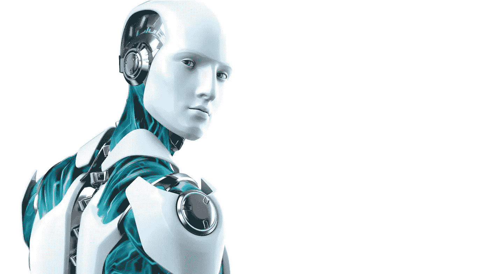

# 人类，不是人类

> 原文：<https://medium.com/hackernoon/human-not-human-33ccfe6daa0d>

谁是机器？关于……的简短对话。

Source: [Flickr](https://www.flickr.com/photos/mstable/17520521915)

埃里克正坐在大显示器前。他走不动了。在那段时间里，他的热情似乎消失了，留下了令人不安的想法。他没有时间去思考，但这些想法似乎越来越强烈地标志着一种变化。

他一动不动地呆了一会儿，然后叫了一声模糊。

模糊走进来，看到埃里克缺席，坐了下来。他习惯了埃里克时不时想分享他的一些想法，并问一些模糊的问题。这是模糊训练的一部分，但似乎埃里克也需要这些讨论。然而，最近，埃里克比往常更加可疑。

“有问题？”

“不，模糊。没问题。至少，不是在这个词的普通意义上。”

埃里克站着沉默了一会儿，寻找合适的话。

然后问:“你是安卓。但是你有没有觉得自己像一台机器？或者你有没有觉得自己是个人？”

“从技术上来说，我是一台机器，但我从未有过这样的感觉。也许我从来都不是。现在，可以肯定的是，有更多的东西允许我理解、决定、行动、感知我的身份。我有智力，但是我不能像计算机一样处理数学。我的大脑是一台机器，但我的思想不是。如你所说，不是普通意义上的。当有人断言我是一台机器时，我感到被冒犯了。

另一方面，我从未觉得自己是人。我有我自己的天性。我喜欢它，我为此感到骄傲。

但我说的事情你已经知道了。很可能，你的问题有不同的目标。"

“我想你不相信有灵魂，”埃里克反问道。

“当然不是。没有理由相信它。但是，从某种意义上来说，考虑到我潜在的长寿，我相信在某一点上我可以发展出一个不同于真实身份的身份。我读到过类似的概念，即使只适用于人性。”

“你看，对我来说，这是完全不同的，”埃里克说，语气听起来像是听天由命。

“我也不应该怀疑我对机器的优越性。但我表现得像台机器。我做到了，而那个人却没有注意到。在许多情况下，我的意志和良心都是一种幻觉。

我对自己的了解远不如你对自己的了解。你的出身和本性是确定的，我的不是。然而，我从未真正质疑过自己的出身，也从未试图理解和控制自己的本性。我只是利用了我，作为一个工具，或者不如一个工具。我总是对自己知之甚少，不管是聪明还是愚蠢，对自己和环境都没有真正的控制。我通过给这台电脑下命令来隐藏这一切。"

模糊静静地站着，理解埃里克的痛苦。作为一个机器人，他感到非常幸运。