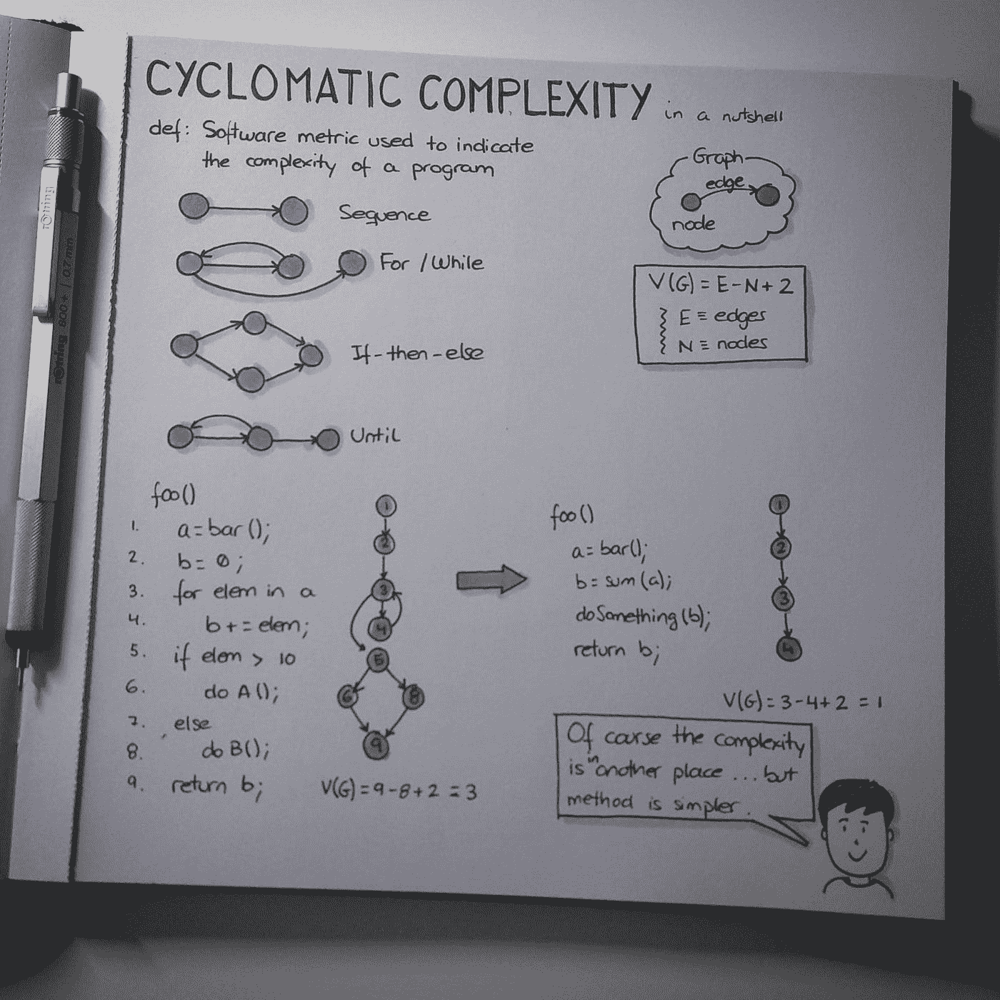

# 人类可读的代码或者为什么我不喜欢 if 语句

> 原文：<https://medium.com/hackernoon/human-readable-code-or-why-i-dont-like-if-statements-c4fb38d3e693>

在这篇文章中，我将解释为什么 if 语句应该从你的代码中删除。我并不是说你应该回去从你写的所有代码中删除所有的 if 语句，或者开始一些大的重构。我只是提出了一种更易于人类阅读的代码编写风格。

> 编写能够工作和执行的代码很容易。机器不关心你如何构造你的代码或者你如何命名你的变量。困难的部分是编写其他人可以看到并快速理解的代码。

这一点可以用例子更好地说明。让我们看看这段任意的代码:

这是一个相当简单的例子，应该不会花你很长时间来解析。然而，这个简单的小方法可以很快演变成不可维护的东西，非常难以阅读和测试。

如果我们去掉 if 语句，将一些[业务](https://hackernoon.com/tagged/business)逻辑抽象成更简单、更简洁/描述性的方法，我们不仅可以使这更容易理解，还可以降低这种方法的圈复杂度。

Image borrowed from [Yeray Darias](https://twitter.com/ydarias)

去掉这些 if 语句并把我们的简单例子变成更具声明性的风格是相对简单的。首先，我们可以将 if 中的每个表达式转化成它自己的[函数](https://hackernoon.com/tagged/function)。

我们的简单例子开始成形了。现在，我们可以知道这些条件句在检查什么。只对这些条件进行单元测试也是可能的，因为它们封装在自己的方法中。

但是，我们可以更进一步…

那里有一个讨厌的 forEach 循环。它像一个疼痛的拇指一样突出。我们用一个*就能搞定。map()* 并将该逻辑抽象成它自己方法。

既然这样，让我们去掉这两个 if 语句。我们可以用三元运算符来代替它们。同样，演示起来更简单:

# 结论

任何必须维护这段代码的人都会更容易理解 *getRelatedArticles* 方法在做什么。与该文件以前的样子相比，在文章解析方法*parseratedtarticle，*中添加更多的方法也容易得多。

这些方法中的每一个都执行一个高度特定的功能，这使得对这个文件的单元测试变得更好。

如果在运行时发生错误，堆栈跟踪将告诉您哪个方法失败了，因此这使得调试比检查哪一行失败并通过原始的 *getRelatedArticles* 方法跟踪到底发生了什么要简单得多。

这当然是一个完全任意的例子。我相信你能从中推断出。

> [黑客中午](http://bit.ly/Hackernoon)是黑客如何开始他们的下午。我们是 [@AMI](http://bit.ly/atAMIatAMI) 家庭的一员。我们现在[接受投稿](http://bit.ly/hackernoonsubmission)，并乐意[讨论广告&赞助](mailto:partners@amipublications.com)机会。
> 
> 如果你喜欢这个故事，我们推荐你阅读我们的[最新科技故事](http://bit.ly/hackernoonlatestt)和[趋势科技故事](https://hackernoon.com/trending)。直到下一次，不要把世界的现实想当然！

