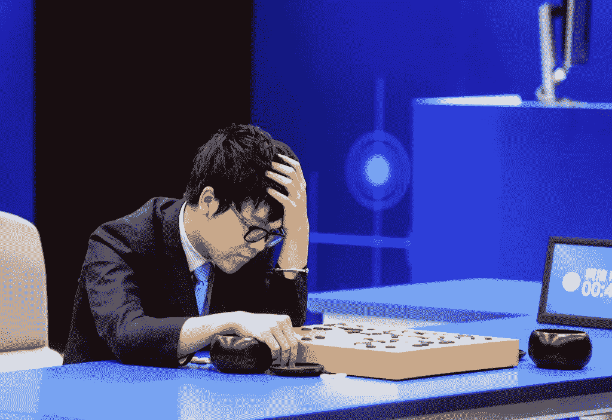

# 人类

> 原文：<https://medium.com/hackernoon/humans-da3422b3a5e0>

[柯洁，](https://en.wikipedia.org/wiki/Ke_Jie)世界顶级围棋选手在我写这篇文章的时候，刚刚一连输了三局，以向计算机[程序](https://hackernoon.com/tagged/program)命名为 [AlphaGo](https://hackernoon.com/tagged/alphago) 。我个人没有能力评价这样的戏，但显然柯洁的戏被认为是最高水平的。

以下是中国社交媒体上关于此事最受欢迎的评论。

你输了，你哭了。机器赢了，但它没有笑。 — 27368 个赞

他 16 岁就已经是世界排名第一的优秀选手了。今天，作为人类的代表，他真的肩负着与艾战斗的重任。AlphaGo 容量巨大，从未停止过自我修复和升级。这从一开始就不意味着是一场公平的竞争。前段时间柯洁说他能赢 AlphaGo，但那是在它进化之前的几个月。 — 14111 个赞

*这不是柯洁的失败，这是人类的失败。同时，这不是 AI 的成功，而是人类的成功。* — 11635 个赞

昨天我们的老师刚刚告诉我们，人们几年前就发明了汽车，但从来没想到会跑得比汽车快。 — 7436 个赞

你的手很漂亮(优雅)，但不适合擦眼泪。 — 5898 个赞

*柯洁不是为自己哭，而是为这个世界上每一个刻苦训练的围棋手，为我们在 AI 面前做不到更好的事实而哭。这可能是老的，但我仍然想说，柯洁已经赢得了他的眼泪。* —未知数量的喜欢

> 黑客中午是黑客如何开始他们的下午。我们是这个家庭的一员。我们现在[接受投稿](http://bit.ly/hackernoonsubmission)并乐意[讨论广告&赞助](mailto:partners@amipublications.com)机会。
> 
> 如果你喜欢这个故事，我们推荐你阅读我们的[最新科技故事](http://bit.ly/hackernoonlatestt)和[趋势科技故事](https://hackernoon.com/trending)。直到下一次，不要把世界的现实想当然！

