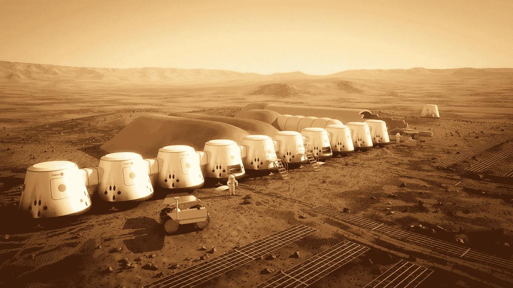
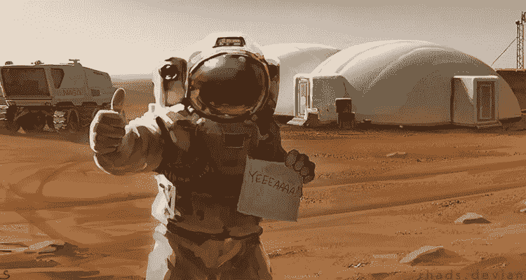

# 人类需要目标，而大目标需要是太空

> 原文：<https://medium.com/hackernoon/humans-need-goals-and-the-big-goal-needs-to-be-space-92bdf34a8b2a>

## 我们应该一起决定人类 2000 年的目标是星际旅行

你上一次钻进自己的车，转动钥匙，开始开车，却一点也不知道自己要去哪里是什么时候？

你上一次掏出刀子开始切菜，却不知道你的晚餐会变成什么是什么时候？

人类不是依赖一套基因图谱行为，而是用我们的思维来规划我们的未来。这是好事。

令人担忧的是，作为一个物种，我们没有计划。

我们详细计划自己的行动。我们安排我们的日子，我们的岁月，我们的退休。我们计划我们孩子的命运，我们的城镇，我们的公司，甚至我们的国家。然而，在所有这一切中，我们似乎很少去思考一切都在朝着什么样的更大目标前进。

作为一个物种，我们的长期计划是什么，比如说 2000 年？

我相信应该是把人类扩展到太空。

Courtesy of Mars One

## 我们当前的短期目标提出了一些难题

现在，世界上有许多聪明而富有献身精神的人在解决各种各样的问题，气候变化、贫困、无家可归等等。即使在他们着手解决这些问题的时候，尽管缺乏一个更宏观的目标会产生一些显而易见但难以回答的问题。

我们必须变得多可持续？

*世界经济持续增长的意义何在？*

*我们为什么要继续提高生活水平？*

## 选择 2000 年的目标有助于回答这些问题

为了回答这些问题和其他许多问题，我们需要一个大目标。

就像开始漫无目的地开车，或者开始做饭时脑子里没有一道菜，我们无法知道我们正在做的事情从长远来看是否有用。

不乏思考过这些问题的思想家，从广义上讲，我们似乎有一个共同的目标:

人类需要在接下来的 2000 年里生存下去。

那是最大的一个。即使不是每个人都愿意说“所有的人类”都必须生存，或者如果有些人想把北极熊和美国栗树列入需要生存的名单，我们似乎都普遍同意。

问题是，我们怎么做？

在接下来的 2000 年里，似乎有两种选择:

1.  **离开地球**——小心翼翼地利用现有的资源、政治、社会和经济体系离开这个星球，殖民其他世界。
2.  **缩小以适应地球**——改变我们目前的增长心态，限制人口和/或资源消耗，以确保我们能够独自在这个星球上维持人类生活。

## 作为 2000 年的目标，在地球之外成长是非常有意义的

在这两个长期选项中，只有选项 1 似乎能保证人类的长期生存能力。如果我们现在选择选项 2，我们要么需要接受我们不可避免的在太阳死亡或全面核战争中毁灭，要么在以后再次面对决定。

由于我们的资本主义经济和快速扩张的历史，我们已经做好了选择 1 的准备。现在停下来，开始缩减我们的人口、消费和增长预期，对世界上大多数人来说，将是一个巨大的转变。在地球之外成长是人类行为模式的自然下一步，这一模式始于我们第一次通过在头上盖一个屋顶来抵御雨水。

这并不是说我们应该放弃所有可持续发展的想法，向无节制的经济增长敞开大门，或者停止试图为所有人制定平等的标准。建立一个星际人类帝国是一项超越我们以往任何成就的事业。这将需要难以置信的资源管理。这将需要我们所有的技术和更多。这需要我们把小冲突放在一边。这将需要 80 亿健康、有生产力、有干劲的男人和女人中的精英。

## 2000 年的工作现在开始

太空殖民不是当今全球议程上的首要项目。

今天的全球问题包括中东和平、应对全球变暖、引导世界经济免于崩溃，所有这些都是需要关注的近期问题。我们在太空的[未来](https://hackernoon.com/tagged/future)应该在那个议程上占有一席之地。没有它，我们今天采取行动的目的是什么？一个共同的人类目标赋予这些行动以目的，将人们团结在一起，并把更小的问题放在正确的位置。

现在是做这个决定的时候了。自从欧洲在“处女地”建立新世界以来，已经过去了将近 400 年。从那以后，我们成长了，改变了。我们已经脱离了我们的国王和王后，分裂了原子，并向太空发射了我们的第一艘飞船。现在我们开始停滞不前。开始变得过于满足于我们所谓的成就。现在是时候利用我们所学的知识向未知的伟大领域进军了。

我们曾经凝视着浩瀚的海洋，并承诺在遥远的海岸建立一个家。

现在我们必须仰望天空，做同样的事情。

Courtesy of “The Martian”

## 那你是做什么的？

有很多事情，取决于你是谁，你以什么为生，但这里有一个大致的清单。

*   讨论那些长期物种目标的选项——你站在哪里？还有吗？
*   审视你自己的生活——你正在朝着这些目标努力吗？
*   订阅[太空新闻](http://www.space.com)。
*   游说你的政客们把太空探索和殖民化提上日程。
*   在[商业空间](http://www.virgingalactic.com/)可用时买入。
*   *当然，你可以点击*💚*在下面，所以其他人会在这里看到它。*

> [黑客中午](http://bit.ly/Hackernoon)是黑客如何开始他们的下午。我们是 [@AMI](http://bit.ly/atAMIatAMI) 家庭的一员。我们现在[接受投稿](http://bit.ly/hackernoonsubmission)并乐意[讨论广告&赞助](mailto:partners@amipublications.com)机会。
> 
> 如果你喜欢这个故事，我们推荐你阅读我们的[最新科技故事](http://bit.ly/hackernoonlatestt)和[趋势科技故事](https://hackernoon.com/trending)。直到下一次，不要把世界的现实想当然！

