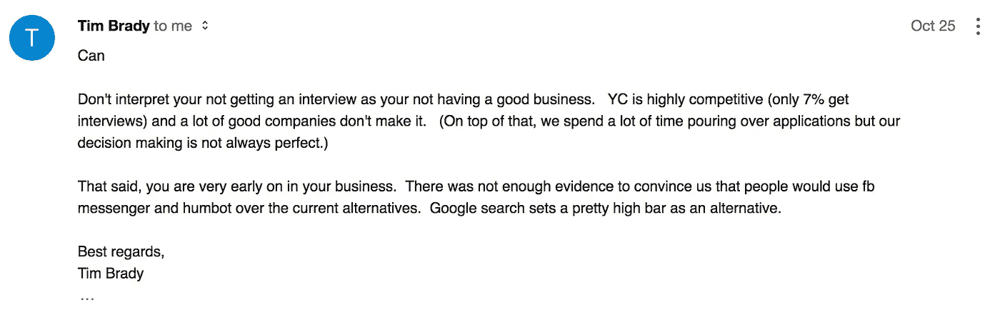
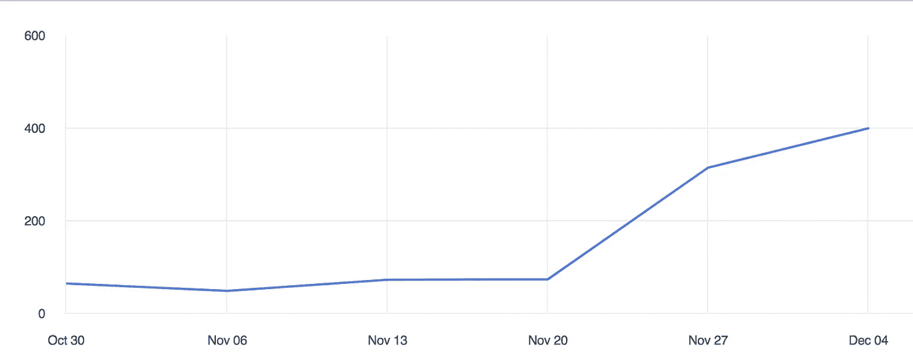

# 亨伯特的策略:我们如何计划让辅导更容易获得

> 原文：<https://medium.com/hackernoon/humbots-strategy-how-we-plan-on-making-tutoring-more-accessible-604fe169afa0>

我们于 2017 年 6 月开始全职开发 [Humbot](https://humbot.io) 。即使我们从不同的产品开始，我们总是有相同的目标:提高公众对科学的理解。

## **以下是摘要:**

2017 年 11 月，我们意识到家教市场存在机会。现在，我们提供的在线辅导比现有的竞争对手便宜 100 倍。我们通过一个熟悉的媒介——Facebook Messenger——辅导我们的学生，由于它的异步特性，进入门槛很低。就像拼车公司一样，我们可以以这些价格提供服务，因为我们相信，通过辅导的自动化，我们能够在未来两年内大幅降低成本。

## **下面是更长、更有趣的版本:**

创业初期，你需要找一个角度开始。这是一种实现最终目标的方法，也能让你快速赚钱并获得用户。找到这个角度并不明显，而是一个月试错过程的结果。一般来说，你对你的产品和目标市场越具体越好。原因是这样你可以快速测试你的假设，看到它失败，然后继续下一次迭代。

# 努力获得牵引力和 YC

当我们开始时，Humbot 是一个本地应用程序，你可以在那里阅读科学主题的简短解释。2017 年 8 月，我们决定用户应该能够[提出问题](https://stories.humbot.io/introducing-questions-you-ask-we-explain-8534ace6b310)，我们作为专家可以回答这些问题。一个月后，9 月份，我们开始专注于问题的独家回答。因此，我们[放弃了我们的 iPhone 和 Android 应用](https://stories.humbot.io/introducing-your-new-ai-friend-that-knows-all-about-science-ac5de4034e24)，重新推出了我们的网站，并启动了一个信使机器人作为我们唯一的新产品。

我们开始研究如何用机器学习来回答问题。事实证明，最近几个月，这一领域的研究取得了良好的进展。尽管现在还不可能实现自动问答，但我们认为这将在未来两年内实现。那时，我们正在用一个半自动机器人在 Messenger 上进行科学问答，希望我们能尽快实现大部分自动化。这似乎是一个很酷的产品:一个在你口袋里的朋友，可以立即回答你所有的科学问题。

几个星期后，我们仍然没有任何真正的牵引。我们还是决定申请 [Y Combinator](http://www.ycombinator.com/) 。不出所料，我们在 2016 年 10 月 24 日收到了我们的拒绝。“感谢申请 Y Combinator，诸如此类”。渴望得到更多的反馈，我给 YC 的合伙人之一蒂姆·布雷迪写了一封信。

令人惊讶的是，他迅速回答道:

The email Tim Brady sent to me was pivotal

在几个一般性的句子之后，最后一句话对我们的思维方式产生了重大影响:“谷歌搜索为备选方案设置了一个相当高的门槛”。什么鬼东西？！为什么他认为我们在和谷歌竞争？

我们的产品太宽泛了，这就是原因！理科答题？拜托，这正是谷歌所做的(以及其他事情)。

# 清晰的焦点有助于更快地迭代

我们决定关注这个坏男孩。我们缩小的第一件事是我们的目标群体和用例。这将有助于我们的营销、沟通和产品供应更加清晰。显然，我们选择高中生作为我们的目标群体。他们每天一定会问一些与学校相关的问题，比如数学和科学。

下一步是了解如何在孩子们面前。我们尝试的一种方法是给老师发邮件。一个他们可以给学生的工具。没成功。在我们联系的大约 100 名教师中，有一个人想尝试一下，但后来决定不去了，因为他不想使用自己的脸书账户。

我们尝试的下一件事成功了。我不记得我们是如何想出这个主意的，但我们认为我们应该看看家教市场。事实证明，家教市场很大，还在增长，由老派的在职者和高价格主导。这是一个创业公司改变现状的绝佳时机。

从那以后，我们的每周活跃用户增长了 50%。

Humbot’s weekly active users

不仅如此，我们的保留率和参与率也大幅上升。一些用户每天花几个小时在 Humbot 上(当然不是每天)。

# 价格高昂的老式手工市场

我不想在这里深究家教市场，但你需要明白的是，父母正在向辅导孩子的人支付过高的费用。许多辅导是通过这些公司定制的类似 Skype 的视频通话软件在网上进行的。每小时的费用高达几百美元，平均每小时大约 70 美元。

这向我们展示了两件事。首先，孩子们在高中挣扎似乎是一个大问题(因为支付了巨额费用)。其次，这些高价是人类坐在网络摄像头前一遍又一遍地解释同样的事情的结果。一个因明显的低效率和巨大的问题而以高利率为标志的市场？算上我们！

我们现在通过 Messenger 为高中生提供辅导。虽然有些互动是自动化的，但实际的辅导是由真人完成的。学生每得到一个解释要支付 0.2 美元。有些解释要花掉导师半个小时的时间。这比现有的在线辅导方案便宜 100 倍。

不仅如此，对于青少年来说，这也是一种更自然的与他人互动的方式。它的门槛低得令人难以置信:你只要有时间就开始发短信。通常，他们拍下他们问题的照片，在上面画些东西，然后我们写或画些东西回来。有些解释可能会持续几天，因为学生可能会从一个问题开始，但接下来的一两天没有时间回答。

Sometimes, drawing an equation helps to make a point :-)

除了价格之外，我们服务的熟悉性和异步性也更适合这个目标群体。

我们怎样才能以一种负担得起的方式提供辅导？因为我们相信我们可以在未来两年内实现大部分辅导的自动化。所以，现在投入时间和金钱是值得的。

这将是一个渐进的过程。可能不会有一个单一的机器学习模型做所有的事情。相反，我们将逐步开始自动化。需要越来越少的人工监管。

这不仅对我们来说更有效率，而且还会提高产品的价值。学生将能够获得即时和全天候的帮助。此外，我们可以为每个人提供最高质量的辅导，而与每位导师的技能水平无关。我们期望另一个额外的好处是我们可以从我们的数据中提取高价值:例如，看看什么样的解释工作得更好或更差。

对我们的战略来说，一个很好的类比是像 Lyft 这样的共享公司。他们现在根本没有盈利，但他们知道这是值得投资的，因为一旦他们拥有了大部分自动驾驶汽车，经济效益就会显现出来。

我知道我们才刚刚开始，很多事情可能会出错。但是驱动我们的(不是双关语)是创造一种新的学校。在这所学校里，教师可以专注于职业中有趣的、非重复性的部分，而不是教 30 个学生，而是可以教 300 个学生。我们认为我们可以开发软件，赋予老师们，以及我们的下一代，超能力。

如果你是一名教育工作者，喜欢我们所做的事情，请联系我(can@humbot.io)，这样我们就可以探索合作的方式。