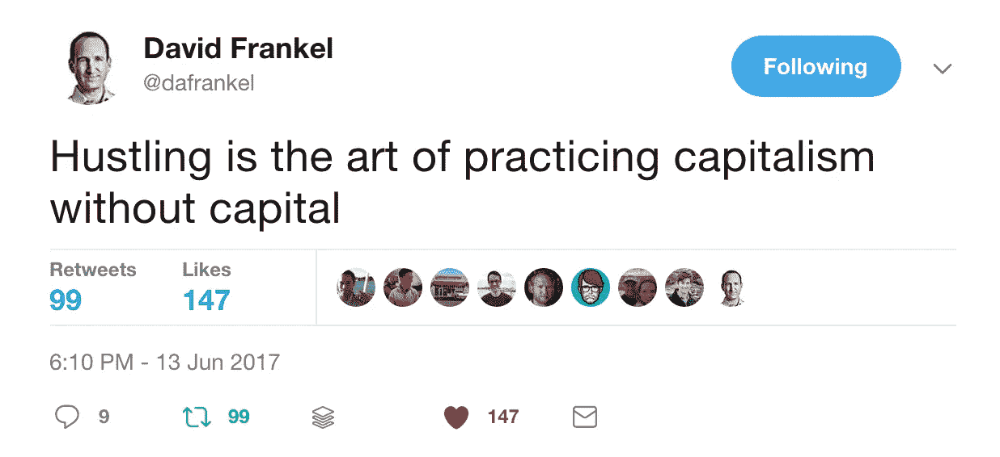
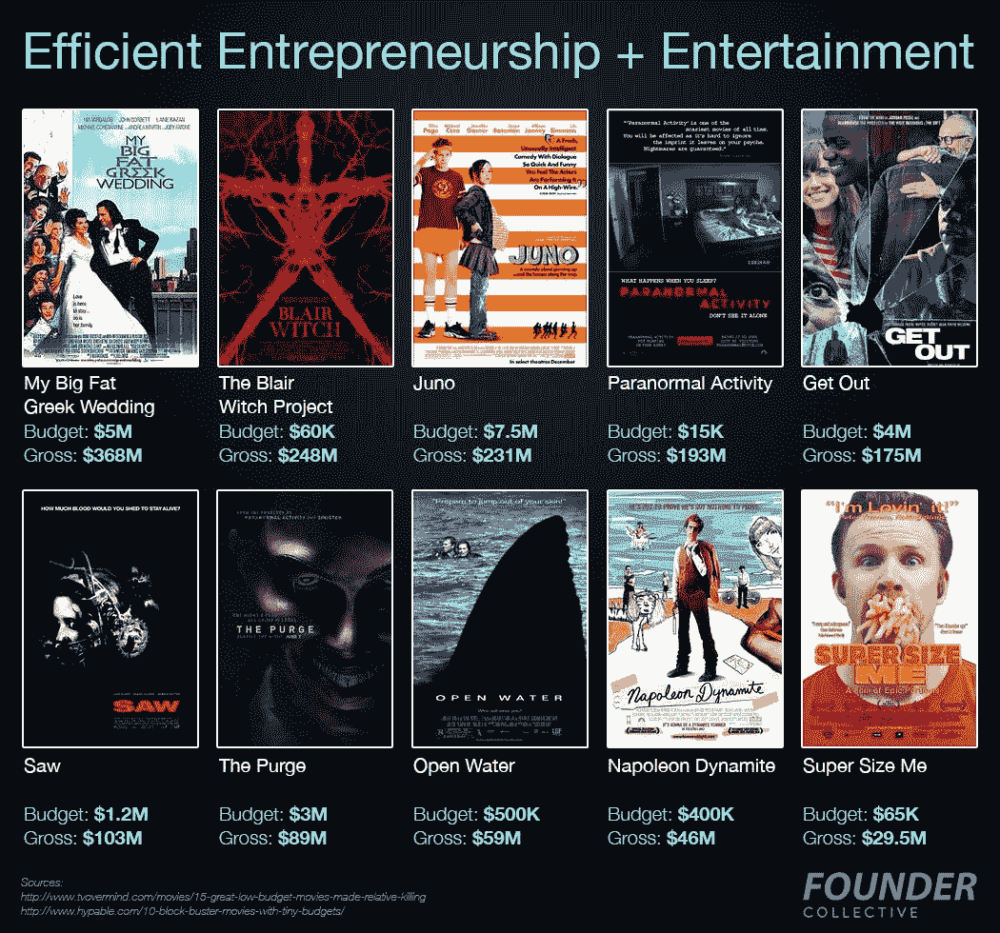
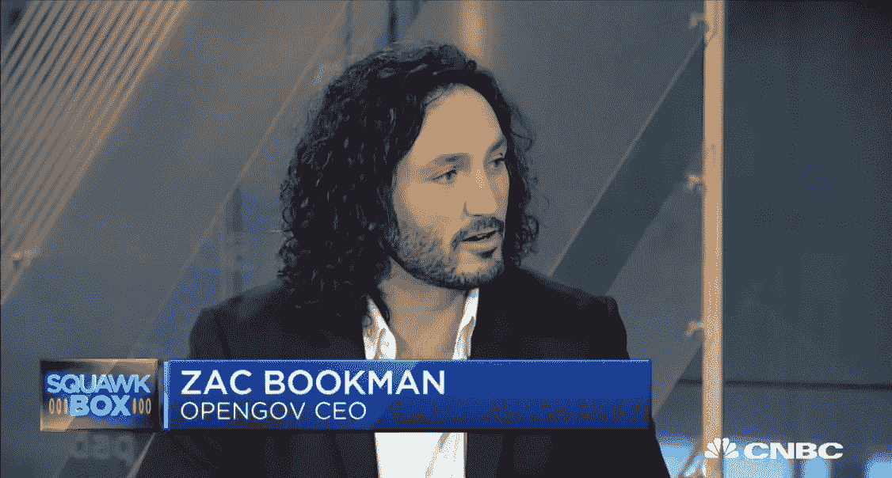
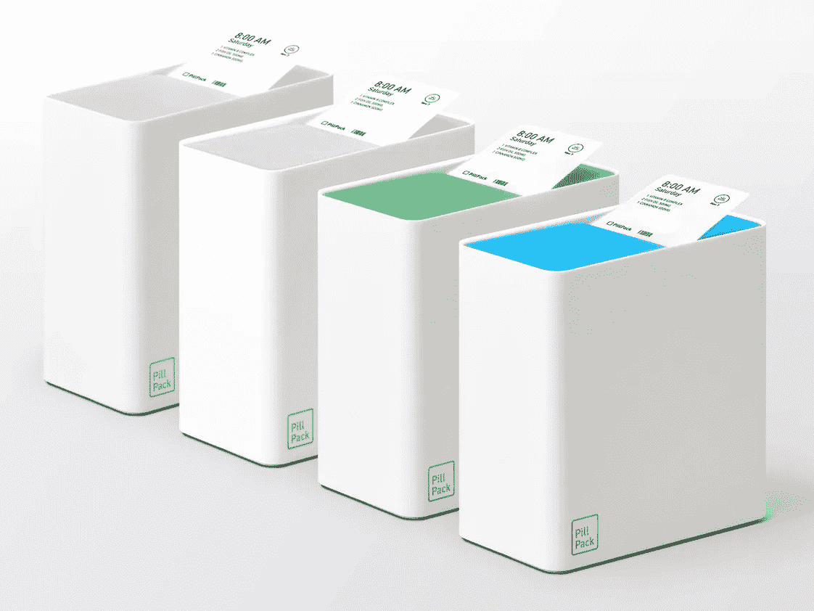

# “行骗是在没有资本的情况下实践资本主义的艺术”

> 原文：<https://medium.com/hackernoon/hustling-is-the-art-of-practicing-capitalism-without-capital-6a729de34a3a>

*原载于刺儿头&怪，方正集体***迅—* [*报名这里*](http://eepurl.com/crytmH) *！**

**

*大卫·弗兰科尔转述了 Regie Gibson 在 Cue Ball Capital 的年度聚会上发表的这句话，提醒人们资本是一种限制——尽管这可能不是大多数创业公司面临的最大限制。喧嚣往往在更短的供应。这里有几个鼓舞人心的企业家故事，说明了努力胜过资本的力量:*

*   ***Wayfair:** 在公司资金短缺的早期，Wayfair 没有投资于昂贵的广告活动， [Wayfair 建立了 270 个极具针对性的网站](http://www.businessinsider.com/the-story-behind-wayfair-2014-10)，用“RacksAndStands.com”等超特定的名字来对抗谷歌的搜索算法，为这项价值 40 亿美元的业务铺平了道路。*
*   *一家 2B 股票图片服务公司，由一名黑客/业余摄影师创建，他亲自创建了这个网站，并从他的照片收藏中挑选了 10 万张图片。*
*   *一旦你筹集到风险资本，你就不会停止忙碌。Langley Steinert 筹集了 500 万美元来启动 CarGurus，但他没有寻求风险投资来雇佣更多的工程师，而是利用他创造的收入雇佣了数百名销售代表来创造更多的收入——现在该公司正在走向 IPO。*

## *见见取代 RadioShack 的高效企业家*

**

*Limor Fried, founder/CEO of AdaFruit. Photo: [Make: Magazine](http://makezine.com/2017/06/13/open-source-ideals-engineering-genius-helm-adafruit-maker-revolution-manufacturing/).*

*在麻省理工学院的宿舍里，Limor Fried 创办了 [AdaFruit](https://www.adafruit.com/) 公司，她的电子商务/电子产品初创公司(现在总部位于纽约)用 105 名全职员工实现了 4500 万美元的收入，产品线包括 400 多种硬件产品和套件。阅读这个[品牌:杂志](http://makezine.com/2017/06/13/open-source-ideals-engineering-genius-helm-adafruit-maker-revolution-manufacturing/)简介，了解更多关于该公司的信息，包括他们如何获得 2000 多万 YouTube 浏览量、10 万 Twitter 关注者和 2M 每月网站访问量。*

## *Unity 前四年没有融资，一轮融资 4 亿美元*

*游戏引擎 Pokemon Go 和 34%顶级手机游戏的制造商 Unity 刚刚从私募股权巨头银湖融资[4 亿美元。更有趣的是创始人在公司的前四年是如何忙碌的历史，发展适合移动设备的 3d 渲染技术，放弃薪水，甚至在筹集风险投资之前为支付账单而等待。](https://www.bloomberg.com/news/articles/2017-05-24/silver-lake-invests-400-million-in-video-game-toolmaker-unity)*

## *创业公司应该关心盈利能力吗？*

*马克·苏斯特提出了一个令人信服的观点，即对于非常适合风险投资的公司，盈利能力被高估了。这是一个微妙的论点，但几乎所有企业家都会从阅读中受益。以下是摘录:*

*如果他们的目标市场非常大并且增长迅速，那么风险投资支持的企业往往会使非风险投资支持的企业更难长期竞争。如果市场不大，那么管理其成本的公司可能能够以公平的价格适度退出，并让团队变得富有，因为他们没有接受风险资本。风投支持的企业有时会“破产”。通常情况下，没有明显或正确的答案。*

*[Fred Wilson](http://avc.com/2017/06/should-your-company-be-profitable/) 发表了一篇帖子，讲述了他投资的公司优先考虑盈利能力所带来的有利影响。[布拉德·菲尔德](https://www.feld.com/archives/2017/06/lessons-internet-bubble-growth-vs-profitability.html)分享了他在网络时代的经历，“我知道市场会奖励增长，直到它们不再奖励。然后他们奖励盈利能力。”此外，一定要阅读罗杰·埃伦贝尔对讨论的深刻贡献。*

# ***来自网络的怪异***

*   *电影制作人用摄像机替换了失去的眼球。[ [主板](https://motherboard.vice.com/en_us/article/rob-spence-eyeborg-video-camera-eye-socket-toronto-filmmaker)*
*   *"最近在阿尔布开克灵魂美食餐厅 Nexus Brewery 的一次打字活动中，大约 36 名粉丝轮流点击一台意大利制造的 1964 年 Olivetti Lettera 32 打字机的按键。"[ [我的萨南托尼奥](http://www.mysanantonio.com/business/article/Call-it-a-comeback-Typewriters-attracting-new-11220392.php)*
*   *英国研究人员扫描了 6000 张脸，为整形外科医生创建了数据库，用于整形手术*
*   *这是 200 多年来第一种用于蜡笔的蓝色颜料*

# *新闻中的方正集体*

## *[解构“近乎”完美的交易——我们对 Julia Computing 的投资](https://hackernoon.com/deconstructing-the-near-perfect-deal-our-investment-in-julia-computing-dca81bb1d779)*

**由* [*D*](https://twitter.com/micahjay1) [*热心的弗兰克尔*](https://twitter.com/dafrankel) *，伙伴**

**

*摘录如下:*

**这些年来，我有幸接触了一些了不起的企业家和初创公司，但当我投资时，这些交易都有一些缺陷。这些显然不是取消资格；事实上，高风险的种子期风险投资是基于……风险之上的。这就是为什么我既兴奋又有点担心，我最近有机会投资一笔交易，这是我可能看到的最接近柏拉图式理想的交易。**

*想知道是什么让一笔交易“近乎”完美吗？[阅读更多！](https://hackernoon.com/deconstructing-the-near-perfect-deal-our-investment-in-julia-computing-dca81bb1d779)*

## *[**有哪些创业公司&风投可以向奇兵学习**](https://hackernoon.com/what-startups-vcs-can-learn-from-indiana-jones-bd6c1bb3de2c)*

**由* [*米卡*](https://twitter.com/micahjay1) *组成，搭档**

**

*摘录如下:*

*对于创始人来说，将自己视为导演而非企业家可能是一种有益的练习。电影制作人和创始人都是有创造力的专业人士，但导演不得不面对一个资本是固定数额，而不是看似无穷无尽的世界。*

*董事们必须对他们的产品有一个愿景，大致了解实现这个愿景的成本，然后在这些限制下执行。相比之下，初创公司的创始人总是有可能筹集到新一轮资金。*

*对电影制作人的严格限制导致了一系列由不知名的创作者以小成本制作的独立项目，这些项目可以与众星云集的好莱坞大片相媲美。例如:*

*这些是让明星和标语出名的事业项目。所有这些都是由 A 轮融资完成的。是什么让这些低成本电影如此成功？似乎有几个共同的主题:*

*想知道大人物拿破仑能教给你的创业公司什么吗？[这里看剩下的](https://hackernoon.com/what-startups-vcs-can-learn-from-indiana-jones-bd6c1bb3de2c)。*

## *一个 1 亿美元的初创公司没什么丢人的*

**由* [*E*](https://twitter.com/micahjay1) [*里克佩利*](https://twitter.com/epaley) *，搭档&* [*【乔·弗莱厄蒂*](https://twitter.com/josephflaherty) *，C & C**

**

*我们已经扩大了已经成为风险投资人的企业家名单，并发现数十亿美元的成果仍然短缺。*

# *投资组合更新*

**

*OpenGov 首席执行官扎克·布克曼出现在美国消费者新闻与商业频道，讨论科技公司如何帮助简化和加强政府服务*【美国消费者新闻与商业频道】**

*[奥马达健康](https://www.omadahealth.com/news/omada-health-raises-50-million-led-by-cigna) 从 Cigna 筹集了 5000 万美元用于对抗糖尿病*【奥马达】**

**

*[PillPack](https://www.wired.com/story/pillpack-pharmacy-of-the-future-is-ready-for-your-bathroom/) 宣布了新的包装设计和 pharmacy OS**【连线】***

****[**ense 360**](http://www.cnbc.com/2017/06/19/for-restaurants-like-mcdonalds-delivery-isnt-keeping-diners-away.html)**发布的数据表明，送餐应用不会蚕食餐厅的销售。*【美国消费者新闻与商业频道】*******

******[**保险杠**](https://bumpers.fm/e/b51eqmcsdhag017mhpag) 分解苹果播客生态系统的新变化*【保险杠】*******

******[**安德拉**](http://www.wsj.com/graphics/25-technology-companies-to-watch/) 是《华尔街日报》的“25 家值得关注的科技公司”之一*【WSJ】*******

# ******本周工作******

************

******3d 打印市场领导者 [Formlabs](https://formlabs.com/) 计划在明年招聘 100 多人，但首先，他们需要找到一名[王牌招聘人员](https://formlabs.com/company/careers/job/637025/apply/)。你知道如何找到最好的软件工程师吗？吸引工程、设计、营销和销售领域顶尖人才的技巧？如果是这样的话，Formlabs 正在打造一些令人惊叹的东西——成为其中的一部分。******

************************************

> ******[黑客中午](http://bit.ly/Hackernoon)是黑客如何开始他们的下午。我们是 [@AMI](http://bit.ly/atAMIatAMI) 家庭的一员。我们现在[接受投稿](http://bit.ly/hackernoonsubmission)并乐意[讨论广告&赞助](mailto:partners@amipublications.com)机会。******
> 
> ******如果你喜欢这个故事，我们推荐你阅读我们的[最新科技故事](http://bit.ly/hackernoonlatestt)和[趋势科技故事](https://hackernoon.com/trending)。直到下一次，不要把世界的现实想当然！******

************