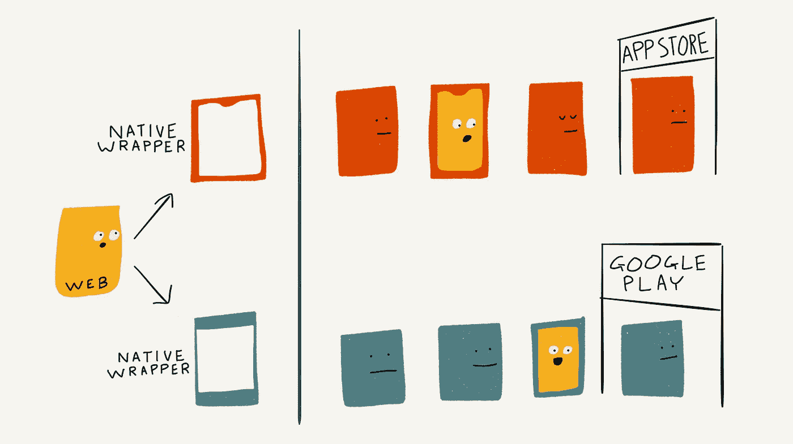

# 混合应用:马上解释。

> 原文：<https://medium.com/hackernoon/hybrid-apps-the-1-minute-guide-4b7fc4638ae4>

要为一个特定的平台开发一个应用程序，你需要使用该平台的创建者(例如苹果或谷歌)提供的工具包。以这种方式构建的应用程序— **原生应用程序** —可以充分利用该平台的功能，并且可以通过应用商店进行分发。

然而，要在另一个平台上启动，您需要使用该平台的工具包重新开始。

另一个选择是一个**网络应用**——一个提供丰富用户交互的网站，就像一个应用一样。web 应用程序是使用 HTML 等 web 技术构建的，可以通过 web 浏览器访问。只需构建一个应用程序，您就可以访问所有平台！

缺点是:网络应用不能访问平台的所有功能，比如使用蓝牙或在后台运行。

见见他们的爱子:T4 混合应用程序 T5。

这是一个隐藏在本机*包装器*中的网络应用——基本上是一个只显示一个网络应用的小浏览器。

像 [Cordova](https://cordova.apache.org/) 这样的混合框架甚至提供工具包，让混合应用程序访问许多本地平台功能。

您只需编写一次代码，但生成的应用程序可以使用应用商店在多个平台上分发。