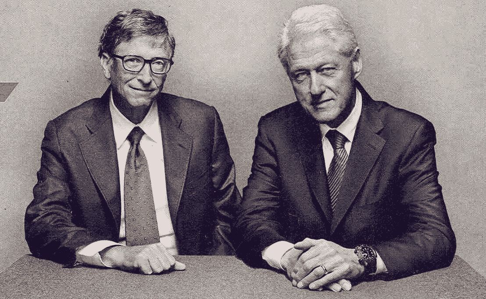

# 对比尔·盖茨和比尔·克林顿的连线封面照片的超分析

> 原文：<https://medium.com/hackernoon/hyper-analysis-of-a-wired-cover-photo-featuring-bill-gates-and-bill-clinton-3f7c43b63d63>

Cover image from Wired Magazine, Dec. 2013.

四年前的这个月，*连线杂志*将这张照片登上了封面(2013 年 12 月刊)。我当时做了一些我已经忘记的观察，但是被脸书便利的“你在脸书的回忆”功能提醒了。我想我应该把那篇不起眼的社交媒体文章提升为一篇完整的媒体文章，因为我仍然对此很着迷…