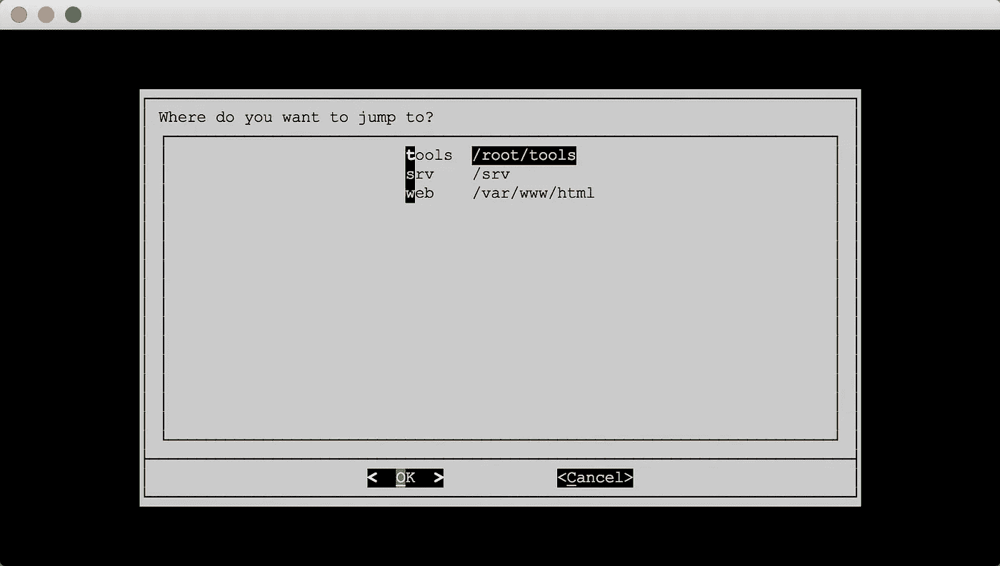

# HyperJump——Bash 中快速 CD 的方法

> 原文：<https://medium.com/hackernoon/hyperjump-a-quicker-way-to-cd-in-bash-7e1c4f93068b>

2015 年 8 月 1 日星期六



今年春天，我与一家初创公司合作，他们希望使用 CentOS 作为他们的主要开发平台。尽管这并不是我的职责，但正如初创公司一样，你应该尽你所能。所以我也成了事实上的服务器管理员。问题是，我习惯了 Linux 的 Debian 衍生版本，所以 CentOS 对我来说有点像一个开关，特别是在它们默认的目录结构中。没什么大不了的，但是在高延迟连接上工作时，自动补全就不那么好了。为了避免记忆新目录结构的麻烦，并且为了加快目录导航的速度，我决定编写一个小的 BASH 脚本来标记我在系统中常用的所有目录。于是，[超跳](https://github.com/x0054/hyperjump)诞生了。

我已经使用了`pushd`和`popd`以及[自动跳转](https://github.com/wting/autojump)实用程序，但是出于我的需要，我想要其他的东西。我的目标是:

*   快速跳转到随机目录
*   会话间的持久存储
*   能够给目录起昵称，所以昵称不一定是目录的名称
*   昵称的自动完成
*   快速且易于使用
*   几乎没有依赖性，因此很容易安装在任何*NIX 系统上

考虑到这一点，我制作了 [HyperJump](https://github.com/x0054/hyperjump) ，一个简单快捷的 bash 和 zsh shells 书签工具。实际上，它可能在其他 shells 上工作，但是我只在 bash 上测试了它。GitHub 上的 [daveFNbuck](https://github.com/daveFNbuck) 提供了一个 zsh 补丁。我在 OSX、Debian、CentOS、Ubuntu 和 Slackware 上进行了测试。我确信它基本上可以在任何有 bash 或 zsh 支持的东西上运行。

简而言之，HyperJump 是一个书签工具，也是一种记忆辅助工具。你用`jr`命令给目录加书签(对于**J**UMP**R**e member)，用`jf`命令删除书签(对于**J**UMP**F**forget)，用`jj`命令跳转到目录(我猜是对于 **J** ump **J** ump)。如果你有 Dialog utility，一个 UNIX CURSES 实用程序，用于显示基于文本的 GUI，它也会显示所有书签的列表，你可以选择你想跳转到的书签。

超级跳跃几乎是纯粹的狂欢。我原本打算把它分成 3 个独立的 bash 脚本，但这被证明是有问题的。没有一种简单的机制可以用来改变一个 bash 会话的工作目录。因此，当您运行`jj`时，如果它在一个单独的 bash 实例中启动，它将不能改变它所来自的 shell 的工作目录。解决方案是将脚本编写为一个函数，将其添加到 bashrc 中，并让它直接在活动的 bash 实例中执行。在任何情况下，将所有 3 个脚本和支持逻辑收集在一个文件中实际上会更优雅。

下载 [hyperjump](https://github.com/x0054/hyperjump/raw/master/hyperjump) 脚本并将其放在系统的某个地方，比如`~/bin/hyperjump`。将下面一行添加到您的*中。简介*、*。bashrc* 或*。zshrc* 文件:

```
source /location/of/hyperjump
```

**可选:**要在一个漂亮的菜单窗口中获得所有书签的列表，你需要一个名为*对话框*的 unix 实用程序。您可以通过 yum、apt-get、homebrew、ports 和其他类似的工具来安装它:

```
# On CentOS or Another RedHat Derivative
sudo yum install dialog

# On Ubuntu or Another Debian Derivative
sudo apt-get install dialog

# On OS X
brew install dialog
sudo port install dialog
```

HyperJump 由 3 个命令行命令(函数)组成。

*   **jr** —记得跳。书签当前目录。运行`jr nickname`添加当前目录，或者只运行`jr`使用交互模式。
*   **jf** —忘了跳吧。从书签中删除当前目录。在你想要忘记的目录中运行`jf`或者`jf nickname`来忘记一个特定的昵称。
*   **jj** —跳转到书签位置。运行`jj nickname`跳转到一个位置，或者直接运行`jj`获得所有书签的列表。您也可以运行`jj nickname command`跳转到一个位置，然后运行用“.”指定的命令。/”作为第一个参数。例如，你可以在 OSX 上运行`jj myProject open subl`跳转到 myProject 目录，并在 Finder 和 Sublime Text 中打开 myProject 目录。

所有的命令都有自动完成功能。jj 和 jf 将自动完成书签位置的昵称。jr 命令将自动完成当前目录的基本名称。在第一个参数之后， **jj** 将自动完成可用系统命令(程序)的列表。

**例子:**

```
# Remember current directory
jr
jr MyDir

# Forget current directory
jf

# Forget another directory
jf AnotherDir

# Jump to a Directory
jj
jj MyDir

# Jump to a directory and open the directory in another program(s)
jj MyDir open
jj MyDir open subl tm
```

# 最后的想法

希望 HyperJump 对别人能像对我一样有用。HyperJump 是在麻省理工学院许可下发布的。使用它，爱它，[叉它](https://github.com/x0054/hyperjump)，做出改变，发送拉动请求。尽情享受吧！

【sdbr.net】最初发表于[](http://sdbr.net/post/HyperJump/)**。**