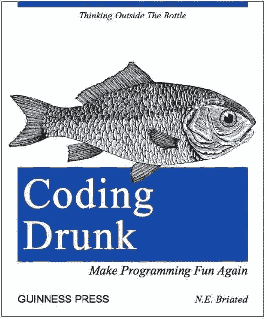
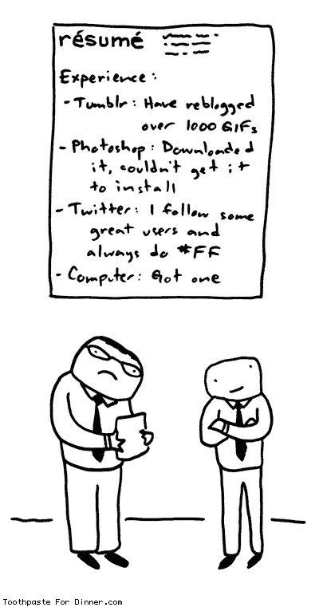

# 我即将开始科技(常见问题)

> 原文：<https://medium.com/hackernoon/i-am-about-to-start-in-tech-faq-c54346cd8ca0>

“*我想成为一名程序员，我有几个问题……*”—IT 行业现在非常赚钱，很多人都在考虑转行。我从事编程已经有一段时间了，人们有时会向我咨询如何开始他们的 IT 职业生涯。很多这样的问题都是类似的，所以我想，我为什么不把它们放在我的博客上。

*免责声明:以下一切仅是我的观点，基于我自己的经验，可能与常识有所不同。*

## 我到底该不该做？

我深信你应该热爱(或者至少喜欢)你所做的事情，不管它是什么。判断你是否喜欢编程的最好方法就是试一试。试着学一些简单的东西，看看它是否能让你开心。当你输入几行代码，一台计算机(一块石头、金属和塑料)开始做你告诉它做的事情时，如果你感到兴奋，这是一个好迹象。小事情，如嘟嘟嘟，闪烁或打印“*你好世界！*“应该被感知为有点纳闷。看你学完基础之后，是不是自然想学更多。或者，如果你已经参加了一个培训项目，看看你是否在没有任何激励的情况下，自己花了额外的时间学习更多的材料或尝试更多的东西。
程序员的工作大部分时间是没有回报的，枯燥的，[职业倦怠](https://en.wikipedia.org/wiki/Occupational_burnout)是真实存在的。对某个主题天生的好奇心可以让你更长时间地解决问题，而不用问自己为什么要这么做。解决问题的时间越长，你就能解决问题，获得回报，并感到快乐。因此，如果你尝试过编程，却找不到任何激情——最好根本不要做，这将很难进步，你也不会从工作中获得什么满足感。否则，我找不到不成为技术人员的理由。

## 我需要计算机科学学位吗？

这是一个有争议的问题。总的来说，你需要的只是正确的心态和一些技能，这些你都可以自己获得。然而，如果我可以选择接受正规教育或者直接去工作，我会选择教育。的确，在大学 4-5 年后，你不会获得太多的实践经验，也无法在简历中加入一堆花哨的技术。然而，必须连续解决数学和算法难题，会极大地影响你的思维方式，并在你的大脑中形成“技术思维”。了解基本知识并能够解释任何事情，计算机在最微小的细节上扩展了你的视野，并将在你的职业生涯中每天帮助你。此外，不要低估你在大学里获得的网络的力量。通常它是人们生活中最强大的网络。许多现在的学生擅长告诉你他们所受的教育是多么无用，但大多数人在开始职业生涯后的几年内会改变他们的看法。我是其中之一。所以，不，你不需要一个 CS 学位就能成为一名程序员并找到你的第一份工作。但是如果你有机会得到它，就去得到它，这不会是浪费时间。

## 在线课程怎么样，编码训练营，速成班等等。？

看情况。对信息技术教育的需求很高，但供应并不短缺。很多这样的东西都很年轻，创造它们的唯一目的就是让它们的主人变得富有。因此，那里的教育质量可能会受到影响。不要期望在网上找到任何免费的信息。此外，不要指望获得深入的基础知识——三个月无法适应四年勉强适应的东西。

我期望的几件事是:

*   熟悉 it，当你对 IT 完全陌生，不知道从哪里开始时，找到一个“切入点”。
*   获得一些关于读什么和做什么的指导。
*   和有同样问题的人在一起(陷入其中)。
*   获得一些介绍，帮助你找到第一份工作(不要期望太高)。
*   把它作为一个强迫的功能，直到你弄清楚你是否喜欢它，并准备好自我教育。

总的来说，自我教育是其中最强大的东西，所以期望自己获得 90%的知识，通过阅读互联网，书籍，和做项目。短期项目可能会有帮助，但要小心。在投入时间和金钱之前做好调查，试着在 LinkedIn 上找到校友，询问他们的真实意见。

## 我应该为我的自我教育做些什么？

你可以自己做的事情太多了，所以让我分享一些建议。

*   阅读书籍。如果你有时间看厚书，试着读一些经典书籍，比如安德鲁·s·塔嫩鲍姆的《算法导论》或《T2 计算机网络》，或者《C++编程语言》，即使你不打算学 C++。好书通常结构严谨，对主题有全面的了解。尽量避免阅读关于特定技术和库的书籍。他们通常不关注基本原则，很快就过时了，并且经常只是重新表述文档。
*   试试类似于 [Topcoder](https://www.topcoder.com/) 、 [Codeforces](http://codeforces.com/) 或者 [Kaggle](https://kaggle.com) 这样的编码比赛。如果你做的时间足够长，你将提高你的算法思维，快速编写无错误代码的能力，并获得大量的调试经验。如果你参加大型的世界范围的比赛，竞争的成分会让你保持动力并增加肾上腺素。
*   为实践想出现实世界的想法(它们不必很大)。从事人们可以使用的东西要比模板化的“*博客网站*”或书本上的“*待办事项*”作业有趣得多。理想情况下，计划不仅要完成编码部分，还要启动项目并吸引一些用户。你不仅会得到很多满足感，还会有一件真实的事情写进你的简历。查看[product hunt](https://producthunt.com)以了解人们正在构建什么(并在项目准备就绪时启动您的项目；) ).
*   YouTube 上有许多来自顶尖大学的高质量讲座系列。斯坦福或哈佛学生花大价钱买的东西，你可以免费得到一部分，所以看好他们。
    [斯坦福的编程方法论](https://www.youtube.com/watch?v=KkMDCCdjyW8)
    [斯坦福的机器学习](https://www.youtube.com/watch?v=UzxYlbK2c7E)
    [麻省理工的算法简介](https://www.youtube.com/watch?v=HtSuA80QTyo)
*   阅读博客和新闻来探索这个行业。[黑客新闻](https://news.ycombinator.com/)、[科技危机](https://techcrunch.com/)、[黑客正午](https://hackernoon.com/)。
*   去聚会认识新朋友，向他们学习，尽管不要太频繁。

## 那么，我的第一个里程碑应该是什么呢？

如果你在大学——完成你的学业，否则尽快进入这个行业。在大多数情况下，这意味着找到一份实习工作。IT 世界从公司内部看起来很不一样，你想从那里看到它。你想和更有经验的人在一起，获得指导，并开始应对现实生活中的挑战。这三个问题最好通过加入一个真正的公司来解决。

## 自由职业者呢？

自由职业是一件非常特殊的事情，我不认为这是一个好的开始，虽然我自己是从远程做一些简单的 HTML 工作开始的。如果你生活在一个生活成本低的国家，并且可以为来自美国或欧洲的客户工作，自由职业在经济上可能会很好。然而，自由职业者应该已经很有经验，能够独立解决问题；没有人会指导你。另一方面，实习是为了帮助初学者进入这个行业，公司在早期阶段找到有前途的员工。所以，现在就在办公室找份工作，把自由职业留到以后，当你有了大量的经验，而且每个人都愿意为此付钱的时候。

## 我想做人工智能，但我只能找到一份 QA 工作。

不要担心，如果你总体上喜欢这家公司的工作，就加入它。记住，程序员的工作大多是枯燥的，只有你能让它变得有趣。每个领域都充满了你可以解决的挑战，并为整体成功做出贡献。对公司来说，将实习生分配到不太关键(通常也不太花哨)的项目更安全，因为他们通常不太可靠。如果有人为核心项目雇佣实习生，很可能他们找不到更有经验的人。所以，在这样的公司里，你不会从其他人那里学到很多东西。

## 我应该先学后端，前端还是移动？

只要专注于原则，做好做任何事情的准备。作为一名实习生，没有人期望你了解任何特定的库、框架或领域。然而，每个人都希望你学得快。理解基本面会对你有很大帮助。最好的方法是先挑选一个教育项目。然后弄清楚需要什么技术。然后学习它们并实施。如果你心中没有一个项目，就选择一种编程语言。我更喜欢 C 或 C++这样的低级语言，因为它能让你更多地了解计算机是如何工作的。

## 我应该在简历上写些什么？

不要放太多，放在一页或更少的篇幅内。不要把你接触过的每一项技术都放进去，挑一两项你花时间最多的技术。做预先筛选的人只会看你的简历 10-15 秒，所以让他看到你最重要的东西。不要用像"*、" "*、"*自学者*"这样的词，它们只是占用空间。在没有之前工作经验的情况下，个人项目会给你很大帮助，尤其是活的。如果没有其他可吹嘘的，告诉他们几个你想发展的领域，并解释你为什么选择它们。**

****

## **面试时他们会问什么？**

**面试风格各不相同，但大多数公司使用典型的算法任务，如排序、列表操作、字符串操作、数字拼图等。这本书会给你一个关于面试的好主意。大多数面试官试图判断你在不熟悉的情况下沟通和自信表现的能力。你是否解决了这项任务并不那么重要。最重要的部分是你理解问题的速度有多快，以及其中的挑战是什么。你分析极限和极限情况的能力有多强，你解释解决问题的方法有多强。如果你已经做了所有这些，但仍然没有解决办法——不要担心，面试官会通过暗示或直接给你答案。即使你没有及时解决任何问题，但沟通良好，你仍有很大的机会被录用。有时你可能会被要求在家完成任务，并通过电子邮件发送解决方案。所以，我的建议是练习解决面试问题，但更重要的是，练习交流你的想法。试着找一个程序员朋友，和他一起做一些面试练习。试着向比你懂得少的人解释一些算法。**

## **应该去哪里找实习？**

**利用你的关系网，问问在 IT 部门工作的朋友，个人推荐最好。用 [AngelList](https://angel.co) 和 [LinkedIn](https://linkedin.com) (我发现 [AngelList](https://angel.co) 更好找工作)。加入与你所使用的技术相关的聊天和论坛，大多数都有求职板。去你大学的招聘会。填写申请表的直接途径通常是最长的。好公司的招聘人员每天要浏览几十份简历，他们很难盲目挑选好的。他们更喜欢依靠个人推荐或通过其他更可靠的渠道找到好的候选人。所以，继续发申请吧，是免费的，但总要想办法绕过去。理想情况下，让招聘人员来敲你的门。赢得一场有声望的比赛或者建造一些人们喜欢的东西是吸引注意力的好方法。**

**我希望我的帖子能帮助人们找到第一份工作或新的激情。我确信，读这篇文章的人有他们自己的问题和观点，所以请在评论中留下他们。我将挑选最好的，并添加到这个职位的尾巴。祝你好运！**