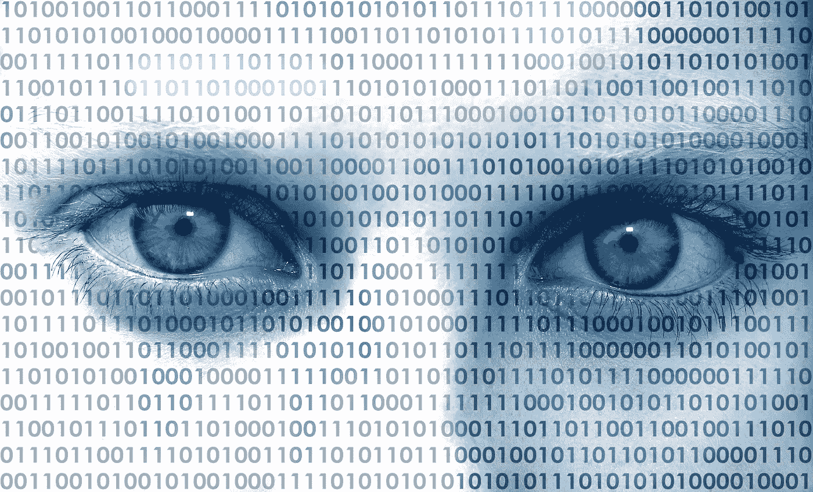

# 隐私泄露让我很恼火

> 原文：<https://medium.com/hackernoon/i-am-annoyed-by-privacy-breaches-7cfb1c0a1f48>

All eyes on us

我承认我有不好的数码习惯。我经常在 FB 和 Instagram 上发帖，在 Twitter 上咆哮，我每天查看手机无数次。我不会说这一切都很好，但我可以合理化，它满足了我的一些基本社交需求。

但是近几年来，我设法限制了其中一些活动，更重要的是(对我来说)，我开始思考和行动来保护我的隐私。或者更好地说，过滤向数据饥渴的服务提供的内容和方式。

(你是否也对点击链接时绑定地址 analytics.twitter.com 感到恼火？)

所以我最近几年做的是:

*   我学会了(并实践了)浏览器指纹识别以及如何(试着)保护自己。
*   沙盒化，使用不同服务的各种浏览器(一个浏览，一个 FB，Google 等等)。
*   开始使用严格的 cookie 策略(删除、拒绝…)。
*   去谷歌化:我尽可能停止使用谷歌和相关服务(duckgogo，no Keep，Maps，Docs 等等)。
*   把我坏掉的安卓换成 iPhone(和相关服务)我就全是 Mac 了。(有人会说一个魔鬼换一个魔鬼，但我不能牺牲我的生意)。
*   iPhone/iPad 中严格的应用程序控制(位置服务、访问…)。
*   我没有登录服务，即使我使用它们(商店、预订…)。
*   对不同的服务使用不同的邮件帐户(尤其是在手机上)。
*   我不使用 FB Messenger，我只通过 Opera Mini(仅用于 FB)在移动设备上访问 FB。
*   一些我不记得的东西。

你可以说我多疑，但这让我感觉很舒服；).我理解“数据公司”的商业模式，但它就像一个巨大的吸尘器，吸走所有的数据。

FB 和 Instagram 的坏习惯依然存在，尽管我设法控制了它。我不喜欢出于兴趣的页面，不要点击文章(FB 不是我的主要文章来源)等。

总之，这一切做起来都很简单。这需要一点纪律和走出舒适区，但没有什么是懒惰的人不能处理的。

因此，预期的结果应该(理想地)看起来像:

*   Google 或者 FB(还有其他的)都检测不到我在哪里冲浪。
*   如果我不愿意，我不会向他们提供各种数据。
*   我可以恶搞 Google Analytics 等(某种程度上；浏览器指纹是个沉重的负担)。
*   Android 并没有通过 Play 服务向谷歌发送大量数据。
*   所有这些服务确切地知道我在单个会话期间在一个浏览器中向它们提供了什么(而不是跨浏览器检测我的身份)。

但让我分享一下过去两个月左右发生在我身上的几件事:

*   我和我的队友在一个封闭的松弛渠道上讨论一个产品。我没有在谷歌上搜索，也没有查看他们的网站。但是几分钟后，这个血腥的服务作为推广出现在我的 FB 流上。
*   我在火车上查看 Instagram，IG 无法使用定位服务。一个(漂亮的)女孩坐在我旁边，几个小时后她出现了。既酷又吓人。
*   我在一个浏览器上只打开了会话 cookies 就预订了一辆巴士，就在那之后，FB 上关于这个目的地/公司的广告出现在我的另一个浏览器上(FB 的沙盒)。
*   在我的专业邮件帐户上收到了一封推广邮件，这封邮件与我用于 FB 登录的邮件无关…然后，你猜对了，在那之后不久，FB 上就出现了该产品的广告。

我可以理解真空吸数据策略和数据公司在做很多事情来获取相关数据。但是他们获取所有元数据的能力和我无法保护自己的能力真的让我很恼火。

我从事物联网业务，你不必成为火箭科学家，也能发现物联网是一颗定时隐私炸弹。

我的意思是，关于一个人害怕他的智能三星电视的文章有点意思，但谷歌 Echo 或亚马逊 Alexa(忘了是哪一个)在人们争吵时自动报警的情况是一个很好的警告。

在某种程度上，目前对我的业务来说更容易，因为我们在工业物联网中，数据隐私仍然是一个标准，我们的服务默认保护隐私和安全。

我计划写下一篇关于物联网安全的文章，敬请关注。

嗯，我把这个问题发布到网上，牺牲了另一个隐私，让我的灵魂变得更轻松。

*由 Jernej Adamic 撰写且懒得编辑*