# 在我为期三周的学徒计划中，我相信小的行动确实很重要，并且可以走很长的路来引起变化

> 原文：<https://medium.com/hackernoon/i-believe-that-small-actions-do-matter-and-can-go-a-long-way-to-cause-a-change-my-three-weeks-9a4e0413415a>

我记得这张照片就像是昨天拍的一样；我来中心参加学徒面试的那天。我看上去美极了；是的，但是在内心深处，我的神经高度紧张。我想，面试进行得很顺利，如果我没有通过，我就不会成为这个项目的一部分。

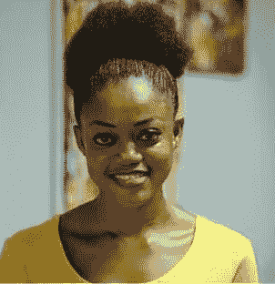

My first picture taken at the interview

然后我收到了一封祝贺邮件，要求我在 11 月 30 日星期一去中心报道。是啊。！我带着很高的期望而来，至少可以说，这些期望都得到了满足。

我第一次见到了其他的学徒，我们见到了我们的协调人帕帕·奥塞，他给了我们一份计划的细目表，并告诉了我们将会发生什么。之后，我们与全队共进午餐，并继续当天的日程。(我喜欢午餐部分)。

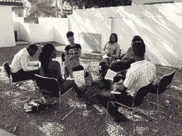

Find me with my leg crossed.

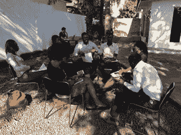

I need to stop crossing my legs.

第一天，我们做了一个有趣的练习，这个练习给了我人生和下一步的路线图。这是一个要求我们写下 5 年和 10 年计划的练习。我知道我想在未来 5 年和 10 年看到自己在哪里，但写下它们使它变得非常真实，并帮助我重新调整我的选择和决定。这个练习也符合 Chimamand 的视频，我们看了她在 TEDx 活动上的演讲，她谈到了讲故事，以及如何讲述我们的故事，不要遗漏任何部分，因为只讲述故事的一部分可能会有危险。

在我们和团队在中心拍了第一张专业照片后。

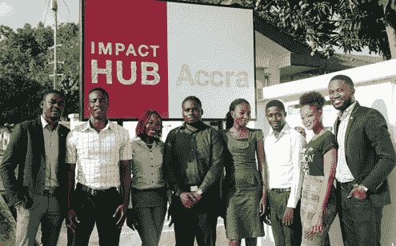

第二天是一个社交媒体会议，与 Emmanuel Gamor 会面，他向我们介绍了社交媒体，它的用途，它的好处以及如果使用不当它会如何影响我们。

不幸的是，就在同一天，我的笔记本电脑掉了。嗯，我试图成为一个超级女人，但却让事情变得更糟。

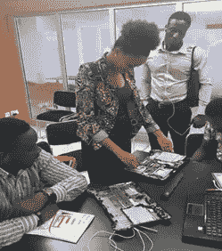

There is a first time for everything

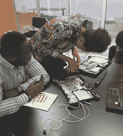

I am my own superwoman

然后到了第三天，Victor 向我们介绍了他如何管理 hub 的社交媒体页面，如何发送简讯，以及如何查看帖子和简讯，以了解哪些人阅读了哪些帖子以及哪些帖子被转发了更多。我们以诗歌朗诵和表演诗歌中的情感结束了这一天。

第四天从午餐开始(这一直是我最喜欢的部分)，我和我的团队制定了社交媒体计划，互相分配了社交媒体管理角色，并制定了问责措施。

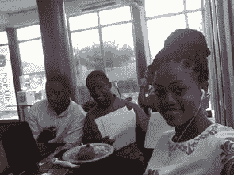

I looove FOOD

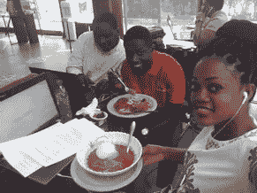

在集体头脑风暴之后，我站出来为我的团队做了报告。我搞定了。走吧我。！(我的信心水平正在上升)

第二周以史蒂夫·乔布斯的视频开始，他讲述了自己的生活，失败，背叛和成功。从中我明白了我必须找到我喜欢的东西并追求它，除非我实现了，否则没有人会相信我的梦想。

我知道迪拜的棕榈酒店，但不知道他们是如何建造的。Emmanuel 向我们展示了一段视频，讲述了项目经理们是如何管理和相互协作，以及如何与王子一起提出这个问题的。

Mathematica 的高级程序员阿菲娅·奥武苏-杜菲向我们讲述了她的程序员之旅和她在加纳的新项目“编写阿克拉代码的女性”。我已经报名参加了并为此兴奋不已。

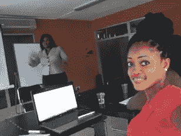

“One of the ways to be successful is to be yourself” — Afia Owusu-Dufie.

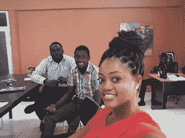

然后是与卡瓦·陆丹蓝一起做影子工作的日子；我们的第一个挑战。我被分配给一个女服务员。我采访了他，并为我的最终报告准备了四份独立的文件。

获胜者的奖励是一周由卡瓦陆丹蓝提供的冰沙、咖啡、华夫饼和三明治。

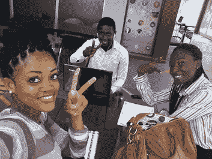

我赢了挑战！！！走吧我。！！我赢了，因为我在我们被要求递送的三份文件中附加了额外的文件，我的写作技巧很好，而且我按时递送了。(第二周是我学徒计划中最棒的一周)

维克多和我们一起写作和发送新闻信件。然后他让我们写一封关于中心最后一次聚会和他们的圣诞晚会的新闻。他还没有给我们反馈我们做得怎么样。#lol

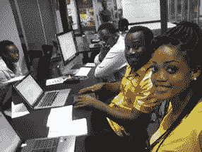

Ever bubbly Victor

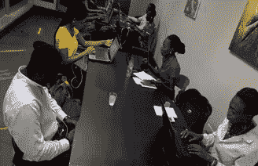

第三周的第三天，我们有一个 1000 字团队的图片新闻和内容创作。在那里我学会了如何用写字的方式拿着相机，拍出专业的照片。

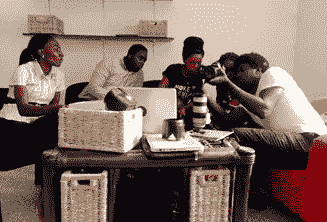

We were eager to know it all about picture taking.

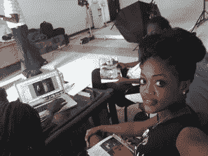

I looked very pretty in this picture

会议结束后，我们与团队合影，瞧！！获奖影片。

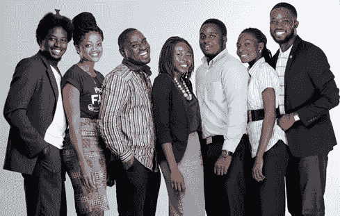

The apprentice and team10oowords

第三周结束了。我们要分手了。万岁！！！！

第四周和第五周将在学徒计划结束后以单独的故事发布。

我给你留下我最喜欢的一句话:“你可以用任何东西创造一个[未来](https://hackernoon.com/tagged/future)；报废，一闪而过。向前的欲望，慢慢地，一次一只脚。你可以建造一座虚幻的符文之城”——劳伦·奥利弗

感谢阅读。

 [## 格洛丽亚·道格比(@萌 _ 格洛丽亚)|推特

### GLORIA DOGBEY 的最新推文(@萌 _gloria)。技术热情洋溢。编码的女人。幸存者。加纳阿克拉

twitter.com](https://twitter.com/adorable_gloria) 

https://www.facebook.com/gloria.a.dogbey

 [## 世界上最大的职业网络| LinkedIn

### 3 亿多会员|管理您的职业身份。建立并参与你的职业网络。访问…

www.linkedin.com](https://www.linkedin.com/home?trk=nav_responsive_tab_home) 

> [黑客中午](http://bit.ly/Hackernoon)是黑客如何开始他们的下午。我们是 [@AMI](http://bit.ly/atAMIatAMI) 家庭的一员。我们现在[接受投稿](http://bit.ly/hackernoonsubmission)并乐意[讨论广告&赞助](mailto:partners@amipublications.com)机会。
> 
> 如果你喜欢这个故事，我们推荐你阅读我们的[最新科技故事](http://bit.ly/hackernoonlatestt)和[趋势科技故事](https://hackernoon.com/trending)。直到下一次，不要把世界的现实想当然！

