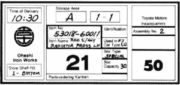
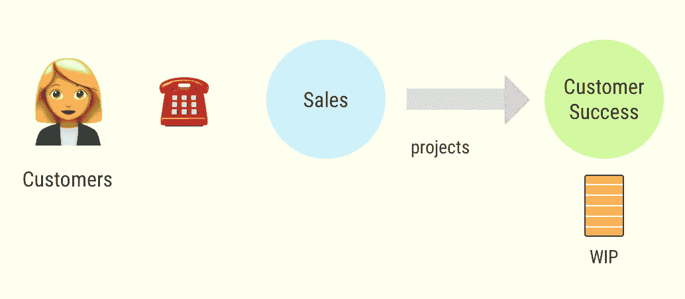
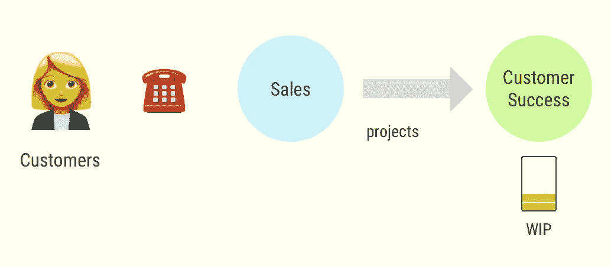
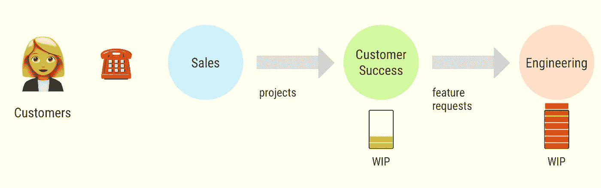
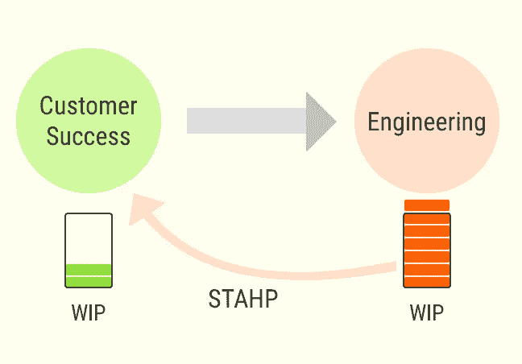
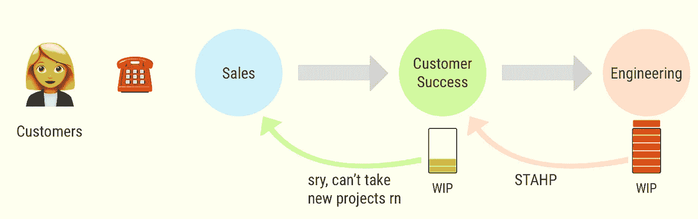
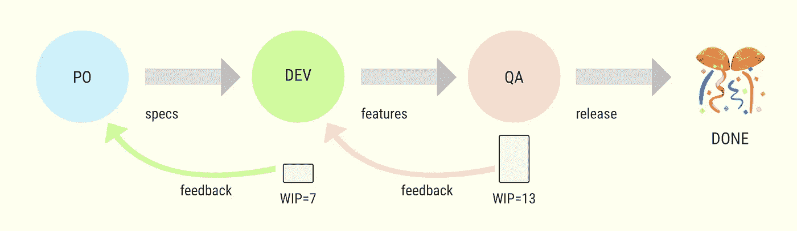
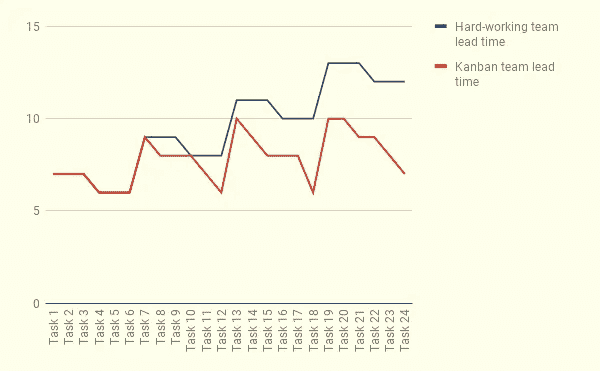
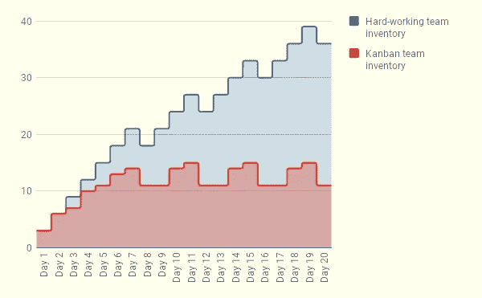

# 我打赌你在车间看起来很棒，🕺💃

> 原文：<https://medium.com/hackernoon/i-bet-you-look-good-on-the-plant-floor-b0c335212eca>

## 像 1984 年一样运行看板

> 这是“软件创业中的约束理论”系列的第三篇文章如果你没看过另外两本。我推荐从那些开始:[第一部分](/@flpvsk/systems-thinking-in-management-c3ed049e8d91)，[第二部分](/@flpvsk/work-hard-enough-and-you-wont-finish-anything-d631d65e7478)。

80 年代的一切都更好，让我们回到过去一分钟。想象你是一个工厂的工人。该工厂向丰田工厂提供零部件，在那里组装华丽的[卡罗拉 AE86](https://en.wikipedia.org/wiki/Toyota_AE86) 。

“Factory worker on roller skates” by [Cristina Amate](http://crisamate.com)

你的轮班从早上 7 点开始。你提前 10 分钟到工厂，换好衣服去看板存储区。在你的架子上，你会发现一张卡片，上面有你要制作的零件的名称和编号。

Kanban card

零件完成后，你把它放在指定的货架上，然后回到看板存储区。这次你的架子上没有卡片了。接下来发生的事情是 100 年管理进化的结果。大野泰一的天才发明叫做…实际上，我不认为它*有*的名字。

如果你的架子上没有卡片。那时工厂不需要你的零件。所以下面是你*不要做的事情*。你不只是开始运行你认为将来“可能”需要的部分，你不去找经理要求工作，你不去帮助你的同事做他们的工作。

你什么都不做。没什么？没有，没有，尼尼奥。

## 恰好

这种使用看板卡来控制工厂车间工作的技术是一个更大框架的一部分。该框架被称为精益或准时。

精益的目标很简单——最大限度地减少浪费。垃圾分类有不同的方法，但我认为只有两大类:

1.  我们做了不该做的工作。那就是*浪费资源*；
2.  我们应该做但没有做的工作。那就是*浪费的机会*。

假设我们正在管理超市的供应链。我们确保每个商店都有足够的供应。这是一个棘手的问题，解决方案会直接影响公司的底线:

*   订购太多食品杂货，它们在我们出售之前就过期了。我们赔钱。浪费资源；
*   订购的食品太少，顾客就不会买他们想要的东西。如果做得太频繁，我们就会失去客户。浪费的机会。

浪费是一个普遍的概念。供应链中的订单、车间的库存、产品特性和缺陷、客户项目——所有这些都可能是浪费的来源。如今，从生产线到创业企业，精益无处不在。

## 何时关闭销售部门

太多工作导致浪费，太少工作导致浪费，多少工作导致闪亮的金山？输入看板。

> 在非看板流程*中，前一个工作中心*决定何时将任务*推送到* *下一个工作中心。这造成了一系列问题，其中一个工作中心可能被其他项目超负荷。*

以下是一家 B2B 初创公司可能如何处理客户的项目:

Customers’ projects flow in a B2B startup

假设客户同意与我们一起进行概念验证(POC)。销售人员可能做的最糟糕的事情是要求客户成功团队立即处理项目*，而不考虑他们已经有多少工作要做:*

**

*New projects will have to wait*

*假设销售人员确实与客户成功协商，并且他们有能力处理新项目。我们应该同意接受吗？*

**

*Customer Success has capacity to handle the new project*

*在非看板流程*中，没有办法知道我们是否能接下项目*。可能出错的是系统的某个部分根本没有能力:*

**

*Engineering doesn’t have the capacity to do work on the new project*

*我们可以通过建立一个反馈回路来修复这个组织。我们使得*下面的工作中心*决定*在*之前的工作中心应该何时开始或停止工作。*

**

*Engineering signaling that it can’t take up more work*

**

*Feedback propagates from the next work center to the previous*

> *有了这个反馈循环，我们现在知道什么时候开始新项目，这样他们就不用花时间等待资源了。*

*让我们在模拟中试用看板。*

## *梦之队改用看板*

*在本系列的前一篇文章中，我们看到了我们的梦之队如何将公司推入不断增长的库存和交付周期的深渊。问题是团队做了太多的工作。*

*当然，我们也可能因为走另一个极端而造成浪费。假设我们每隔一个月开始只做一个规格，而系统每周可以做 20 个(这有足够的市场需求)。在这种情况下，我们浪费了机会，因为*没有充分利用*这个系统。*

*下面是我们如何用看板来修正流程。我们有三个工作中心:产品负责人、开发人员和质量保证人员。我们会给 QA 13 张看板卡。他们将使用这些卡片向开发者“订购”要测试的特性。开发人员在得到 QA 的许可之前，不能开始开发新的规范。一旦他们完成一项任务，他们就把它连同卡片一起转移到测试仪*。一旦 QA 拿回看板卡，他们可以再次使用它来“订购”开发人员的工作。**

**

*我们将对来自产品所有者的 Devs 订购规范做同样的事情。开发者将有 7 张牌。*

*后面我会说 WIP 的那些具体数字是从哪里来的。首先，[让我们运行模拟](https://www.slideshare.net/flpvsk/kanban-team-simulation)。*

*一些观察结果:*

*   *在最初的 8 天加速期后，团队稳定下来，每 4 天发布一次。20 天后，我们发行了 24 张票；*
*   *通常，由于 WIP 限制，PO 和 dev*不能以 100%* 的能力工作，QA 是唯一一个一直以 100%能力工作的人；*
*   *进行中的工作从不超过 15 个任务；*
*   *每张票的交货时间从不超过 10 天。*

## *摊牌*

*让我们在 20 天内比较一下努力工作的团队和看板团队。*

****

*Comparing Hard-working team vs Kanban Team. On the left: lead time by task, on the right: inventory over time.*

*看板团队正在粉碎它！WIP 限制帮助他们控制库存和交付周期。他们可以有把握地预测和计划*和*可以更快地完成任务。所有这些都是可能的*，因为* *他们知道什么时候开始和停止工作*。*

## *为什么要使用看板*

**

*“Signaling system” by [Cristina Amate](http://crisamate.com)*

*看板是在系统参与者之间建立的一种信号机制。它通知他们什么时候工作，什么时候停止。*

*看板也是一种平衡的工具。一旦我们设定了在制品(WIP)限制，*系统会自我调节*。不需要动手控制。*

*我们可以使用看板来管理一个团队或整个组织的工作流程。*

*与仅仅“努力工作”相比，这种方法有以下一些好处:*

1.  *组织更可靠。我们可以预测完成一项新工作需要多少时间；*
2.  *我们知道哪些承诺可以做，哪些不可以做；*
3.  *很少或没有多任务处理，因为管道中的库存是有限的；*
4.  *更少的多任务处理会带来更高的绩效和团队中更少的挫折。*

> *一旦我们专注于最大限度地减少浪费，组织的效率就会提高。*

## *为什么不使用看板*

*这听起来不错，但是我们还没有讨论如何实际设置这些工作进展限制。在我看来，这是看板的弱点，因为:*

1.  *团队在现实世界中的表现是不稳定和不可预测的，没有办法可靠地计算它；*
2.  *系统中的每个参与者都有自己的 WIP 限制。演员越多，难度越大；*
3.  *最重要的是，我们必须为每个参与者使用不同的 WIP 单位。例如，我们不能用开发人员的估计来衡量 QA 的库存。类似地，与工程相比，客户成功团队将拥有不同的 WIP 单位。*

> *设定在制品限制很难。*

*看板实践者鼓励我们从*某件事*开始，并在进行中调整 WIP 限制。*

*为了客观地看待问题，我不得不在纸上运行大约 *10 次*的模拟，以便找出演员的 WIP 限制，但我仍然对结果不满意。例如，我知道我们可以通过改变开发人员的 WIP 限制来缩短交付周期。如果你喜欢，你可以自己尝试一下。*

## *摘要*

*如果我们尽量减少浪费，我们可以使一个组织更有效率。为此，我们需要[做正确的事情](/@flpvsk/systems-thinking-in-management-c3ed049e8d91)，但我们也需要明智地选择我们做这件事的方式。*

*看板是一种智能机制，它使系统的不同部分进行交流并平衡工作。*

*看板不容易实施和维护，因为我们需要定期调整每个工作中心的 WIP 限制。*

## *–Andrey，这是本系列的第 3 部分，您还没有介绍约束理论吗？！*

*我知道我知道，对不起。相信我，我们讨论的其他事情很重要。我们会处理的。实际上，*现在*是做介绍的好时机。*

*80 年代，Eli Goldratt 在精益和 6-sigma 等现有框架的基础上建立了他的约束理论。他的突破性想法是，如果我们想从整体上改善系统，我们不需要担心*每一个单独的工作中心*。我们应该把注意力集中在*系统中的单个行动者*身上，这种约束。*

*他明白，不管系统有多复杂，不管它有多少部分，工作流程有多复杂，每个系统都只有一个约束。我们将讨论如何使用他的发现[系列的下一部分](/@flpvsk/theory-of-constraints-in-colour-187291015327)。*

*我要感谢那些与我分享经验和有用见解的人。他们的投入是这个系列的基础。排名不分先后的这些人是:[斯特凡·威鲁达](/@stefan.willuda)，[里卡多·j·门德斯](http://numergent.com/)，[埃德·希尔](http://www.synchronoussolutions.com/about-us/)，[阿迪娅·莫尔](https://twitter.com/adiyathemighty)，[康尼·彼得罗维奇](https://twitter.com/produktgestalt)，[戈兰·ојkić](https://twitter.com/najgoricovek)。*

*特别感谢 [Cristina Amate](http://www.crisamate.com/) 的插图，以及她的支持和对演讲和文章的早期反馈。*

*我在寻找机会谈论创业中的约束理论。如果您想推荐一个会议或邀请我发言，请联系:[https://flpvsk.com](https://flpvsk.com/)*