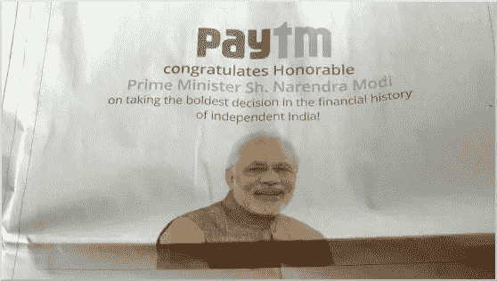
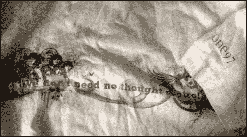

# 技术官僚专制:我为什么抵制 Paytm

> 原文：<https://medium.com/hackernoon/i-boycott-paytm-5df93d189356>

[Sculpture](https://commons.wikimedia.org/wiki/File:Gyarah_Murti_Statue,_New_Delhi.JPG) in Delhi depicting Gandhi’s [Salt March](https://en.wikipedia.org/wiki/Salt_March)

当“创业印度”变成“裙带资本主义印度”时，我们应该站在普通人一边，反对专制政府。

我有一件名为“One97”的 t 恤，这是我多年前在一次创业活动中作为商品与一个咖啡杯一起得到的。One97 Communications 是该活动的赞助商，也是印度创业社区的积极力量。我参观了他们在诺伊达的办公室，我感谢创始人维贾伊·谢卡尔·夏尔马对网络中立运动的支持，包括反对脸书免费基础服务的[运动。他们的移动钱包产品 Paytm 的成功预示着印度大众有机会超越传统银行业务，转向移动支付。](https://backchannel.com/how-india-pierced-facebook-s-free-internet-program-6ae3f9ffd1b4)

几周前，我对这家公司的积极看法戛然而止。

Paytm newspaper front page ad congratulating the Prime Minister on the demonetisation decision

2016 年 11 月 8 日，印度总理宣布，大部分纸币将[不再有效](https://en.wikipedia.org/wiki/2016_Indian_banknote_demonetisation)，必须存入银行以换取新的货币。主要理由是解决“黑钱”(逃税的财富)。然而，只有一小部分印度人是富人，在这个群体中，所得税突击检查显示，只有高达 6%的黑钱是以现金形式持有，而不是像房地产这样的资产——这促使最高法院将纸币禁令比作不分青红皂白的“地毯式轰炸”。

尽管去货币化的任何好处都很微弱，但很快人们就意识到，印制足够多的新钞需要几个月的时间。对于 Paytm 这样的金融科技公司来说，这种现金流动性危机是一笔巨大的财富。他们要求每个人都加入“无现金革命”。(这恰好是政府和金融行业的首脑邀请我参加的第一场‘革命’！)

在后非货币化时代，当我需要现金购买食品杂货时，我会花数小时在一台可以使用的自动取款机前寻找和排队。这就像生活在一个狩猎采集的社会。现在想象一下那些不住在大城市或者没有银行账户的人的情况。然后推断出因需求收缩和供应中断而关闭的业务活动。记者们一直在追踪这个拥有超过 10 亿人口的国家由此造成的死亡和破坏。

看到成千上万的中年人在我家附近的银行排队，希望有机会获得一点自己的钱，我真的很生气——我想，*你怎么能这样对待我的人民*？我个人最难过的是这张照片，一个绝望的老妇人无法提取她每月 14 美元的养老金。

前线文章“T2 摧毁系统”中讨论了这些影响的概述。史提夫·福布斯说，'[印度对其货币的所作所为令人作呕且不道德沙希·塔鲁尔将这次演习总结为一场灾难。](http://www.forbes.com/sites/steveforbes/2016/12/22/what-india-has-done-to-its-money-is-sickening-and-immoral/)

随着余波的继续，Paytm 发布了一则广告，将对去货币化的抱怨斥为“戏剧”，在社交媒体上受到抨击后，他们进行了修改。

在他们欢迎这一决定的引人注目的广告、幸灾乐祸和从纸币禁令中牟取暴利之间，Paytm 坚定地将自己与非货币化政策联系在一起。因此，我对这项政策的反对延伸到抵制使用他们应用程序的压力。

总体而言，我并不反对金融科技。我支持与传统银行竞争的产品——我去年做了一个演示，从产品的角度展示了数字钱包如何发展。我计划继续使用其他钱包应用程序，比如 Mobikwik，其创始人在公开声明中更加体贴。

最重要的是，我会选择使用支付应用。数字解决方案必须通过吸引市场来取胜。如果唯一的激励是选择进入监控状态，向金融公司提供费用和个人数据，以及人为的现金限制——这不仅对经济有危险，而且正如诺贝尔奖获得者阿马蒂亚·森正确地说的那样，是一种专制行动。

Nikhil Pahwa 写道，关于我们前进的方向，有些事情[感觉不对劲](http://www.medianama.com/2016/12/223-year-end-rant-2016-technology-has-never-been-this-political-in-india/):

> 当印度(自称)最大的金融科技公司的创始人站在舞台上，称其公司的“虔诚使命”是让印度无现金时……这个词的宗教性——“虔诚”总是让人想到“白人的负担”、帝国主义以及随之而来的转变。姑且称之为“数字人的负担”…
> 
> 我们已经从给予人们选择的技术发展到剥夺人们选择的技术:我们的政府今天实施技术的方式是对自由和选择的攻击……当政治介入时，技术领域的狗咬狗竞争变成了野兽和小狗之间的战斗。
> 
> —[2016 年年末大吼:在印度，科技从未如此政治化](http://www.medianama.com/2016/12/223-year-end-rant-2016-technology-has-never-been-this-political-in-india/)

政府宣传人员通过说“无现金”来转移对现金短缺的担忧，这直接传达了金融科技公司的信息。不负责任的政客和投机商人之间的这种循环动力让每个人都缺乏同理心。假设每个面临家庭需求或医疗紧急情况的印度人都有足够的银行账户和智能手机来突然使用数字支付，这导致一名议员认为总理“[莫迪·安托瓦内特](http://www.hindustantimes.com/india-news/yechury-compares-modi-to-french-queen-marie-antoinette/story-SAV2VOplQ26PCudhzttNoJ.html)”。

令人不安的是，突然之间，在没有讨论或辩论的情况下，政府和企业唱起了“无现金化”的技术官僚口号，以安抚人们放弃对自身权利的警惕。Jean Drèze 描述了利益的[趋同](http://www.thehindu.com/opinion/op-ed/The-mother-of-all-disruptions/article16946195.ece):

> 令人惊讶的是，这场灾难在权力走廊中引起的关注如此之少……印度软件业的巨大力量[可能]有助于解释为什么去货币化的破坏性影响被轻视……
> 
> 政府政策现在与这些商业游说团体的利益相一致……一位私人顾问最近透露，“我们的营销成本下降了”，因为政府在做广告……政府和企业之间的旋转门每天都在变宽。
> 
> — [一切混乱之母](http://www.thehindu.com/opinion/op-ed/The-mother-of-all-disruptions/article16946195.ece)

Aadhaar 身份系统和 Reliance Jio 等雄心勃勃的电信巨头的崛起凸显了这样一种担忧，正如 Aruna Roy 所说，“T2 数字平台将把每个公民困在最普通的任务中”。硅谷具有自由主义倾向，这是美国的功劳——如果印度科技文化没有培养出对公民自由的类似热情，我们将最终成为现代的香蕉共和国，Jio 共和国。

印度的弱势群体不应该成为政府和企业可怕联盟的社会工程中技术官僚冒险的实验品。正如前总理曼莫汉·辛格[指出的](http://www.thehindu.com/opinion/lead/Making-of-a-mammoth-tragedy/article16779252.ece)，任何合法的改革都不能“导致哪怕一个诚实的印度人丧生”。

我不记得签署了技术官僚专制。我会反抗的。

我个人的抵制会有影响吗？几乎没有。但我采纳了旧 t 恤上平克·弗洛伊德歌词的建议:“我们不需要思想控制。”

凭良心说，我不会成为一家公司的客户，这家公司通过假装为去货币化灾难提供足够的资源而获利。我知道，在这个政府和金融公司的阴谋诡计之后很久，人们将会继续生活下去，已经将他们自己从思想控制的最新尝试中解放出来。

> 人民是的，人民将继续生活下去。博学和浮躁的人将继续存在。
> 他们会被欺骗，被卖掉，再被卖掉
> 然后回到滋养的土地上扎根，
> 这些人在更新和回归中如此独特，
> 你不能嘲笑他们的承受能力。
> 
> —卡尔·萨根

当政府从 10 亿公民的嘴里抢走食物，一家公司庆祝时，是时候站在人民一边了。我抵制 Paytm。

*你可以在*[*Twitter*](https://twitter.com/firasd)*[*LinkedIn*](https://www.linkedin.com/in/firasd)*或 firasd at gmail* 上与我联系*

******

> *[黑客中午](http://bit.ly/Hackernoon)是黑客如何开始他们的下午。我们是 [@AMI](http://bit.ly/atAMIatAMI) 家庭的一员。我们现在[接受投稿](http://bit.ly/hackernoonsubmission)，并乐意[讨论广告&赞助](mailto:partners@amipublications.com)机会。*
> 
> *如果你喜欢这个故事，我们推荐你阅读我们的[最新科技故事](http://bit.ly/hackernoonlatestt)和[趋势科技故事](https://hackernoon.com/trending)。直到下一次，不要把世界的现实想当然！*

**