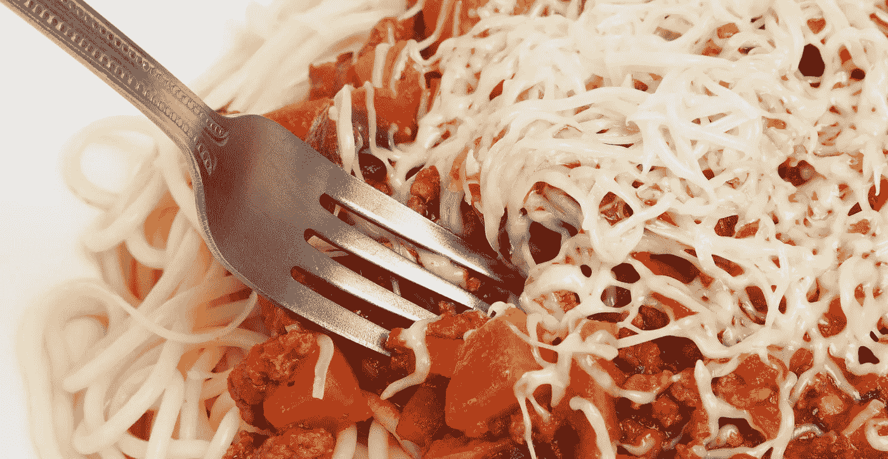
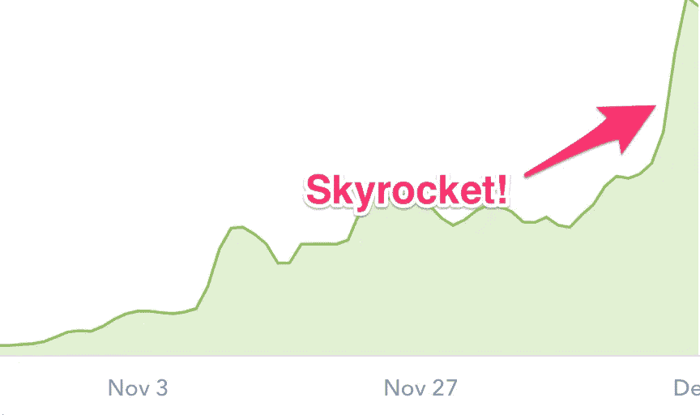
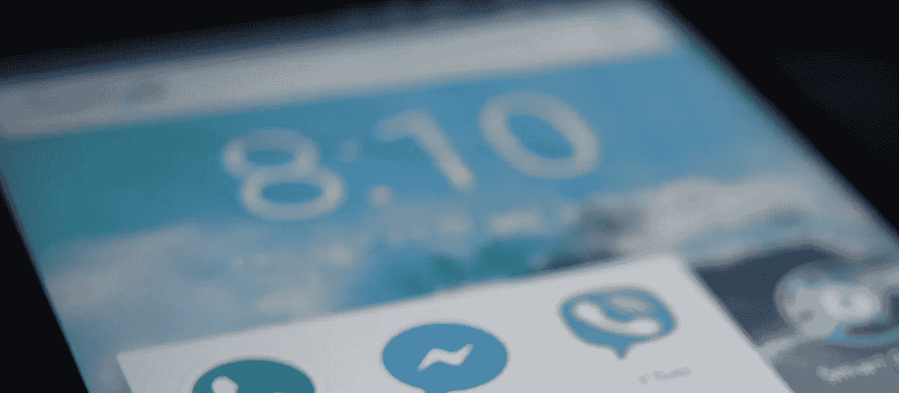
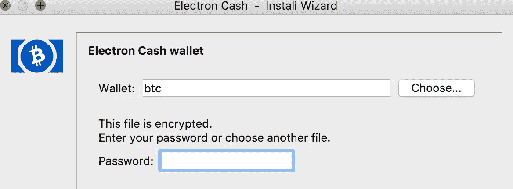
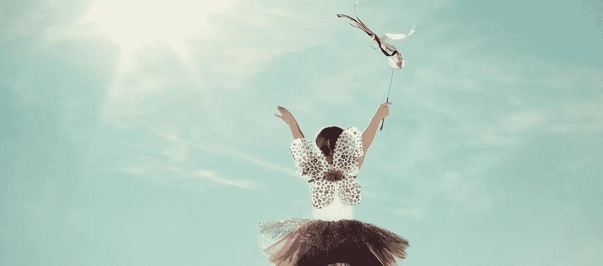

# 我认领了我的比特币现金，你也可以

> 原文：<https://medium.com/hackernoon/i-claimed-my-bitcoin-cash-and-you-can-too-c765610239df>

我花了半天时间研究了一千多块。

*快速声明——几周前，我奶奶问我关于购买加密货币的事情。我给了她最好的建议，但基本上是鼓励她自己做研究，不要拿我的遗产去赌农场；-).那也适用于你。不要把我在这里写的任何东西当作标准，在你决定拿任何资金、密码或其他东西冒险之前，读、读、读。*

背景故事——我在 [Mt Gox](https://en.wikipedia.org/wiki/Mt._Gox) 的时候花了大约 80 美元买了不到 1 BTC。谢天谢地，在 Mt Gox [破产之前，我把钱放进了当地](https://www.wired.com/2014/03/bitcoin-exchange/)[的一个多比特](https://multibit.org/)钱包里。最终我改用了名为 Multibit HD 的后续钱包。在很大程度上，我完全忘记了比特币，直到最近的加密货币激增(2017 年 12 月)。

eeek, just the logo makes me shudder

无论如何，在 2017 年 8 月 1 日，一群比特币矿工决定创造一种新的货币，称为比特币现金。他们执行了一个“硬分叉”，基本上任何在拆分前拥有比特币的人现在都拥有比特币和比特币现金——并有权获得与他们已经拥有的比特币相同数量的比特币现金。

我基本上忽略了这一点，但在过去的一周，自从[比特币基地](https://www.coinbase.com/)开始上市比特币现金(BCH)，新货币 BCH 的价值飙升。

trajectory of bitcoin cash

从 8 月 1 日到今天，我已经卖掉了一大块我原来的 BTC 的“真钱”(也是通过比特币基地)。但我开始做研究，结果表明，如果我在 8 月 1 日拥有一只 BTC，我仍然有权拥有一只 BCH，不管我在 8 月 1 日分叉后的行为如何。

因此，在谷歌搜索了一番后，我找到的关于如何从多比特高清(或各种其他钱包)认领 BCH 的最佳教程在这里:

 [## 如何用 Coinomi 从众多钱包/软件/服务中获取比特币现金:Coinomi 支持

### 虽然我们乐于成为市场领导者，但我们仍然相信协同和合作是所有参与者前进的最佳方式…

coinomi.freshdesk.com](https://coinomi.freshdesk.com/support/solutions/articles/29000013719-how-to-get-bitcoin-cash-from-many-wallet-software-services-with-coinomi) 

但不幸的是，这只适用于 Android 应用程序 [Coinomi](https://coinomi.com/) 。我身边没有安卓设备。而且我宁愿被化学阉割也不愿意在圣诞节前三天去沃尔玛买一个。

DROID!

在撞墙(看着 BCH 贬值)之后，我发现了一篇 Stack Exchange 的文章，内容是关于如何从我的多位高清钱包中领取比特币现金。本质上，因为我仍然有我的[钱包字](https://en.bitcoin.it/wiki/Mnemonic_phrase)从多比特高清写下来，我能够把它们输入到[电子现金](https://www.electroncash.org/)并且实际上要求我的 BCH。(比这稍微复杂一点，见 deetz 的[栈交换文章](https://bitcoin.stackexchange.com/questions/57482/bitcoin-cash-multibit-hd-electrum))。

electron cash

在我的电子现金钱包里有了 BCH 资金后，我把 BCH 转移到比特币基地，并立即以美元出售，因为美元可以购买最后一分钟的圣诞礼物，而神话硬币(目前)不能。

*当我不假装我知道我在用比特币做 WTF 的时候，我还为* [*分享 WebGL 游戏*](https://simmer.io) *运营一个名为 smelle . io 的网站。如果你对游戏或游戏开发感兴趣，那就去看看吧！*

如果你喜欢这篇文章，别忘了鼓掌或关注我。它为我继续写作提供了巨大的动力！