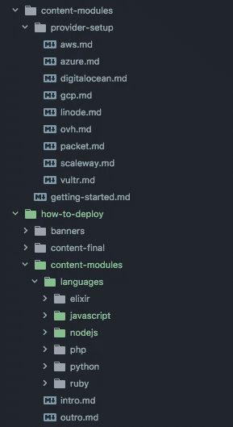

# 如何实现内容营销的自动化

> 原文：<https://medium.com/hackernoon/i-created-a-tool-to-automate-our-marketing-teams-content-marketing-367e2367e41d>

Drawing Hands — M.C. Escher (1948)

我第一次接触《发展世界》是由一个朋友介绍的，他当时正在为他参加的一个艺术班做项目。他用 Flash 制作了一个简短的动画，完全让我大吃一惊。从那以后，我就迷上了。

快进 10 年。我一直在与同一个团队合作开发各种不同的产品，其中最新的是 [Nanobox](https://nanobox.io/) 。由于我们是一个相对较小的团队，我有机会在许多不同的角色之间转换。这对我来说是一个很好的机会，让我在开发栈的所有层都获得经验。

然而最近，我的注意力实际上已经从开发转移到了营销、销售和商业策略上。我真的很喜欢涉足商业和营销领域，因为这是我以前从未真正做过的事情。这是另一个完善我的技能并深入到一个以前对我来说是个谜的领域的好机会。

然而，我最喜欢的事情是当我将我的开发背景应用到这个新的关注领域时。

# 内容营销

由于我们产品的性质，至少可以说，为 Nanobox 编写内容是一种有趣的体验。Nanobox 是一个编排层，位于应用程序和底层主机(AWS、Azure、Google 等)之间。基本上，它是一个 DevOps 自动化工具，消除了配置、部署和管理生产基础架构的所有复杂性。

要为这样的产品编写内容，了解许多不同的语言、框架、主机、流程是很重要的……你明白了。虽然我已经做了很多年的开发人员，但是在这么多不同的领域保持专家水平的知识仍然是一件很费力的事情。

我们最近的营销计划是创建一个关于“将 X 语言/框架部署到 Y 主机”的系列。创建内容，然后以各种不同的形式复制/粘贴它的前景令人望而生畏。

在讨论了内容的细节之后，我发现大部分内容都是非常相似的，只有一小部分在每个框架/主机的基础上有所变化。如果我们将内容模块化，我们将能够挑选出相同的部分，并将它们与我们需要的任何独特内容缝合在一起。那时我有了 Stitch 的想法。

# [缝合](https://github.com/sdomino/stitch)

事实上……史迪奇不是原来的名字。由于这个想法围绕着自动化内容营销，特别是博客内容，我们想到的第一个名字是“blomit”(博客呕吐)。然后我们发现了这张图片，它看起来非常适合…

最终我决定，如果我想让人们认真对待它，我应该想出另一个名字。史迪奇就是这样诞生的。

## 真正的缝合

这个名字显然来源于这样一种想法，即你将一个个内容拼接在一起，形成一个连贯的整体。

写它其实很有趣。我已经有几个月没有机会进行任何严肃的开发了，所以回到 Go(我已经爱上了它)并创建它是一件很棒的事情。发展是我真正的激情所在。虽然它实际上很容易写，也不需要花太多时间，但在它持续的时候，它是非常令人愉快的。

Stitch 并不适用于所有人，因为很多内容都没有模块化的优势。但是当它起作用的时候，它真的很好。当我在写的时候，我想，“这一定会很酷”。在我为它写了测试之后，我想，“这看起来很酷”。团队中另一个用过它的开发营销人员告诉我，它真的很酷，但直到我第一次真正使用它，我才坐下来，笑着大声说，“哇…这真的很酷。”

# 使用缝合

我确信 Stitch 有大量不同的用例，其中一些我甚至还没有想出来。

## 下面是我们如何使用它

我们有一个根级别的“内容-模块”文件夹，其中包含了所有不会真正改变的内容(主要是 Nanobox 配置内容)。

对于我们所做的每一个内容“活动”,我们都会创建一个包含介绍、结尾、图片及其自己的内容模块集的文件夹。例如，在这里，您可以看到我们的“如何部署”活动。

## 永久针迹

如果你不是开发人员，不要害怕，因为 Stitch 是一个类似命令的工具(CLI)。非常好用。您只需按顺序指定想要拼接在一起的文件，如下所示:

这将通过将内容拼接在一起的每个文件夹进行置换，瞬间生成几十、几百甚至几千篇文章。

# 最后

虽然编写 [Stitch](https://github.com/sdomino/stitch) 很有趣，但使用起来更有趣。对我来说，最酷的部分是开始写一些我觉得改进了一个我传统上不属于的行业的东西。使用我多年来积累的技能作为一个焦点的一部分，并将它们整合到另一个焦点，感觉真的很酷。

Stitch 并没有完全自动化内容营销，仍然有一些工作可以确保内容足够独特以避免重复内容，然后上传所有内容，但它大大减少了复制/粘贴的工作量。

我希望有人能像我们到目前为止一样发现 Stitch 的用处。写起来很有趣，用起来也很有趣！我很乐意听到任何有机会使用它的人的意见。让我知道你的想法！它对你有什么作用？