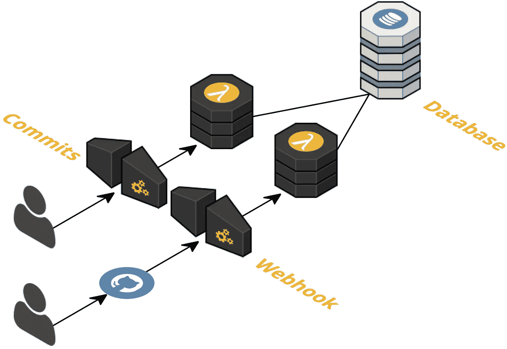
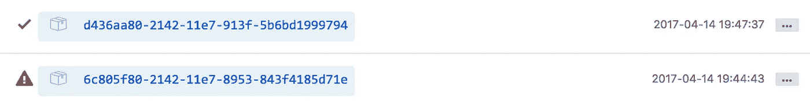

# 为 GitHub 创建字数统计 webhook

> 原文：<https://medium.com/hackernoon/i-created-a-word-count-webhook-for-github-45c69ba0e22>


Using graphics from [SAP Scenes Pack](https://experience.sap.com/designservices/approach/scenes)

虽然听起来像个人武器，但网钩不是个人武器。因此，如果你想学习如何对某人造成伤害，这不是你的博客文章。Webhooks 实际上是“web 回调”，允许开发人员构建应用程序来响应事件。在这篇博文中，我将介绍一个我最近为 Github 创建的 webhook，它计算 git 提交中单词变化的数量。

该服务使用[无服务器框架](https://serverless.com)构建在 Node.js 上，并部署到 [AWS Lambda](https://aws.amazon.com/lambda/) (亚马逊网络服务)。我不会在这篇博文中解释如何使用它们，相反，我将介绍字数是如何计算的，并给出架构的一个高层次概述。

要查看代码，请查看下面的 Github 库。

[](https://github.com/danielireson/github-wc-webhook) [## danielireson/github-wc-webhook

### github 字数统计 webhook for AWS Lambda

github.com](https://github.com/danielireson/github-wc-webhook) 

# 要求

GitHub 有 26 个不同的事件，你可以订阅。在订阅事件时，您要求 GitHub 在每次事件发生时向特定的处理程序发送一个 POST 请求，该请求带有一个包含事件细节的 JSON 有效负载。这个处理程序只是一个 web 服务，可以在互联网上公开获得。选择何种技术来创建处理程序并不重要，只要它能够接收 HTTP 请求并进行处理。唯一的要求是处理程序必须具有高可用性(它不应该离线)。如果服务脱机，事件通常会丢失。这使得 AWS 成为托管 webhook 处理程序的绝佳平台选择。使用 AWS Lambda，您可以创建和部署服务，而不必担心服务器的设置、维护或扩展。AWS 会为您处理这个问题，并且只在每次调用服务时向您收费。这与典型的服务器设置形成对比，在典型的服务器设置中，无论服务器是否被使用，您都需要支付一笔经常性费用。查看以下 3 分钟的宣传视频，快速介绍 AWS Lambda 服务。

# 架构概述

字数统计服务有两个端点，一个*/提交*端点和一个 */webhook* 端点。webhook 端点负责处理 Github push 事件，对单词变化进行计数，并将计数保存到数据库中。提交端点允许用户从数据库返回计数。Amazon API Gateway 用于创建端点和触发 Lambda 函数。DynamoDB 用于计数数据库。



# 计算单词变化

*/webhook* 端点订阅了 Github 推送事件。该事件包含该推送中每个提交的元信息。包含在推送事件中的提交信息的示例如下所示。

```
{
  "commits": [
    {
      "id": "0d1a26e67d8f5eaf1f6ba5c57fc3c7d91ac0fd1c",
      "tree_id": "f9d2a07e9488b91af2641b26b9407fe22a451433",
      "distinct": **true**,
      "message": "Update README.md",
      "timestamp": "2015-05-05T19:40:15-04:00",
      "url": "https://github.com/baxterthehacker/public-repo/commit/0d1a26e67d8f5eaf1f6ba5c57fc3c7d91ac0fd1c",
      "author": {
        "name": "baxterthehacker",
        "email": "baxterthehacker@users.noreply.github.com",
        "username": "baxterthehacker"
      },
      "committer": {
        "name": "baxterthehacker",
        "email": "baxterthehacker@users.noreply.github.com",
        "username": "baxterthehacker"
      },
      "added": [

      ],
      "removed": [

      ],
      "modified": [
        "README.md"
      ]
    }
  ]
}
```

只能看到添加、删除或更改的文件的文件名，而不能看到对这些文件所做的具体更改。为了获得更改，我们需要每个文件的 git 补丁，这可以通过对 Github API 上的`[/repos/${path}/commits/${sha](https://api.github.com/repos/${path}/commits/${sha)}`的 get 请求来获得，其中`${path}`是存储库路径(对于个人存储库，它由用户名和存储库名称组成，用正斜杠分隔)和`${sha}`作为要查找的提交 ID。

在 Github 上查看最近提交的[,我在自述文件中修正了一个拼写错误。这个 API 请求的 URL 如下所示。打开一个新的选项卡，在浏览器中加载它，您应该会得到一个 JSON 响应。](https://github.com/danielireson/formplug-serverless/commit/458a6d182f4b3a68e7be6db4193227f3de301c3f)

```
https://api.github.com/repos/danielireson/formplug-serverless/commits/458a6d182f4b3a68e7be6db4193227f3de301c3f
```

可以分析 git 文件补丁来计算单词变化。上面的提交具有以下针对自述文件的 git 补丁。

```
@@ -30,7 +30,7 @@ [https://apigatewayurl.com/to/1974d0cc894607de62f0581ec1334997\n](https://apigatewayurl.com/to/1974d0cc894607de62f0581ec1334997\n) ```\n \n ### AJAX\n-Append *_format=json* to the query string of the Formplug URL to get responses back in JSON with a CORS allow all origin header. This makes it easy to interact with Formplug using Javscript.\n+Append *_format=json* to the query string of the Formplug URL to get responses back in JSON with a CORS allow all origin header. This makes it easy to interact with Formplug using Javascript.\n ``` html\n [https://apigatewayurl.com/to/johndoe@example.com?_format=json\n](https://apigatewayurl.com/to/johndoe@example.com?_format=json\n) ```
```

沿着`\n`将它分成一个数组，显示文件的每一行。

```
[ 
  '@@ -30,7 +30,7 @@ [https://apigatewayurl.com/to/1974d0cc894607de62f0581ec1334997'](https://apigatewayurl.com/to/1974d0cc894607de62f0581ec1334997'),
  ' ```',
  ' ',
  ' ### AJAX',
  '-Append *_format=json* to the query string of the Formplug URL to get responses back in JSON with a CORS allow all origin header. This makes it easy to interact with Formplug using Javscript.',
  '+Append *_format=json* to the query string of the Formplug URL to get responses back in JSON with a CORS allow all origin header. This makes it easy to interact with Formplug using Javascript.',
  ' ``` html',
  ' [https://apigatewayurl.com/to/johndoe@example.com?_format=json'](https://apigatewayurl.com/to/johndoe@example.com?_format=json'),
  ' ```' 
]
```

删除了以`-`开头的行，添加了以`+`开头的行。在上面的例子中，你可以看到第五个数组项被删除，第六个数组项被添加。我们可以使用正则表达式从字符串中提取单词。

```
function getWordsInString (str) {
  let regex = /[a-zA-Z0-9_\u0392-\u03c9\u0400-\u04FF]+|[\u4E00-\u9FFF\u3400-\u4dbf\uf900-\ufaff\u3040-\u309f\uac00-\ud7af\u0400-\u04FF]+|[\u00E4\u00C4\u00E5\u00C5\u00F6\u00D6]+|\w+/g
  return str.match(regex) || []
}
```

上面的函数返回行中单词的数组。从这个数组中，我们可以计算每个单词在每行中出现的次数。

```
function getWordCount (arr) {
  return arr.reduce(function (obj, word) {
    if (word in obj) {
      obj[word]++
    } else {
      obj[word] = 1
    }
    return obj
  }, {})
}
```

从这个单词计数对象中，我们可以估计哪些单词被删除，哪些被添加。请注意，这只是一个估计，因为单词计数器只查看出现次数，而不一定是单词使用的位置。如果你在句首删去一个 the，而在中间加上一个 the，它们就会相互抵消。

继续上面的补丁示例，可以比较被删除行和被添加行的单词出现。

```
// Deleted
{  Append: 1, _format: 1, json: 1, to: 3, the: 2, query: 1, string: 1, of: 1, Formplug: 2, URL: 1, get: 1, responses: 1, back: 1, in: 1, JSON: 1, with: 2, a: 1, CORS: 1, allow: 1, all: 1, origin: 1, header: 1, This: 1, makes: 1, it: 1, easy: 1, interact: 1, using: 1, Javscript: 1 }// Added
{ Append: 1, _format: 1, json: 1, to: 3, the: 2, query: 1, string: 1, of: 1, Formplug: 2, URL: 1, get: 1, responses: 1, back: 1, in: 1, JSON: 1, with: 2, a: 1, CORS: 1, allow: 1, all: 1, origin: 1, header: 1, This: 1, makes: 1, it: 1, easy: 1, interact: 1, using: 1, Javascript: 1 }
```

实际上只做了一处更改，通过查看两个对象的最后一个属性可以看出这一点——注意“Javascript”是如何变为“Javascript”的。这应该表示为一个单词计数删除和一个添加。我们可以通过将这两个对象传递给一个比较它们的函数，以编程方式计算单词的变化。

```
function countChange (wordCountObjOne, wordCountObjTwo) {
  let count = 0
  for (let word in wordCountObjTwo) {
    if (word in wordCountObjOne) {
      let change = wordCountObjTwo[word] - wordCountObjOne[word]
      count += change > 0 ? change : 0
    } else {
      count += wordCountObjTwo[word]
    }
  }
  return count
}
```

这个函数应该被调用两次，以获得添加和删除单词的总数。

```
function getWordChanges (deletedWords, addedWords) {
  let deletedWordCount = getWordCount(deletedWords)
  let addedWordCount = getWordCount(addedWords)
  return {
    deleted: countChange(addedWordCount, deletedWordCount),
    added: countChange(deletedWordCount, addedWordCount)
  }
}
```

这给出了 git 补丁中每个删除(-)和添加(+)对被删除和添加的单词数。一个 git 补丁可以包含多个删除/添加，一个 commit 可以包含多个文件补丁。使用上面提到的函数，我们感兴趣的是将这些计数减少到每次 git 提交的一个总计数。

```
function countWordChangesInCommit (files) {
  return files.reduce(function (wordCount, file) {
    if ('patch' in file) {
      let fileChangeCount = countWordChangesInFilePatch(file.patch)
      wordCount.deleted += fileChangeCount.deleted
      wordCount.added += fileChangeCount.added
      wordCount.net += fileChangeCount.added - fileChangeCount.deleted
    }
    return wordCount
  }, {deleted: 0, added: 0, net: 0})
}function countWordChangesInFilePatch (patch) {
  let deletedWords = []
  let addedWords = []
  return patch.split('\n').reduce(function (wordCount, line) {
    switch (line.charAt(0)) {
      case '-':
        deletedWords = deletedWords.concat(getWordsInString(line))
        break
      case '+':
        addedWords = addedWords.concat(getWordsInString(line))
        let countResult = getWordChanges(deletedWords, addedWords)
        wordCount.deleted += countResult.deleted
        wordCount.added += countResult.added
        wordCount.net += countResult.added - countResult.deleted
        break
    }
    if (line.charAt(0) !== '-') {
      deletedWords = []
      addedWords = []
    }
    return wordCount
  }, {deleted: 0, added: 0, net: 0})
}
```

# webhook 端点

我们现在知道了如何计算提交中的字变化，那么这如何适应更大的架构呢？当点击 API 网关上的 */webhook* 端点时，将触发一个处理程序，该处理程序采用以下形式。

```
module.exports.handle = (event, context, callback) => {
  authenticate(event)
    .then(function () {
      // get the commits in the push event
      // call Github API for each commit
    })
    .then(function (responses) {
      // count word changes for each commit
    })
    .then(function (payloads) {
      // save payload for each commit to database
    })
    .then(function () {
      // send http success response
    })
    .catch(function (error) {
      // send http error response
    })
}
```

为了简单起见，promise‘then’函数已经被注释所取代，并且有助于解释(查看 Github 上的[库以获得完整代码)。它首先通过检查是否发送了正确的 HTTP auth 头来验证请求(您可以设置 Github webhooks 使用 API 键)。然后，它为每个提交调用 Github API 来获取该提交的文件补丁。使用 git 补丁计算字数。并且根据字计数，创建具有数据库的正确格式的计数信息的有效载荷。如果这一切都成功发生，处理程序应该返回一个 HTTP 200 成功响应，如果没有，它应该抛出一个错误和适当的 HTTP 代码。](https://github.com/danielireson/github-wc-webhook)



# 提交端点

为了从数据库中获取计数结果，用户应该向*/提交* API 网关端点发出 get 请求。提交处理程序比 webhook 处理程序简单。在对用户进行身份验证之后，它会解析 URL 以检查自定义搜索选项(比如对返回结果数量的限制)，使用 AWS SDK npm 库进行数据库查询，并返回结果。

```
module.exports.handle = (event, context, callback) => {
  authenticate(event)
    .then(function () {
      // check for url parameters
      // search database
    })
    .then(function (res) {
      // send results as http response
    })
    .catch(function (error) {
      // send http error response
    })
}
```

# 总结

Webhooks 是扩展您已经使用的第三方服务功能的一种简单而有效的方式——它们也是一个很好的 AWS Lambda 用例。有关完整的项目代码，请参见下面链接的 Github 资源库。

[](https://github.com/danielireson/github-wc-webhook) [## danielireson/github-wc-webhook

### github 字数统计 webhook for AWS Lambda

github.com](https://github.com/danielireson/github-wc-webhook) [](http://bit.ly/HackernoonFB)[](https://goo.gl/k7XYbx)[](https://goo.gl/4ofytp)

> [黑客中午](http://bit.ly/Hackernoon)是黑客如何开始他们的下午。我们是 [@AMI](http://bit.ly/atAMIatAMI) 家庭的一员。我们现在[接受投稿](http://bit.ly/hackernoonsubmission)并乐意[讨论广告&赞助](mailto:partners@amipublications.com)机会。
> 
> 如果你喜欢这个故事，我们推荐你阅读我们的[最新科技故事](http://bit.ly/hackernoonlatestt)和[趋势科技故事](https://hackernoon.com/trending)。直到下一次，不要把世界的现实想当然！

