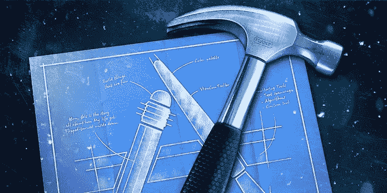
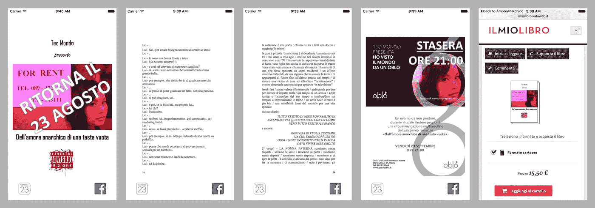
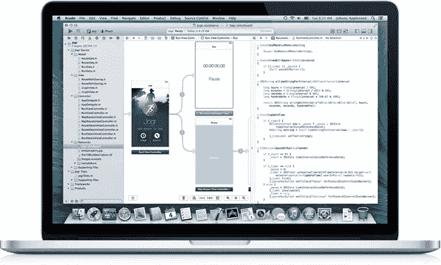
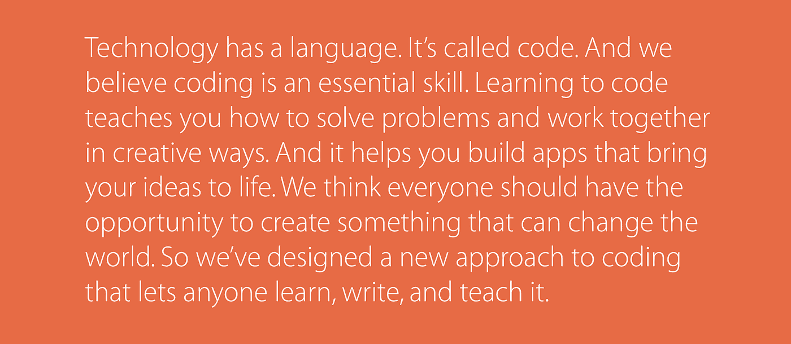
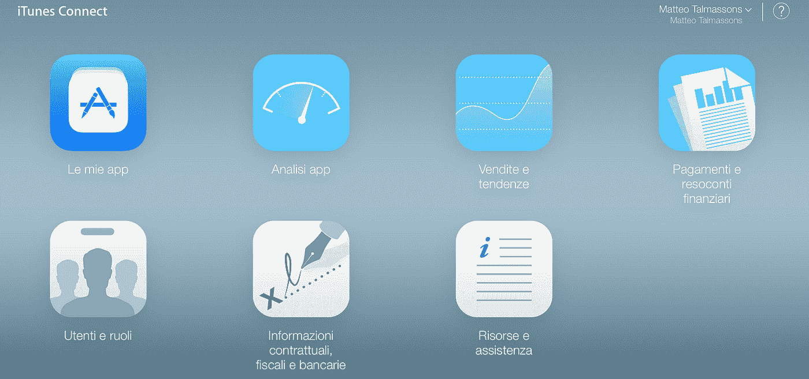
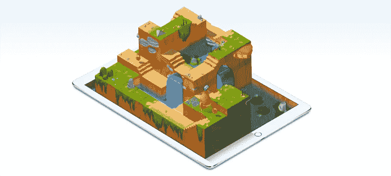

# 我发展所以我在

> 原文：<https://medium.com/hackernoon/i-develop-therefore-i-am-b501e2a10277>

## 我如何编写我的第一个应用程序，这对我意味着什么

我在 1983 年写了第一行代码。我当时 8 岁。这台机器是闪亮的 VIC-20 准将。我从 BASIC 开始，几年后我开始尝试 Logo。

快进到 2001 年。我毕业于工业工程专业:我的论文是一个商业游戏，为此我花了几个晚上在 Linux 电脑上，一边开发 MySQL 数据库，一边用 Java 编写 servlets。几年来，这种商业游戏一直被接近公司管理和竞争市场的学生所玩。

至于我自己，在过去的 15 年里，我太专注于发展我作为经理的职业生涯，太投入于发展我与异性的婚姻关系，我最终忘记了我曾经学到的关于编码的创造性快乐的一切。

在过去的六个月里，我开始在股票市场上迈出第一步，我的投资组合中有一家公司是苹果公司。由于 iPhone 上的苹果股票应用程序，以及苹果电视上的苹果活动应用程序，我开始更密切地关注它。去年 6 月，当我在 WWDC16 主题演讲上观看时，我起初很着迷，在结束视频时，我笑了:我开始记得我曾经喜欢编码。

去年六月，我和家人在克罗地亚度假。一天下午，孩子们在睡觉，我在享受网上冲浪的自由时光。我的思绪仍然在回顾 WWDC16 和刚刚宣布的 Swift Playgrounds iPad 应用程序。挖掘更多信息时，我登陆了使用 Swift iBook 预览版的[应用程序开发](https://itunes.apple.com/WebObjects/MZStore.woa/wa/viewBook?id=1118575552&mt=11&v0=www-us-education-everyone-can-code-book-app-development-swift-preview)。

就在那天下午，我读了第一章，并第一次尝试了一个快速操场。那时，我的策略是享受几个预览章节，然后等待今年秋天，届时应用程序和完整的 iBook 都将发布。我将尝试编写我的第一个应用程序的挑战推迟到了这个培训路径的末尾:在过去的几年里，我一直在考虑一些新应用程序的想法，现在是时候尝试将它们变成现实了。至少，这听起来是一种策略。

但是上周我确实读到了 iBook 预览版的第四章也是最后一章，这个场景突然发生了变化。

作为一名 Scrum 实践者，我总是喜欢设定有挑战性的目标，并投入到新的挑战中。我希望我自己，也希望所有参与其中的人，每天的进步都能变成每周的成果。简而言之，我将我的战略重新定义如下:如果我能证明自己能在一周内开发出我的第一个应用程序，实现我可以“用指尖触摸”的第一个结果，然后我等待完整版 iBook 的发布来完成一个更雄心勃勃的项目，会怎么样？这难道不是乐趣、刺激、挑战和回报的完美结合吗？

这个想法来自 iBook 预览(一个显示照片的应用程序)的第 4 章也是最后一章，并结合了在我所在城市的当地活动中推广一本书的机会，该活动定于明年 9 月举行。我着迷于寻找正确的方法来将 iBook 中的例子修改成一种数字/极简降临日历，用于当地的图书展示活动。逻辑是在展示日期前的最后一个月的每一天显示书的不同页面，而不是单一的图像，有些特殊情况下，人们会过早地访问应用程序，或者在活动的同一天，或者是后记。此外，我想提供在脸书分享图书页面的可能性，并在本地 iPhone 日历上添加图书发布活动日期。最后但并非最不重要的一点是，在书籍展示后访问应用程序应该会将用户重定向到购买该书的意大利在线书店。

## 入门指南

如果你想开发一个 iOS 应用程序(*又名*在 iPhone 或 iPad 上运行的应用程序)，你需要知道的第一件事是，你需要一台 Mac 电脑(在我的情况下，我使用的是 MacBook)来运行*免费的* IDE [Xcode](https://developer.apple.com/xcode/) ( *又名*你将用来编写应用程序的软件， 你可以从苹果应用商店下载到你的苹果电脑上——目前还没有 iPad 版本),在那里你可以写你的应用程序，在我的例子中是用 Swift(苹果专门开发的编程语言)。 底线是苹果给你提供所有的软件，而且是*免费*，但是你需要购买他们的硬件。没别的办法。

第二点你要知道的是，要把你的 iOS 应用程序分发给其他人，你需要通过 App Store，这是全世界所有 iPhone 和 iPad 用户在他们的设备上查找和安装任何应用程序的标准方式。为此，您需要[注册](https://developer.apple.com/programs/enroll/) ( *也就是*加入[苹果发展计划](https://developer.apple.com/programs/)。基本上，你每年要支付 99 美元的订阅费，另外你还得把收入的 30%留给苹果公司(如果有)。

*简而言之，你需要一台 Mac 加上一个*[*99 美元的年度订阅费*](https://developer.apple.com/programs/enroll/) *再加上一个 Xcode(这是随 Mac 从 Mac App Store 免费下载的)。*

## 第一步

我强烈建议大家从借助 Swift iBooks Preview 进行[应用程序开发开始，它非常清晰，而且做得非常好，至少在到目前为止可用的几章中是这样。如果你不着急的话，最好等到明年秋天，也就是完整版 iBook 发布的时候。另一个有用的起点是](https://itunes.apple.com/WebObjects/MZStore.woa/wa/viewBook?id=1118575552&mt=11&v0=www-us-education-everyone-can-code-book-app-development-swift-preview)[开始开发 iOS 应用程序(Swift)](https://developer.apple.com/library/ios/referencelibrary/GettingStarted/DevelopiOSAppsSwift/index.html#//apple_ref/doc/uid/TP40015214) ，它可以在网上免费获得。

有了这两个工具，我就能组装出第一个非常简单的 App，我的前两个 WOW 也给了我回报！瞬间:当我意识到我的 Mac (Xcode)上有一个适用于所有 iOS 平台(从过时的 iPhone 4 到最新的 iPad Pro)的完全免费的模拟器，而且当我能够将我的简单应用程序转移到我的 iPhone 上，并把它带到我去的任何地方时。

*总之:花几个小时熟悉 Xcode 读取(和测试)* [*App 开发用 Swift iBook 预览*](https://itunes.apple.com/WebObjects/MZStore.woa/wa/viewBook?id=1118575552&mt=11&v0=www-us-education-everyone-can-code-book-app-development-swift-preview) *加* [*开始开发 iOS App(Swift)*](https://developer.apple.com/library/ios/referencelibrary/GettingStarted/DevelopiOSAppsSwift/index.html#//apple_ref/doc/uid/TP40015214)*(我建议按这个顺序)。*

## 血泪

到目前为止还不错，但我确实是按照一套循序渐进的说明来做的。在 DYI 的感觉很棒，但是挑战的程度很低。当我发现自己突然独自一人愿意将这个简单的程序(显示一个特定的图像)操作到我的“数字降临节日历”中以推广图书展示活动时，事情发生了巨大的变化。

第一个挑战是在哪里以及如何编写一些代码，以便让应用程序决定显示哪个图像，在我的情况下是基于实际日期。深入研究[开始开发 iOS 应用程序(Swift)](https://developer.apple.com/library/ios/referencelibrary/GettingStarted/DevelopiOSAppsSwift/index.html#//apple_ref/doc/uid/TP40015214) 中包含的示例，我已经能够正确地将图形界面的图像元素(技术上是通过*出口*)与代码(技术上是 *ViewController.swift* 文件)连接起来(技术上是通过*出口*)。我准备写一个 if-then 子句，将这本书的不同页面(*又名*截图)与不同的日期关联起来。

第二个挑战是找出如何询问当前日期(*提示:*您需要使用 NSDate 类中的一个对象)以及如何“管理它”。我用像“MMDD”这样的名字来命名这本书的选定页面的图像，例如名为“0902”的图像应该在 9 月 2 日显示。问题是，我当前的日期类似于“2016 年 8 月 6 日，晚上 9:31”转换成文本(*又名*字符串)类似于“2016–08–06 19:31:03+0000”。如何提取加载我的图书页面所需的“0806”？我在寻找一种“子串”函数，并到处搜索，但失败了。**那天晚上我终于不干了，睡觉前承诺自己放弃，等待 Swift iBook** **应用开发完整版** [**的发布。**](https://itunes.apple.com/WebObjects/MZStore.woa/wa/viewBook?id=1118575552&mt=11&v0=www-us-education-everyone-can-code-book-app-development-swift-preview)

幸运的是，几个小时像样的睡眠仍然可以重新调整我的情绪，恢复我的精神能量。第二天，我准备重新开始，寻找解决问题的方法。最后，我成功地正确使用了字符串索引，如 Swift 编程语言(Swift 2.2)的官方文档[所述:字符串和字符](https://developer.apple.com/library/ios/documentation/Swift/Conceptual/Swift_Programming_Language/StringsAndCharacters.html)。

现在，我能够显示基于实际日期的图像。但是当我试图手动更改我的 iPhone 的日期时…图像一点也没变！事实上，时间永远不会停止…但如何告诉我的应用程序永远不要停下来查看时间？我在这个问题上思考了几个小时，直到最简单的想法出现在我的脑海中…让我们寻找一个天文钟应用程序的源代码！我在由[拉威·香卡](http://rshankar.com/about/)开发的 Swift 中的[简单秒表应用中找到了我的答案(*提示*:你需要使用 NSTimer 类的对象在运行循环中安排一个计时器)。我编了码，成功了。这绝对是另一个哇！瞬间:)](http://rshankar.com/simple-stopwatch-app-in-swift/)

*总之:永不放弃！那里有一个巨大的支持社区，如果你专注于创造性的方法来处理和解决你的问题，很可能你将能够找到一条出路。反正熟悉一下*[*【Swift 编程语言(Swift 2.2)*](https://developer.apple.com/library/ios/documentation/Swift/Conceptual/Swift_Programming_Language/TheBasics.html#//apple_ref/doc/uid/TP40014097-CH5-ID309) *是个好主意。*

## 分发您的应用

如前所述，一旦你有了一个工作应用程序，你想把它公开，你需要把它上传到应用商店。第一次可能会很棘手，你需要一个向导。幸运的是，你永远不会孤单，我的建议是[如何向苹果提交应用程序:从无账户到应用商店](https://www.raywenderlich.com/127936/submit-an-app-part-1)作者[托尼·达布拉](https://www.raywenderlich.com/u/tdahbura)。

另一个减轻你努力的建议是使用一个应用程序来创建所有需要的图标。我认为来自 [TweakNow](http://www.tweaknow.com) 的 [AppIcon 生成器](https://itunes.apple.com/us/app/appicon-generator/id972321619?ls=1&mt=12)值它的 0.99 美元。

*简而言之:让*[*App icon Generator*](https://itunes.apple.com/us/app/appicon-generator/id972321619?ls=1&mt=12)*为你创建所有需要的图标，并按照一步一步的指导如* [*如何向苹果提交应用:从无账户到 App Store*](https://www.raywenderlich.com/127936/submit-an-app-part-1) *。*

## 收尾

我想添加到我的应用程序中的第一个免费功能是在脸书上分享图书页面的可能性。我又一次搜索关于这个问题的一些具体指南，在这里是:[用 Swift 获得社交——由](https://www.andrewcbancroft.com/2015/11/23/get-social-with-swift-posting-to-facebook-and-twitter/) [Andrew Bancroft](https://www.andrewcbancroft.com) 发布到脸书和 Twitter(*提示*:你需要导入社交模块并使用它的类 SLComposeViewController)。

我想添加到我的应用程序中的第二个免费功能是可以在我的日历中添加一个活动，包括图书发布的日期和时间。解决方案就在附近:[用 Event Kit 和 Swift](https://www.andrewcbancroft.com/2016/06/02/creating-calendar-events-with-event-kit-and-swift/) 创建日历事件，再次由 [Andrew Bancroft](https://www.andrewcbancroft.com) 完成。这个 taks 比前一个复杂得多，但是它是可以管理的(*提示*:您需要导入 EventKit 模块并使用 EKEventStore 类)。

最后一个附赠功能是重定向到意大利书店网站，在 Safari 中打开网页链接。这非常简单(*提示*:您需要来自 UIApplication 类的 sharedApplication()方法。

*简而言之:对于脸书和 Twitter，请阅读* [*使用 Swift 获取社交—发布到脸书和 Twitter*](https://www.andrewcbancroft.com/2015/11/23/get-social-with-swift-posting-to-facebook-and-twitter/) *，对于访问日历，请阅读* [*使用事件工具包和 Swift*](https://www.andrewcbancroft.com/2016/06/02/creating-calendar-events-with-event-kit-and-swift/) *创建日历事件，打开 web 链接的解决方案是“ui application . shared application()。openURL(url！)".*

## 包裹

*   你需要一台苹果电脑和一份苹果开发项目的注册信息(每年 99 美元)
*   在你的 Mac 上下载 Xcode(免费)和 [AppIcon 生成器](https://itunes.apple.com/us/app/appicon-generator/id972321619?ls=1&mt=12)(0.99 美元)
*   阅读[Swift 应用程序开发](https://itunes.apple.com/WebObjects/MZStore.woa/wa/viewBook?id=1118575552&mt=11&v0=www-us-education-everyone-can-code-book-app-development-swift-preview)和[开始开发 iOS 应用程序(Swift)](https://developer.apple.com/library/ios/referencelibrary/GettingStarted/DevelopiOSAppsSwift/index.html#//apple_ref/doc/uid/TP40015214) 并关注今年秋天即将到来的 [Swift Playgrounds](https://www.apple.com/swift/playgrounds/) (你需要一台 iPad 来做这件事)
*   熟悉[Swift 编程语言(Swift 2.2)](https://developer.apple.com/library/ios/documentation/Swift/Conceptual/Swift_Programming_Language/TheBasics.html#//apple_ref/doc/uid/TP40014097-CH5-ID309)
*   从有经验的用户那里获得帮助，完成你想在应用中编写的所有详细任务，但你不知道如何去做(例如[用 Swift 获得社交——发布到脸书和 Twitter](https://www.andrewcbancroft.com/2015/11/23/get-social-with-swift-posting-to-facebook-and-twitter/) 或[用 Event Kit 和 Swift](https://www.andrewcbancroft.com/2016/06/02/creating-calendar-events-with-event-kit-and-swift/) 创建日历事件)
*   阅读[如何向苹果提交应用:从无账户到应用商店](https://www.raywenderlich.com/127936/submit-an-app-part-1)

## 收场白

> 他回去见狐狸。
> 
> “再见，”他说。
> 
> “再见，”狐狸说。“现在，这是我的秘密，一个非常简单的秘密:只有用心才能看得清楚；本质的东西是肉眼看不见的。”
> 
> “重要的东西是肉眼看不见的，”小王子重复道，这样他就一定会记住。
> 
> "正是你为你的玫瑰所浪费的时间，才使得你的玫瑰如此重要."
> 
> “这是我为我的玫瑰花浪费的时间——”小王子说，这样他就一定会记得。
> 
> “人们已经忘记了这个真理，”狐狸说。“但你一定不能忘记它。你要对你所驯服的东西永远负责。你要对你的玫瑰负责。。."
> 
> “我要对我的玫瑰负责，”小王子重复道，这样他就一定会记得。

## 感谢

感谢苹果和所有苹果员工创造了应用经济，并支持“每个人都能编码”的方法。感谢安德鲁·班克罗夫特(Andrew Bancroft)的“一次一个字节地分享他正在学习的东西”。感谢拉威·香卡，因为“在学习中你会教，在教中你会学到东西”。感谢[托尼·达布拉](https://www.raywenderlich.com/u/tdahbura)“帮助人们认识到定制应用满足他们需求的乐趣”。感谢 TweakNow 以合理的价格简化了我的生活。感谢所有人分享他们的知识，热情支持开发者社区。

> ***在这里你可以下载*** [**我的第一个 App**](https://itunes.apple.com/it/app/amoreanarchico/id1140528784?l=en&mt=8) ***还有这里的 Xcode*** [**源代码**](https://onedrive.live.com/?cid=afbbc35c2e8a9f67&id=AFBBC35C2E8A9F67%2152775&authkey=!AEQq9-_sDL1sb_Q)

> [黑客中午](http://bit.ly/Hackernoon)是黑客如何开始他们的下午。我们是 AMI 家庭的一员。我们现在[接受投稿](http://bit.ly/hackernoonsubmission)并乐意[讨论广告&赞助](mailto:partners@amipublications.com)机会。
> 
> 如果你喜欢这个故事，我们推荐你阅读我们的[最新科技故事](http://bit.ly/hackernoonlatestt)和[趋势科技故事](https://hackernoon.com/trending)。直到下一次，不要把世界的现实想当然！

