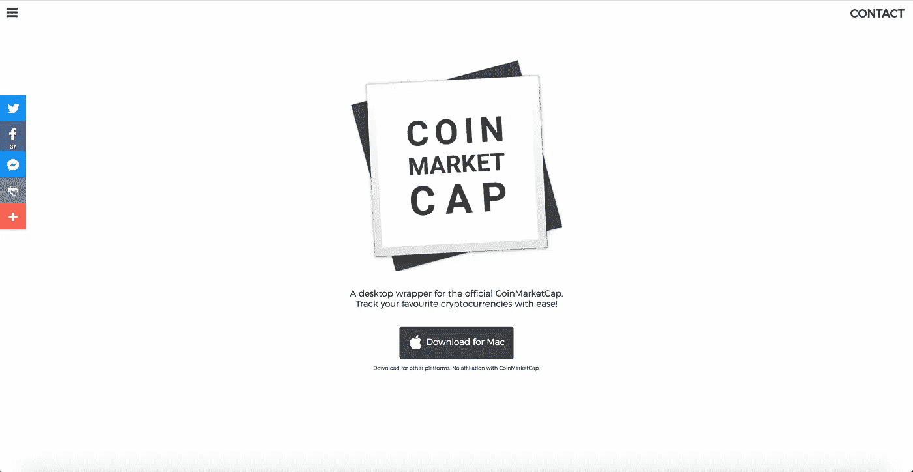
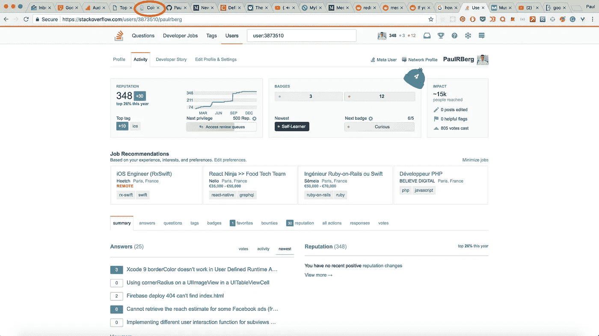

# 我为 CoinMarketCap 开发了一个桌面客户端

> 原文：<https://medium.com/hackernoon/i-developed-a-desktop-client-for-coinmarketcap-8dab71c81e17>

Snapshot from website

# 故事

许多加密货币交易员和搬运工会定期查看价格，因为他们知道在传统投资领域，西部荒原的一天意味着整整一个月。

几个月前，当我阅读白皮书时，我个人爱上了加密货币背后的技术。我投资了我认为有内在价值的东西，自然，现在我想跟踪我的钱。 [CoinMarketCap](https://cmcd.netlify.com) 是一个很好的工具，但是有一个问题。

作为一名[开发者](https://github.com/PaulRBerg)，同时也患有 Chrome 的 tabmania，几乎不可能与我的 cryptos 保持联系。只是看一看。寻找合适的标签需要很长时间。

This is a decent number of tabs, usually there are many more

这就是为什么我决定为 CoinMarketCap 推出一个简单但有效的桌面客户端[的原因，因为在谷歌上的几次搜索中，我只发现了一些糟糕的、没有记录的](https://cmcd.netlify.com)[尝试](https://steemit.com/steemit/@flash56/coinmarketcap-desktop-open-source-project)。

# 动机

很简单，在应用程序的核心有一个 webview，包裹着官方网站。目前，使用桌面版有 4 个优势:

1.  它在自己的窗口中运行，不会和你的正常浏览混淆
2.  在 dock/任务栏/ alt+tab 列表/ cmd+tab 列表/开始菜单中有自己特殊的图标
3.  您可以将其设置为在启动时启动
4.  当你不得不退出网络浏览器，因为某些东西使它变得疯狂，它开始使用 1000%的 CPU 和 10 GB 的 RAM，客户端将继续运行(如果是客户端导致了问题，这同样适用于你的普通浏览)

此外，还有自动更新，这真的很重要，因为事实上有一些非常酷的功能即将推出。

## 路标🚀

*   刷新按钮
*   自动刷新
*   能够在达到特定价格时设置通知
*   为其他硬币跟踪网站开发相同的应用程序，如 CoinGecko

# 捐助

当然，源代码是开放的，任何人都可以贡献。由于我将受到时间的限制，我鼓励你尝试和玩这个项目。

 [## PaulRBerg/CoinMarketCap-桌面

### 一个简单的桌面包装器

github.com](https://github.com/PaulRBerg/CoinMarketCap-Desktop) 

构建说明位于自述文件的底部。对于功能请求和错误报告，请[提交问题](https://github.com/PaulRBerg/CoinMarketCap-Desktop/issues/new?labels=bug)或通过 [Gitter](https://gitter.im/CoinMarketCap-Desktop) 或 Twitter [@PaulRBerg](https://twitter.com/PaulRBerg) 与我联系。

# [计] 下载

以下是您最喜爱的操作系统的下载链接:

*   [Windows](https://github.com/PaulRBerg/CoinMarketCap-Desktop/releases/download/v1.0.0/coinmarketcapdesktop-1.0.0-win32-setup.exe) (32 位和 64 位，Windows 7 及更高版本)
*   [Mac OSX](https://github.com/PaulRBerg/CoinMarketCap-Desktop/releases/download/v1.0.0/coinmarketcapdesktop-1.0.0-osx.dmg) (64 位，最低 10.9)
*   [Linux](https://github.com/PaulRBerg/CoinMarketCap-Desktop/releases) (Ubuntu 12.04，Fedora 21，Debian 8)

 [## CoinMarketCap 桌面

### 官方 CoinMarketCap 的桌面包装。

coinmarketcapdesktop.com](https://coinmarketcapdesktop.com) 

# 支持

如果你认为这个应用程序有真正的内在价值，并且能帮助他人，请考虑分享这篇文章。

欢迎捐款。我将通过为社区进一步开发工具和项目来十倍回报你的善举。

*   [比特币](https://hackernoon.com/tagged/bitcoin):38 fyav 4 drecog 38 jra 9 uaopfeh 9 rqrmhhq
*   以太坊:0 x7 deb 85 db 0d 84 cfef 5 a5 b 9 bdeb 868 ac4cf 269538d
*   lite coin:lqz 9 lqkeiljmk 1 drtcddkordvfpxf 74 rt

# 感谢您的阅读。这是给你的饼干！

Looks delicious

> 如果你喜欢这篇文章，你介意鼓掌或分享吗？✌️ 不胜感激

如果你想聊天，可以在 [**Twitter**](https://twitter.com/paulrberg) 或 [**Keybase**](https://keybase.io/PaulRBerg) 上找到我。