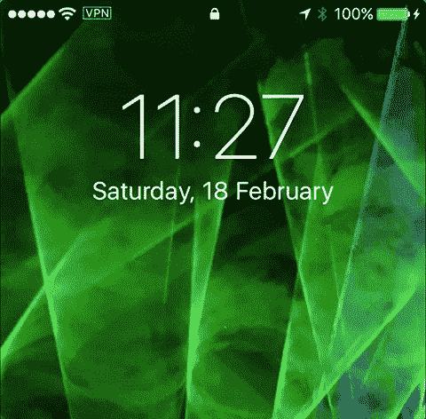
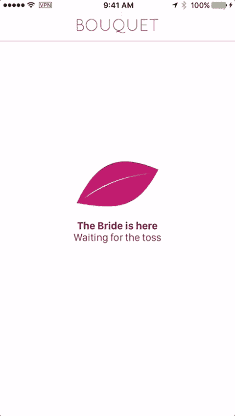

# 我为我的婚礼开发了一个应用程序

> 原文：<https://medium.com/hackernoon/i-developed-an-app-for-my-wedding-ad8c65974864>

在 WWDC 2013 之后，我的第一个配音，当我回家的时候，我有很多新的东西要考虑:skeuomorphism 结束的 iOS 7，新的 MacPro 等等…但最让我感兴趣的是 **iBeacon** 。

我在 2007 年的学期论文是关于使用位置感知(第一个 RFID，但我最终在手机上使用了[蓝牙](https://hackernoon.com/tagged/bluetooth))来根据你在建筑物内的位置绘制地图。我使用的方法类似于 iBeacon，因为这些设备并没有互相“连接”,它们只是在广播它们的 ID。我想这就是我对 iBeacon 感到兴奋的原因，现在我将有一个标准的方法来开发使用 BLE 作为存在指示器的应用程序。

在 WWDC 期间，每个人都在谈论用它来[营销](https://hackernoon.com/tagged/marketing)宣传、博物馆……就是这样。我知道它可以用在更有趣的事情上，所以我决定用它做点什么。那时，我正在为 100 名学生(上午 50 名，下午 50 名)教授 iOS,“教室”实际上是一栋大楼的整层楼。对我和其他老师来说，记录学生的出勤真的很难，所以我有了一个想法:使用 iBeacon 来建立一个出勤应用程序！我们和我的朋友一起开始开发，过了一段时间，我们已经在 App Store 上有了一个工作版本。当时，除了老一套的营销和博物馆之外，我没有看到 iBeacon 有任何其他好的用途……所以当这个应用程序准备好的时候，我决定向一些网站发送一份新闻稿，看看他们有什么想法。幸运的是，我们是对的，甚至 TechCrunch 也公布了一条消息！

 [## BeHere 允许教师使用 iBeacon 技术进行考勤

### 虽然苹果的 iBeacon 技术已经被大型和小型零售商采用，但我们已经开始看到其他…

techcrunch.com](https://techcrunch.com/2014/03/28/behere-lets-teachers-take-attendance-using-ibeacon/) 

一晃两年过去了，我又一次去了 WWDC，但这次我在拉斯维加斯还有一件重要的事情，我要结婚了！当我说我在拉斯维加斯结婚时，每个人问的头两个问题是:“你喝醉了吗？”和“这是真的吗？”。答案是肯定的，肯定的。

I know it looks like a stock photo, but this is really me and my wife

我所有的同事朋友和部分学生也会去，所以我想，如果我能为我的婚礼开发一个应用程序，那该多好？我知道那里的每个人都会有 iOS 设备(因为他们都是 iOS 开发者)，我真的很喜欢和 iBeacon 一起工作。决定做什么很容易，因为新娘扔花束是婚礼期间所有人都参与的唯一动作(除了最后扔大米或者像电影中那样打断婚礼)。

当我开始考虑这款应用时，我有 3 个要求:

1.  它不应该要求用户创建一个帐户，你需要能够下载并立即使用，简单而容易
2.  它不应该需要互联网连接，我的大部分客人不是来自美国，也不会有互联网
3.  对新娘和客人来说，这应该很有趣

我也希望它只是一个应用程序，你可以选择是新娘还是客人(默认选项)。

我的第一个想法很简单，新娘会开始宣传一个数字作为主要的，客人(在特定的 clbeacon 区域范围内)会显示他们是否是被选中的人。但很快我意识到我有一个问题，新娘如何知道有多少客人来选择，客人如何知道哪个 ID 分配给他们？那时我决定，客人们也必须宣传他们的身份证，而新娘必须在另一个 clbeacon 区域活动。所以现在两者同时在测距和对抗。这是我在 iOS 7 / iOS 8 上测试过的东西，从来没有工作得很好…但看起来现在工作得很完美:)

好了，现在客人知道新娘在那里，新娘知道有多少客人在场，但我仍然有一个问题:我如何决定每个客人使用哪个 ID，因为他们彼此不通信？只要我们有办法为每个用户定义一个唯一的标识符…我们做到了！从 iOS 6 开始，我们有了一个名为 **identifierForVendor** 的东西，这基本上是来自一个供应商的应用程序中特定设备的唯一标识符。因为这是一个 UUID，而我需要一个 UInt16 来作为主要的，所以我决定使用这个属性的字节数作为我的标识符。

最后，bride 将开始广告一个带有主零的区域，并开始为客人区域测距信标。客人们将开始宣传他们独特的身份证作为他们的专业，并开始在新娘区范围内活动。当新娘摇动设备来“扔”花束时，它会随机选择一个客人的信标，并开始宣传所选择的 ID 作为它的主要部分。这样客人就能知道哪个是赢家(如果你的身份证和新娘的专业相同)，哪个是输家。

我在 iBeacon 中实现的另一个小功能是当你进入新娘的领地时会有一个本地通知。因此，当新娘抛花束的时候，她打开应用程序，所有的客人都会收到这条消息:

Hurry!!

还记得我说过 app 要好玩吗？这是当你是得到花束的幸运儿时的屏幕:

当我把这款应用展示给我妻子时，她问的第一件事是:“作为新娘，我怎么能看出哪一个赢了呢？”。获胜者可能会跳起来/尖叫/等等…但是如果每个人都“同时”发现谁是获胜者，那就太棒了？我花了两天时间才明白，我们用手电筒吧！即使是在屏幕的“后面”，每个人都能够很容易地确定谁是获胜者！

现在是时候对所有这些进行测试了，这是我在:D 婚礼上的一段视频

如果你想测试这款应用，这里有 App Store 的链接:

 [## 花束-婚礼新体验！在 App Store 上

### 阅读评论，比较客户评级，查看截图，并了解更多关于花束-一个新的婚礼体验！…

itunes.apple.com](https://itunes.apple.com/us/app/bouquet-new-wedding-experience!/id998297130?mt=8) 

如果你有兴趣了解我是如何做到的，这里有一个源代码链接:

 [## GitHub-mauriciomeirelles/Bouquet:使用 iBeacons 的花束示例

### 使用 iBeacons 的花束示例

使用 iBeaconsgithub.com 的花束示例](https://github.com/mauriciomeirelles/Bouquet) 

我仍然认为 iBeacon 是一项令人敬畏的技术，人们没有充分利用它的潜力。陷入这只是对市场营销和博物馆有用的陷阱真的很容易，但当你试图有创意时，你会意识到在你的应用程序中有位置意识真的很强大！我希望这能帮助和激励人们用它做更多不同的事情！

> [黑客中午](http://bit.ly/Hackernoon)是黑客如何开始他们的下午。我们是 [@AMI](http://bit.ly/atAMIatAMI) 家庭的一员。我们现在[接受投稿](http://bit.ly/hackernoonsubmission)并乐意[讨论广告&赞助](mailto:partners@amipublications.com)机会。
> 
> 如果你喜欢这个故事，我们推荐你阅读我们的[最新科技故事](http://bit.ly/hackernoonlatestt)和[趋势科技故事](https://hackernoon.com/trending)。直到下一次，不要把世界的现实想当然！

