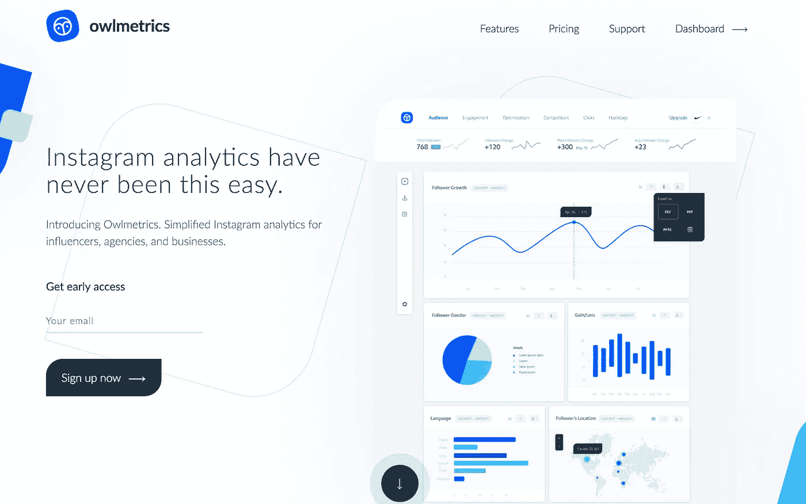

# 我在发布任何产品之前都会这样做

> 原文：<https://medium.com/hackernoon/i-do-this-before-i-launch-any-product-6411d78922ee>

*你好，我是* [*乔丹*](http://www.jordangonen.com/) *，我喜欢帮助人们思考&发展他们的产品。希望这有所帮助！你可以在* [*推特*](https://twitter.com/jrdngonen) *:)* 上找到我

在过去 11 个月左右的时间里，我在各种领域推出了一些产品。我不会称自己是一个广泛的成功。我也不会说我真的知道我在做什么。但是我和我工作过的团队已经为我的产品吸引了成千上万的用户。

这是一种令人谦卑的感觉，它是由制造人们真正想要的东西的愿望驱动的。得到这种认可是令人惊讶的——不仅满足了我自己的个人目标，还帮助了公司/创业公司/项目的成长。

“倾听你的用户”是每个创始人都声称投入大量时间的事情，但是他们真的能做到始终如一吗？

在我(有限的经验)与其他创始人的交谈中，我会说，虽然大多数创造者都希望由客户驱动，但通常还有许多其他变量/因素在起作用。

自我。

个人偏见。

沉没成本。

这样的例子不胜枚举——尽管如此，项目通常是由一小部分人的意愿推动的，至少在早期是如此。

这些努力有时会奏效。长期的、更可持续的努力是由真实的、切实的客户问题驱动的。

无论何时你发布一个东西，你都是在测试这个假设——直播！在整个万维网面前。

但是如果你的假设是错的，会发生什么呢？

我会告诉你，因为它已经发生在我身上很多次了。

当你赌错了的时候——a)没人关心你的产品。你在你的网站上得不到任何浏览。你没有任何注册。没人付钱给你。没人在乎。

b)无论你拥有哪支球队，都会变得悲伤。他们感到痛苦的是，他们花了这么多时间来建造没人想要的东西。糟透了。

**避免围绕未经测试的假设大肆宣传。**

怎么会？

与客户交谈！在你出去建立这个大公司之前，先去看看它是否应该存在。在筹集资金、获得媒体等之前了解痛点。等等。

我认为这样做有两种方式:

## **1。寻找利基**

找出谁是你的定位，然后直接联系他们。和他们谈谈。问他们问题。不要强加你的个人偏见。

去脸书，寻找一个你想合作的利基社区。

加入 facebook 群组，然后尝试免费为人们提供价值。发送有趣的内容。有帮助等。

然后，个人给群组中的人发消息，请他们加入一个快速的 skype /电话通话。

提问。

为根本问题而建，而不是绒毛。人们真正需要的。

## 2.贴一个**“提前访问页面”**仔细面试每一个报名的人。

例如:[owl metrics](http://owlmetrics.com)—insta gram Analytics

有时候很难管理这么多的直接外展，尤其是当你正埋头于产品的时候。

在黑暗中建造真的很可怕，因为你经常会遇到这样的问题:不知道你正在建造的东西是否是人们真正想要的。

开灯！放一个登陆页面，看看大家怎么想。

他们会丢弃电子邮件吗？他们求你允许他们进入吗？

他们会马上给你钱吗？

他们有什么反应？

然而,“说”你想买某样东西和实际购买之间有着明显的区别。更多的人会选择前者而不是后者。

这就是为什么把你的假设分成多个部分是很重要的。a)你认为人们对你的产品感兴趣，B)你认为他们会为此付费。a 可能是真的，而 B 不是。找出同时测试两者的方法！

让你的用户告诉你，你正在构建的东西是否好。不是媒体。不是你的朋友。不要等到发布日才知道:)**开始吧！**

> 非常感谢你的阅读！我的名字是[乔丹·戈宁](http://www.jordangonen.com/)，我每天都写博客*。如果你能做到，对我来说意义重大:*
> 
> **>** [**在 Twitter 上关注我**](https://twitter.com/jrdngonen) **<**
> 
> 如果您有任何问题，请发送电子邮件至 gmail dot com！非常感谢！