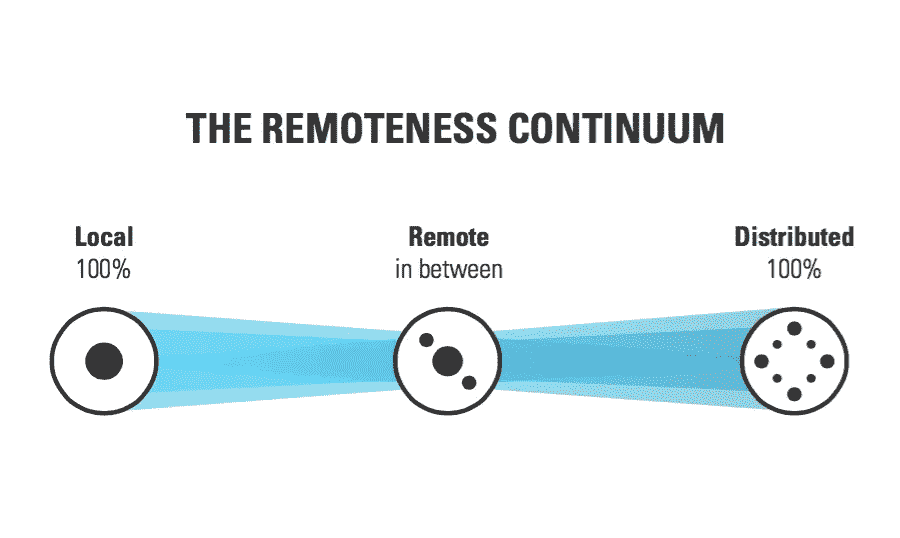
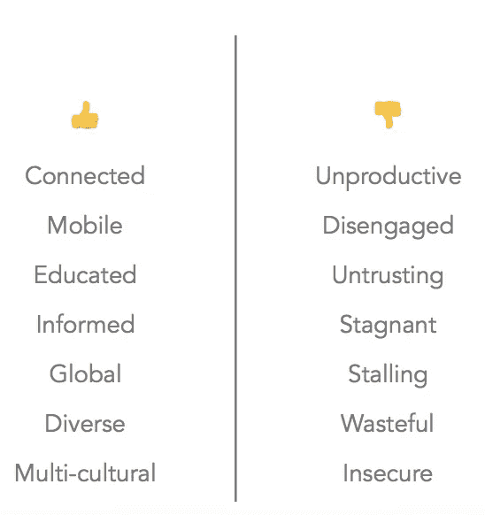

# 我不需要权限，我已经有了。

> 原文：<https://medium.com/hackernoon/i-dont-need-access-i-already-have-it-6be925042c46>

你可能会想，在举办了 5 场以*未来工作*为主题的活动后，这将变得有点重复。或许很无聊。但它不能。也不会。原因如下:

## 我们劳动力构成和组织方式的转变正在迅速发展——我们正处在一个重要的关头。

现在有可能创造一种新的工作模式，让去*办公室*变得高效、充实和有意义。许多有远见的人一直忙于设计，T4 称之为充满灵魂的工作场所。这些公司不一定是你去的地方，而是你所属的社区。现代社会的主要组织原则是:

> 一个展示你才能的地方。

领导第五版*工作的未来*系列*一* t 肖尔迪奇屋三位领导见证了这些变化。他们对我们的工作方式和方法正在发生的变化、它对我们个人和集体的影响以及即将发生的事情发表了自己的看法。

登峰造极..

Video by [Elco Ian](https://medium.com/u/6ec809e67123?source=post_page-----6be925042c46--------------------------------)

[Elco Ian](https://twitter.com/elcoian) ，成长黑客、[画互联网的创始人](http://www.paintingtheinternet.com/)爱上了事物变慢的声音。他敦促你停下来思考一下我们周围的这些变化:

> "..未来的工作将是你的工作、你的个人生活、你的人际关系、你周围的一切——界限将不再像过去那样严格，它们将更加模糊，你将有能力选择你喜欢什么和不喜欢什么——在我们可以期待巨大的技术加速的时候，我们应该一起非常清楚地思考我们希望自己、彼此和我们的未来过什么样的生活。”

Slide via [Davide ‘Folletto’ Casali](https://medium.com/u/1672909b609d?source=post_page-----6be925042c46--------------------------------)

[automatic](https://twitter.com/folletto)的产品体验总监 David Casali 正在体验分布式劳动力模式。在一个欣欣向荣、不断进步的组织中工作，他引用了 3 条指导原则，这是不搞砸文化的关键

> “透明——分享一切，尽早分享
> 
> 主动性——个人领导，团队自治
> 
> 沟通——是氧气”

深入探究是什么让一家世界领先的分布式公司运转起来，并了解大卫对*让工作运转起来所需的工具和支持的看法:*

Door Global 董事布雷特·麦克法兰(Brett Macfarlene)代表着越来越多的超级人才，他们将创造力、商业和技术以正确的方式融合在一起，带来了翻天覆地的变化。承认他拥有的知识广度超过深度——他声称正是这种特质、*、好奇心基因、*将定义下一代知识工作者:

Slide via [Brett Macfarlane](https://medium.com/u/45f6c86502d0?source=post_page-----6be925042c46--------------------------------)

深入了解布雷特的思想，回顾过去，展望未来:

所以你看，虽然这些可能是对未来的不同看法，但潜在的转变是不言而喻的。如果你已经读到这里，你会同意这个话题——以及它对我们工人和人类的意义——一点也不无聊。

*下一次工作的未来活动在 10 月 6 日@ WeWork 老街*

*预定你的位置* [***这里***](https://www.eventbrite.co.uk/e/future-of-work-series-6-tickets-26438227450)

*感谢点击* **💚如果你喜欢这样。**

> 黑客中午是黑客如何开始他们的下午。我们是这个家庭的一员。我们现在[接受投稿](http://bit.ly/hackernoonsubmission)并乐意[讨论广告&赞助](mailto:partners@amipublications.com)机会。
> 
> 如果你喜欢这个故事，我们推荐你阅读我们的[最新科技故事](http://bit.ly/hackernoonlatestt)和[趋势科技故事](https://hackernoon.com/trending)。直到下一次，不要把世界的现实想当然！

