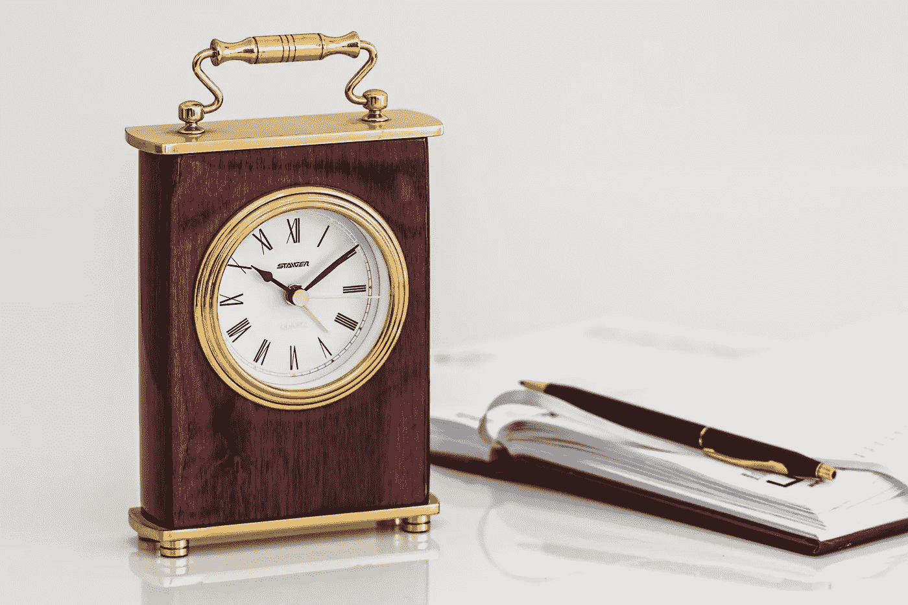

# 今天早上我给了自己 10 分钟

> 原文：<https://medium.com/hackernoon/i-gave-myself-10-minutes-this-morning-99e54e0a2cbe>

credit: pexels.com

今天早上，我决定给自己 10 分钟时间来写作——不多也不少。我会写下我所想的，只删除错别字，然后继续前进。下面是这个过程的结果。

早晨的第一杯咖啡有一种神奇的力量。就像一次净化和重生。昨天的罪恶，昨晚感觉如此真实，如此沉重，似乎被第一口咖啡带进了食道。可能是太热了。可能是酸度的原因。见鬼，也许两者都是。不管它是如何发生的，它确实发生了。也许这就是为什么我最终感觉如此充满活力。一只手放在笔记本电脑上，一只手抓住杯子的把手——这感觉很像宗教的神圣仪式，但没有伪装。

当我感觉很累的时候，这些小事让我坚持下去，并设法为未来的一天建立动力。因此，难怪有那么多文章都是关于早上做的事情，第一件事。但也许不止如此。

我刚刚开始阅读卡尔·纽波特的 [*深度作品*](http://calnewport.com/books/deep-work/) ，他提出了一个关于意志力的伟大观点。他说(我在这里转述一下)，意志力不是可以随时调用的某种性格表现。不是有些人一直有的，有些人就是没有。它就像一块肌肉，当你在白天用得越多，它就会变得疲劳。这就是休息如此重要的原因，但也可能是第一杯咖啡如此重要的原因。能够坐下来，让咖啡的仪式冲走昨晚压在我身上的东西，让我以新的活力接受今天的事情。这也证明了“我现在无法处理这件事”的态度是正确的。

但最重要的是，我认为重要的是保护好早晨的这段时间，确保我正确地使用它。这段时间应该是我伸展意志力的时候——我需要用它来做一整天的深度工作。但是我需要*拉伸*它，而不是开始让它承受负荷。这是一个重要的区别，因为如果我做了后者，我会有效地破坏我一天的平衡，使帮助我加强工作的肌肉疲劳。

10 分钟已经过去了，令人惊讶的是，这给了我这么少的时间。时间是一种非常棘手的资源——事实上是最稀缺的资源。即使你不想使用它，你也在不断地使用它。我在时间管理方面一直很差，所以确保我最大限度地利用持续耗尽的时间，尽管我很希望如此，这非常重要。

## 喜欢这篇文章吗？点击底部的小心脏，或者把它送给别人——也许就在你啜饮早晨咖啡的时候。

*原载于* [*贵愚桂冠*](http://www.mikesturm.net/I-gave-myself-10-mins) *。*

> [黑客中午](http://bit.ly/Hackernoon)是黑客如何开始他们的下午。我们是 [@AMI](http://bit.ly/atAMIatAMI) 家庭的一员。我们现在[接受投稿](http://bit.ly/hackernoonsubmission)并乐意[讨论广告&赞助](mailto:partners@amipublications.com)机会。
> 
> 如果你喜欢这个故事，我们推荐你阅读我们的[最新科技故事](http://bit.ly/hackernoonlatestt)和[趋势科技故事](https://hackernoon.com/trending)。直到下一次，不要把世界的现实想当然！

