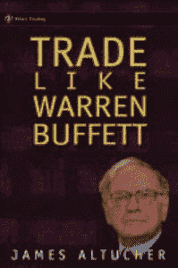

# 我在见每个人之前都会用谷歌搜索他们

> 原文：<https://medium.com/hackernoon/i-google-everyone-i-meet-before-i-meet-them-dbc611e5c73e>

## 生活帮

> 作者:詹姆斯·阿尔特彻。【JamesAltucher.com 原载

**这个生活帮太简单了，太琐碎了。**我几乎不好意思分享，因为这太明显了。

然而很少有人这样做，这一项技术让我赚了数百万美元。

这听起来几乎是骗人的:“它让我赚了数百万美元”。对此我能说什么呢？18 个月后，我身无分文。生活帮不是一种理解生活的方式。

我一会儿会谈到这一点。

有一次我开了一家公司。我有数百万的用户，我是盈利的。但我想卖掉公司。

我和一个人见了面，他是我合作的一家公司的新任首席财务官。

**生活帮:**

我事先谷歌了他。我看到他去了格林内尔学院。

我谷歌了格林内尔学院。

我看到沃伦·巴菲特是格林内尔大学的董事会成员，正因为如此，这所我在那之前从未听说过的大学拥有全国最好的大学捐赠投资回报。在世界上。

所以我和新的首席财务官和他的老板，首席执行官坐在一起。我的生意是一个与投资相关的网站。所以投资是话题的一部分。首席执行官想让我见见首席财务官，这样他就可以了解首席财务官对我的看法，以及如何处理我的业务。

我说的第一句话是，“很高兴见到来自格林内尔的人。”

首席执行官甚至不知道他的首席财务官在哪里上的大学。他笑着说:“为什么？”首席财务官可能也有点困惑。

我说，“如果你想学习任何关于投资的东西，除了格林内尔，其他的都别想了。他们是世界上最好的。这是你真正了解沃伦·巴菲特成功秘诀的地方，因为他是指导他们所有投资决策的人。”

首席财务官说:“没错。”他还讲了一些故事，讲述了格林内尔的大笔捐赠是如何以意想不到的方式帮助这所小学校的。首席执行官对此印象深刻。首席财务官很高兴我让他在新老板面前看起来不错。

这一切都是因为我有一条至今仍在使用的规则:在我见到每个人之前，我都会用谷歌搜索他们。

我说，“这件事让我印象深刻，我想送你一件礼物。”几年前，我写过一本书，名为《像沃伦·巴菲特一样交易》。他接过来，随手翻了翻。

我都不记得会议的其他部分了。我们谈了很多沃伦·巴菲特。我们谈到了首席财务官曾工作过的另一家公司，我研究过这家公司，我有许多朋友曾在那里工作过。

我们简单谈了一下我的公司。

两周后，首席财务官打电话给我说，“我们必须收购你的公司。”几周后，他们成功了，获得了 1000 万美元。

这是生活帮。我每天都用它。我今天要用它。我明天会用它。

但是生活黑客并不能创造生活。

卖掉那家公司不到 18 个月，我又一次破产了。我不得不爬回去。

这很令人沮丧。我很沮丧我又回到了这个位置，因为这不是第一次了。甚至是第二次。我重新振作起来，不得不更多地了解自己。我是谁。我所代表的。这是每天的战斗。

今天拥有一个好的生活帮会有所帮助。但是学习如何过好生活会永远有帮助。

➤ [注册](https://altucher.leadpages.co/start-here/?_ga=1.147953332.2077339586.1472084123?utm_source=medium&utm_medium=syndicate&utm_term=free-updates&utm_content=&utm_campaign=free-updates)订阅我的时事通讯。你会收到我最新内容的每日邮件！

➤或访问我的[网站](http://www.jamesaltucher.com/?utm_source=medium&utm_medium=syndicate&utm_term=home-page&utm_content=&utm_campaign=home-page)阅读我的免费博客内容

➤，你有问题吗？在 [Quora](https://www.quora.com/profile/James-Altucher?utm_source=medium&utm_medium=syndicate&utm_term=quora-page&utm_content=&utm_campaign=quora-page) 上问我……我每天都回答问题！

[*詹姆斯·阿尔图切*](http://www.jamesaltucher.com/?utm_source=medium&utm_medium=syndicate&utm_term=home-page&utm_content=&utm_campaign=home-page) *是畅销书《选择你自己》的作者，* [*的编辑，阿尔图切报道*](http://www.thealtucherreport.com/?_ga=1.127276173.1850486739.1486068468?utm_source=medium&utm_medium=syndicate&utm_term=altucher-report&utm_content=&utm_campaign=altucher-report) *和流行播客* [*的主持人，詹姆斯·阿尔图切秀*](http://www.jamesaltucher.com/category/the-james-altucher-show/?utm_source=medium&utm_medium=syndicate&utm_term=james-altucher-show&utm_content=&utm_campaign=james-altucher-show) *带你超越商业和企业家精神，探索在一个日益复杂的世界中作为人类和实现福祉意味着什么。*