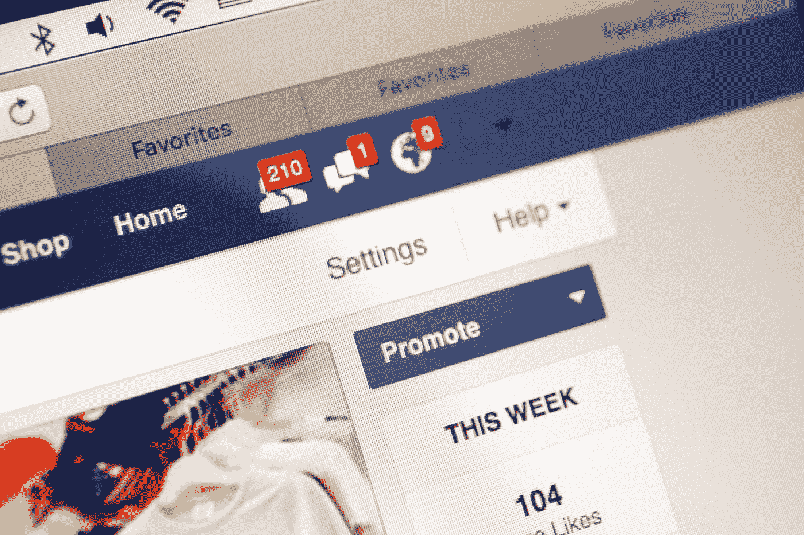
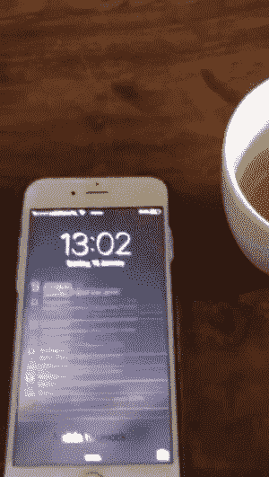

# 我收到了太多推送通知，他们把我推下了悬崖，我死了

> 原文：<https://medium.com/hackernoon/i-got-so-many-push-notifications-they-literally-pushed-me-over-a-cliff-and-i-died-c97d9ffcdb3e>

Heaven is a place without push notifications.

## 我从来没有在乎过，也永远不会在乎，有人有工作纪念日。

亲爱的读者，我知道你不相信我，但我是在伟大的来世写下这些的。我需要警告你推送通知的危险。当然，这些在你手机上弹出的泡泡看起来是无害的，但是要注意它们是来抓你的……就像它们是来抓我的一样。

我和你们每个人一样，曾经一整天都在使用智能手机，在阅读竹井乔治脸书 feed 上的垃圾 clickbait 文章时，避免与陌生人目光接触。我一点也不知道有一天我的生活会立即改变…那天我收到了太多的推送通知，他们真的把我推下了悬崖，我死了。

我知道很难相信我的推送通知真的从我的手机屏幕上消失了，它们捆绑在一起，把我推下了 2000 米的边缘。但我向你保证，你所需要做的就是看一串通知，通知我一些爬虫回到过去，喜欢我的 50 张旧脸书照片，就知道这是一个阴谋。

我的朋友，问题是营销人员太喜欢推送通知了。他们查看打开率，跟踪用户的活动，然后说，“这是一件好事！”而不是听所有的人大喊“我发誓我检查了我所有的通知六次，为什么他妈的这个红点还在我的手机上显示！？?"

早在智能手机大规模普及之前，推送通知实际上就已经…很好了！我的手机上只有少数几个应用程序，所以知道有人喜欢我坐在马桶上深思熟虑地制作的《脸书邮报》是一件很酷的事情。

但这些通知只是不停地推动，最终，没有人能控制住它们！像你一样，我的生活被闪烁的电话和嘟嘟的声音所包围，以至于有一天我的手机上有这么多红色的通知点，让我的眼睛流血了。

如果我的手机不觉得有必要告诉我，我在 Twitter 上关注的两个人喜欢一个我从未听说过的人的推文，而这个人肯定是因为在 Fiverr 上购买粉丝而获得蓝色支票的，我可能还活着。作为世界上一个没有蓝色支票的人，我可以告诉你，任何人都可能成为收到如此多推送通知的受害者，这些通知联合起来，把你推得如此之重，以至于你绊倒并从深不可测的高度跌落。

是的，我知道我可以进入每一个应用程序并关闭推送通知。但仅脸书一个国家在脸书就有不下 7 万个手机通知和电子邮件选项。现在，如果你客观地看待这个问题，并意识到我的手机上有 11 个应用程序，你可以做一下计算(如果你想知道，我必须关闭 600 亿个推送通知)。

但更重要的是，如果其中一个真的很重要呢？“抱歉，我错过了你怀了外星恶魔宝宝的消息。我今天不得不筛选 39，999 条其他推送通知。”根据记录，他们中大约有 9999 人在 Imgur 上通知我关于可爱动物的 gif。

一旦你意识到你收到了 20 条推送通知，而其中没有一条是你认识的人的评论或赞，这真的会改变你。当没有人爱你，但脸书想让你把你在考虑从宜家购买的沙发上拍的照片做成幻灯片时，这个世界会发生什么？

脸书，我不在乎我家附近有人在你的市场上卖东西。我住在布鲁克林。如果每次有人想卖古董电唱机，我都会收到通知，我的电话会爆炸。事实上，那些三星 Galaxy 7 手机可能都是因为收到太多该死的推送通知而爆炸的。

ProductHunt，你认为我需要定期的 Chrome 通知来让我了解像便便时间这样的产品，这是一个为便便者提供的移动应用程序。(这是所有人，以防你错过了，或者可以给我指出世界上谁不拉屎。)谢谢，但我很确定，如果我想要一个便便应用，那不会是因为它是作为通知来找我的。

LinkedIn，我从来不在乎，也永远不会在乎，有人有工作纪念日...还有*尤其是*不是我以前的实习生康妮。她被解雇了，因为她出现在高处并复印了她的屁股，记得吗？

电话…搞什么鬼，伙计？我不需要知道谁给我打电话了！说真的…反正他们两分钟后就要发短信了。

你以为我想这样吗？Instagram 的产品主管小姐，你真的认为我有必要知道@bigbuttz6969，我在大学时在一次聚会上见过他，他第一次在 Instagram 上发布消息。作为脸书现场的副总裁，你真的认为我需要看我朋友播放的 311 演唱会的视频吗？我甚至不需要在现实生活中看到这些。我是一个更好的人，因为在我死之前没有看到这一点。

I’m sure you have nothing better to do with your life than to wait for all your notifications to load. Via: [Giphy](https://gph.is/1T4bJWv)

我敦促你…营销人员。产品人员。创业公司创始人。你本可以救我一命的！你本可以给我更多的时间来探索世界和使用应用程序，而不是被心理条件限制所束缚。最重要的是，你可以让我享受当下，而不会觉得我也必须经常打电话。

哦，在我忘记之前…亲爱的读者，谢谢你回复了建议你阅读这篇文章的推送通知。

别往下看就好。

# 非常感谢你阅读这篇文章！如果你喜欢它，请随意鼓掌，我会继续写更多的东西来逗你笑。😄

图片来源:图海伦斯/Shutterstock.com